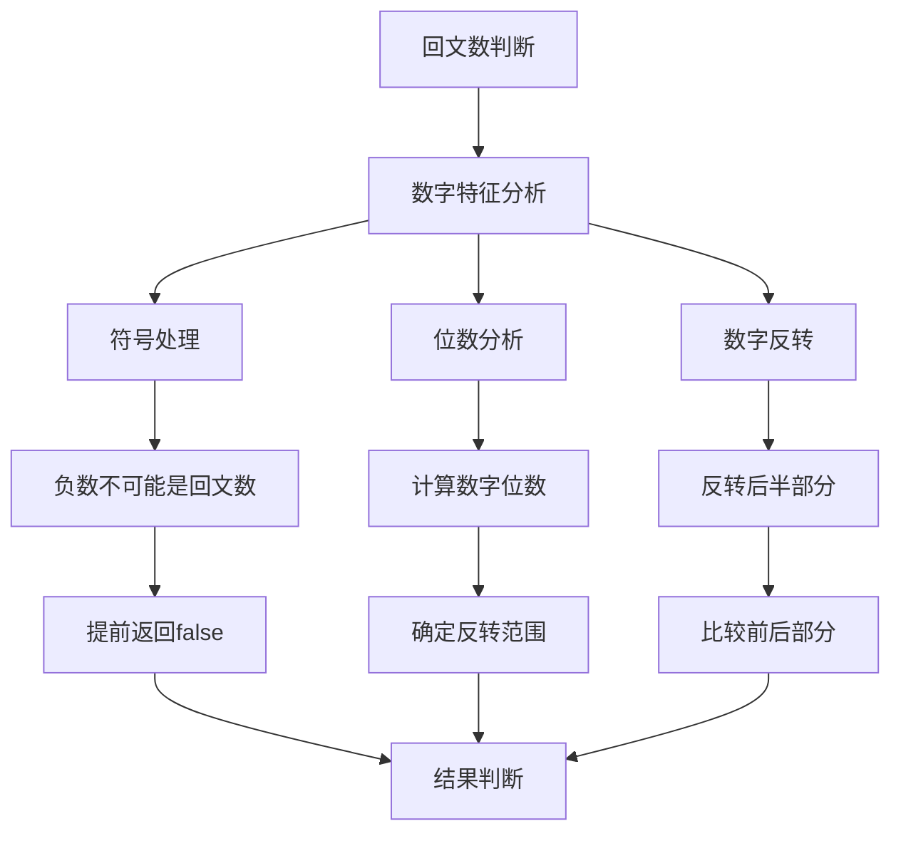
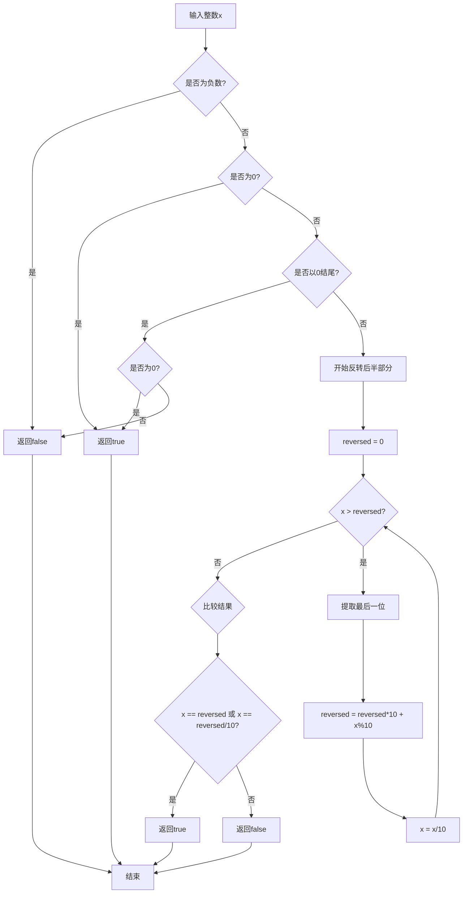
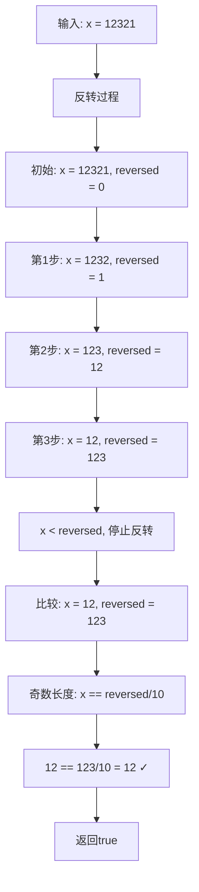
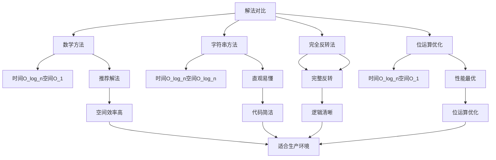
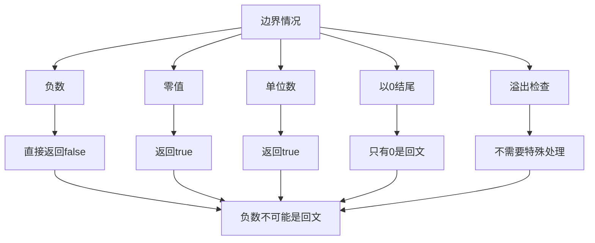
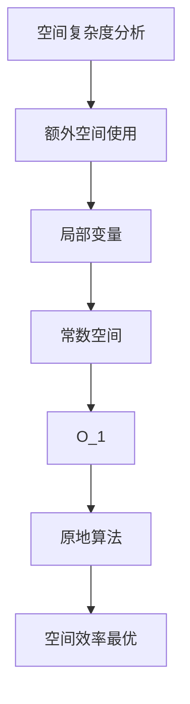
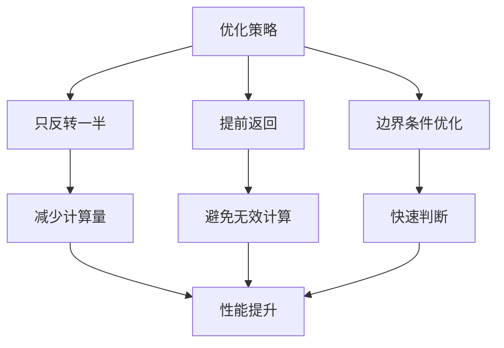
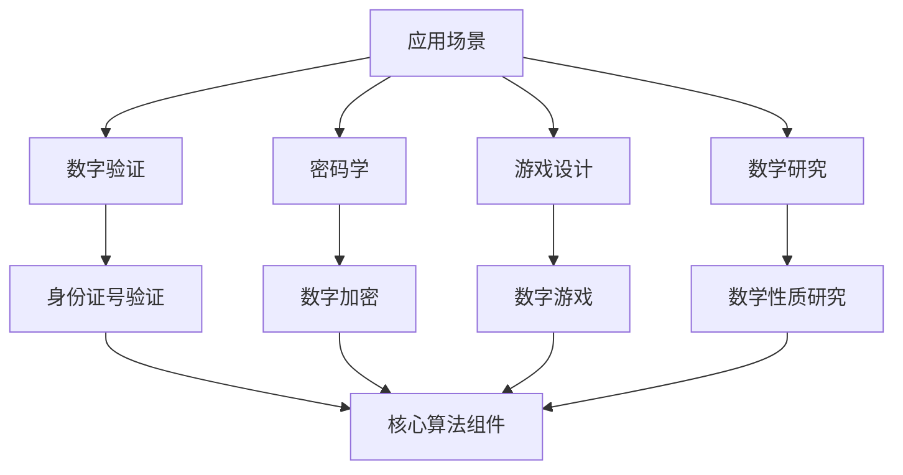
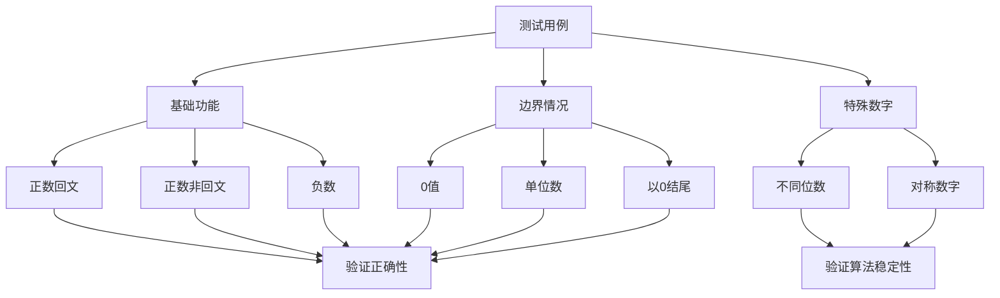

# 9. 回文数

## 题目描述

给你一个整数 x ，如果 x 是一个回文整数，返回 true ；否则，返回 false 。

回文数是指正序（从左向右）和倒序（从右向左）读都是一样的整数。

例如，121 是回文，而 123 不是。

## 示例 1：

输入：x = 121
输出：true

## 示例 2：

输入：x = -121
输出：false
解释：从左向右读, 为 -121 。 从右向左读, 为 121- 。因此它不是一个回文数。

## 示例 3：

输入：x = 10
输出：false
解释：从右向左读, 为 01 。因此它不是一个回文数。
 

## 提示：

- -2^31 <= x <= 2^31 - 1

## 解题思路

这道题要求判断一个整数是否为回文数。回文数是指正序和倒序读都一样的整数。这是一个数学运算和字符串处理的经典问题。

### 算法分析

这道题的核心思想是**数字反转比较**，主要解法包括：

1. **数学方法**：只反转一半数字进行比较（推荐）
2. **字符串方法**：转换为字符串后使用双指针判断
3. **完全反转法**：反转整个数字后与原数比较
4. **位运算优化**：逐位比较首尾数字

### 问题本质分析



### 数学方法详解



### 反转过程可视化



### 字符串方法详解

```mermaid
graph TD
    A[字符串方法] --> B[转换为字符串]
    B --> C[双指针初始化]
    C --> D[逐位比较]
    
    B --> E[str = strconv.Itoa(x)]
    C --> F[left = 0, right = len-1]
    D --> G{left < right?}
    
    G -->|否| H[返回true]
    G -->|是| I{str[left] == str[right]?}
    
    I -->|否| J[返回false]
    I -->|是| K[left++, right--]
    
    K --> G
    H --> L[结束]
    J --> L
```

### 各种解法对比



### 算法流程图

```mermaid
flowchart TD
    A[开始] --> B{是否为负数?}
    B -->|是| C[返回false]
    B -->|否| D{是否为0?}
    
    D -->|是| E[返回true]
    D -->|否| F{是否以0结尾?]
    
    F -->|是| G{是否为0?}
    G -->|是| E
    G -->|否| C
    
    F -->|否| H[初始化reversed = 0]
    H --> I{x > reversed?}
    
    I -->|否| J{比较结果}
    I -->|是| K[提取最后一位]
    
    K --> L[reversed = reversed*10 + x%10]
    L --> M[x = x/10]
    M --> I
    
    J --> N{x == reversed 或 x == reversed/10?}
    N -->|是| O[返回true]
    N -->|否| P[返回false]
    
    C --> Q[结束]
    E --> Q
    O --> Q
    P --> Q
```

### 边界情况处理



### 时间复杂度分析

```mermaid
graph TD
    A[时间复杂度分析] --> B[数字位数]
    B --> C[反转次数]
    C --> D[总时间复杂度]
    
    B --> E[log₁₀(n)]
    C --> F[O_log_n]
    D --> G[O_log_n]
    
    E --> H[n是整数值]
    F --> I[只反转一半]
    G --> J[最优解法]
```

### 空间复杂度分析



### 关键优化点



### 实际应用场景



### 测试用例设计



### 代码实现要点

1. **负数处理**：
   - 负数不可能是回文数，直接返回false
   - 这是最重要的边界条件

2. **零值处理**：
   - 0是回文数，直接返回true
   - 以0结尾的数字只有0本身是回文数

3. **反转策略**：
   - 只反转后半部分数字
   - 当x ≤ reversed时停止反转

4. **长度判断**：
   - 奇数长度：x == reversed/10
   - 偶数长度：x == reversed

5. **性能优化**：
   - 避免完全反转整个数字
   - 使用数学运算而非字符串操作

这个问题的关键在于**理解只反转一半数字的策略**和**正确处理各种边界情况**，通过巧妙的数学运算实现高效的回文数判断，避免不必要的计算和空间开销。
