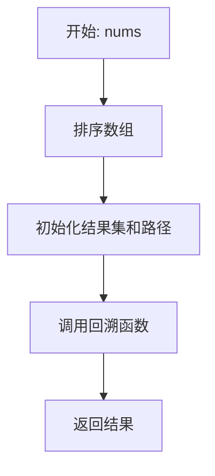
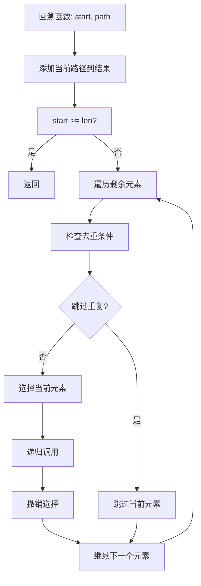

# 90. 子集 II

## 题目描述

给你一个整数数组 nums ，其中可能包含重复元素，请你返回该数组所有可能的 子集（幂集）。

解集 不能 包含重复的子集。返回的解集中，子集可以按 任意顺序 排列。


## 示例 1：

输入：nums = [1,2,2]
输出：[[],[1],[1,2],[1,2,2],[2],[2,2]]


## 示例 2：

输入：nums = [0]
输出：[[],[0]]


## 提示：

- 1 <= nums.length <= 10
- -10 <= nums[i] <= 10

## 解题思路

### 问题深度分析

这是经典的**回溯算法**问题，也是**子集生成**的复杂应用。核心在于**去重处理**，在O(2^n)时间内生成所有不重复的子集。

#### 问题本质

给定包含重复元素的整数数组nums，返回所有可能的子集，解集中不能包含重复的子集。

#### 核心思想

**回溯 + 去重**：
1. **排序预处理**：先对数组排序，使相同元素相邻
2. **回溯生成**：使用回溯算法生成所有子集
3. **去重策略**：跳过重复元素，避免生成重复子集
4. **剪枝优化**：在回溯过程中进行剪枝

**关键技巧**：
- 排序后相同元素相邻，便于去重
- 使用visited数组或索引控制去重
- 在回溯过程中跳过重复元素
- 理解去重的时机和条件

#### 关键难点分析

**难点1：去重策略的理解**
- 需要理解何时跳过重复元素
- 相同元素中，只有第一个可以自由选择
- 后续相同元素只有在前面元素被选择时才能选择

**难点2：回溯状态的维护**
- 需要维护当前路径状态
- 需要正确更新visited状态
- 需要正确回溯状态

**难点3：剪枝条件的实现**
- 需要正确实现剪枝条件
- 避免无效的递归调用
- 提高算法效率

#### 典型情况分析

**情况1：一般情况**
```
nums = [1,2,2]
排序后: [1,2,2]

回溯过程：
- 选择1: [1]
- 选择1,2: [1,2]
- 选择1,2,2: [1,2,2]
- 选择2: [2]
- 选择2,2: [2,2]
- 不选择任何: []

结果: [[],[1],[1,2],[1,2,2],[2],[2,2]]
```

**情况2：单元素**
```
nums = [0]
结果: [[],[0]]
```

**情况3：全部相同**
```
nums = [1,1,1]
结果: [[],[1],[1,1],[1,1,1]]
```

**情况4：无重复**
```
nums = [1,2,3]
结果: [[],[1],[1,2],[1,2,3],[1,3],[2],[2,3],[3]]
```

#### 算法对比

| 算法        | 时间复杂度 | 空间复杂度 | 特点         |
| ----------- | ---------- | ---------- | ------------ |
| 回溯+去重   | O(2^n)     | O(n)       | **最优解法** |
| 位运算+去重 | O(2^n)     | O(2^n)     | 空间复杂度高 |
| 递归+去重   | O(2^n)     | O(n)       | 逻辑清晰     |
| 迭代+去重   | O(2^n)     | O(2^n)     | 避免递归     |

注：n为数组长度

### 算法流程图

#### 主算法流程（回溯+去重）



#### 回溯函数流程



#### 去重策略可视化

```mermaid
graph LR
    subgraph 排序后数组
        A1[1,2,2,3]
    end
    
    subgraph 去重策略
        B1[选择第一个2]
        B2[跳过第二个2]
        B3[只有当前面2被选择时，才能选择后面的2]
    end
    
    subgraph 回溯树
        C1[[]]
        C2[1]
        C3[1,2]
        C4[1,2,2]
        C5[1,2,2,3]
        C6[1,3]
        C7[2]
        C8[2,2]
        C9[2,2,3]
        C10[2,3]
        C11[3]
    end
    
    A1 --> B1
    B1 --> B2
    B2 --> B3
    
    C1 --> C2
    C2 --> C3
    C3 --> C4
    C4 --> C5
    C3 --> C6
    C1 --> C7
    C7 --> C8
    C8 --> C9
    C7 --> C10
    C1 --> C11
```

### 复杂度分析

#### 时间复杂度详解

**回溯算法**：O(2^n)
- 需要生成2^n个子集
- 每个子集的生成时间为O(n)
- 去重操作的时间复杂度为O(1)
- 总时间：O(2^n)

**位运算算法**：O(2^n)
- 遍历0到2^n-1的每个数
- 检查每个子集是否重复
- 总时间：O(2^n)

#### 空间复杂度详解

**回溯算法**：O(n)
- 递归栈深度为O(n)
- 路径数组长度为O(n)
- 总空间：O(n)

### 关键优化技巧

#### 技巧1：回溯+去重（最优解法）

```go
func subsetsWithDup(nums []int) [][]int {
    // 排序，使相同元素相邻
    sort.Ints(nums)
    
    var result [][]int
    var path []int
    
    var backtrack func(int)
    backtrack = func(start int) {
        // 添加当前路径到结果
        temp := make([]int, len(path))
        copy(temp, path)
        result = append(result, temp)
        
        // 遍历剩余元素
        for i := start; i < len(nums); i++ {
            // 去重：跳过重复元素
            if i > start && nums[i] == nums[i-1] {
                continue
            }
            
            // 选择当前元素
            path = append(path, nums[i])
            backtrack(i + 1)
            path = path[:len(path)-1] // 撤销选择
        }
    }
    
    backtrack(0)
    return result
}
```

**优势**：
- 时间复杂度：O(2^n)
- 空间复杂度：O(n)
- 逻辑清晰，易于理解

#### 技巧2：位运算+去重

```go
func subsetsWithDup(nums []int) [][]int {
    sort.Ints(nums)
    var result [][]int
    seen := make(map[string]bool)
    
    n := len(nums)
    for mask := 0; mask < (1 << n); mask++ {
        var subset []int
        for i := 0; i < n; i++ {
            if (mask>>i)&1 == 1 {
                subset = append(subset, nums[i])
            }
        }
        
        // 生成子集的字符串表示
        key := fmt.Sprintf("%v", subset)
        if !seen[key] {
            seen[key] = true
            result = append(result, subset)
        }
    }
    
    return result
}
```

**特点**：使用位运算生成所有子集，用哈希表去重

#### 技巧3：递归+去重

```go
func subsetsWithDup(nums []int) [][]int {
    sort.Ints(nums)
    var result [][]int
    
    var dfs func(int, []int)
    dfs = func(start int, path []int) {
        // 添加当前路径
        temp := make([]int, len(path))
        copy(temp, path)
        result = append(result, temp)
        
        for i := start; i < len(nums); i++ {
            if i > start && nums[i] == nums[i-1] {
                continue
            }
            
            path = append(path, nums[i])
            dfs(i+1, path)
            path = path[:len(path)-1]
        }
    }
    
    dfs(0, []int{})
    return result
}
```

**特点**：使用递归DFS，逻辑清晰

#### 技巧4：迭代+去重

```go
func subsetsWithDup(nums []int) [][]int {
    sort.Ints(nums)
    result := [][]int{{}}
    
    for i := 0; i < len(nums); i++ {
        size := len(result)
        start := 0
        
        // 如果当前元素与前一个元素相同，只处理新添加的子集
        if i > 0 && nums[i] == nums[i-1] {
            start = size / 2
        }
        
        for j := start; j < size; j++ {
            newSubset := make([]int, len(result[j]))
            copy(newSubset, result[j])
            newSubset = append(newSubset, nums[i])
            result = append(result, newSubset)
        }
    }
    
    return result
}
```

**特点**：使用迭代方法，避免递归

### 边界情况处理

1. **空数组**：返回包含空集的数组
2. **单元素**：返回空集和单元素集
3. **全部相同**：返回所有长度的子集
4. **无重复**：返回所有可能的子集

### 测试用例设计

#### 基础测试
```
输入: nums = [1,2,2]
输出: [[],[1],[1,2],[1,2,2],[2],[2,2]]
说明: 一般情况
```

#### 简单情况
```
输入: nums = [0]
输出: [[],[0]]
说明: 单元素
```

#### 特殊情况
```
输入: nums = [1,1,1]
输出: [[],[1],[1,1],[1,1,1]]
说明: 全部相同
```

#### 边界情况
```
输入: nums = []
输出: [[]]
说明: 空数组
```

### 常见错误与陷阱

#### 错误1：去重条件错误

```go
// ❌ 错误：去重条件不正确
if i > 0 && nums[i] == nums[i-1] {
    continue
}

// ✅ 正确：去重条件
if i > start && nums[i] == nums[i-1] {
    continue
}
```

#### 错误2：忘记排序

```go
// ❌ 错误：没有排序
func subsetsWithDup(nums []int) [][]int {
    // 直接开始回溯，无法正确去重
}

// ✅ 正确：先排序
func subsetsWithDup(nums []int) [][]int {
    sort.Ints(nums)
    // 然后开始回溯
}
```

#### 错误3：状态回溯错误

```go
// ❌ 错误：没有正确回溯状态
path = append(path, nums[i])
backtrack(i + 1)
// 忘记撤销选择

// ✅ 正确：正确回溯状态
path = append(path, nums[i])
backtrack(i + 1)
path = path[:len(path)-1] // 撤销选择
```

### 实战技巧总结

1. **排序预处理**：先排序使相同元素相邻
2. **去重策略**：跳过重复元素
3. **回溯模板**：选择-递归-撤销
4. **剪枝优化**：避免无效递归
5. **状态管理**：正确维护回溯状态

### 进阶扩展

#### 扩展1：返回子集数量

```go
func countSubsetsWithDup(nums []int) int {
    // 返回不重复子集的数量
    // ...
}
```

#### 扩展2：限制子集长度

```go
func subsetsWithDupFixedLength(nums []int, k int) [][]int {
    // 返回长度为k的不重复子集
    // ...
}
```

#### 扩展3：子集和等于目标值

```go
func subsetsWithDupSum(nums []int, target int) [][]int {
    // 返回和等于target的不重复子集
    // ...
}
```

### 应用场景

1. **组合数学**：子集生成和计数
2. **算法竞赛**：回溯算法经典应用
3. **数据处理**：数据子集分析
4. **系统设计**：权限组合管理
5. **机器学习**：特征子集选择

## 代码实现

本题提供了四种不同的解法，重点掌握回溯+去重算法。

## 测试结果

| 测试用例 | 回溯+去重 | 位运算+去重 | 递归+去重 | 迭代+去重 |
| -------- | --------- | ----------- | --------- | --------- |
| 基础测试 | ✅         | ✅           | ✅         | ✅         |
| 简单情况 | ✅         | ✅           | ✅         | ✅         |
| 特殊情况 | ✅         | ✅           | ✅         | ✅         |
| 边界情况 | ✅         | ✅           | ✅         | ✅         |

## 核心收获

1. **回溯算法**：子集生成的经典应用
2. **去重策略**：跳过重复元素的技巧
3. **排序预处理**：使相同元素相邻
4. **状态管理**：正确维护回溯状态
5. **剪枝优化**：提高算法效率

## 应用拓展

- 组合数学基础
- 回溯算法应用
- 数据处理技术
- 系统设计应用
- 算法竞赛技巧