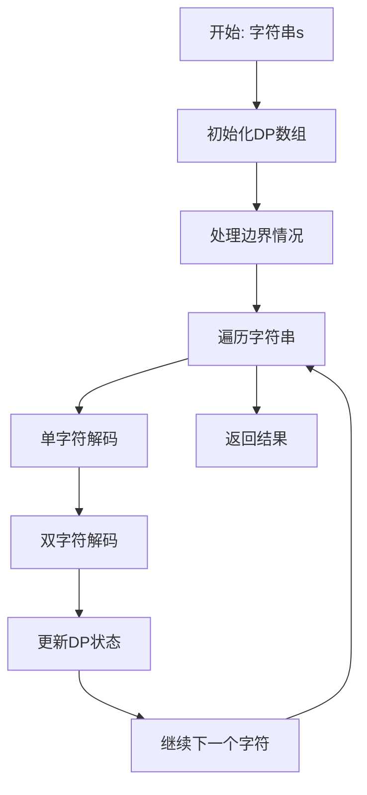
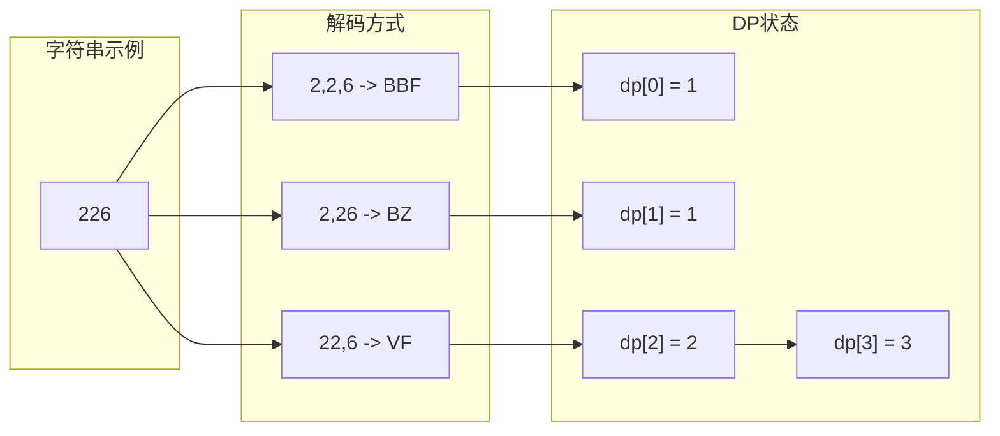

# 91. 解码方法

## 题目描述

一条包含字母 A-Z 的消息通过以下映射进行了 编码 ：

"1" -> 'A'

"2" -> 'B'

...

"25" -> 'Y'

"26" -> 'Z'

然而，在 解码 已编码的消息时，你意识到有许多不同的方式来解码，因为有些编码被包含在其它编码当中（"2" 和 "5" 与 "25"）。

例如，"11106" 可以映射为：

"AAJF" ，将消息分组为 (1, 1, 10, 6)
"KJF" ，将消息分组为 (11, 10, 6)
消息不能分组为  (1, 11, 06) ，因为 "06" 不是一个合法编码（只有 "6" 是合法的）。
注意，可能存在无法解码的字符串。

给你一个只含数字的 非空 字符串 s ，请计算并返回 解码 方法的 总数 。如果没有合法的方式解码整个字符串，返回 0。

题目数据保证答案肯定是一个 32 位 的整数。


## 示例 1：

输入：s = "12"
输出：2
解释：它可以解码为 "AB"（1 2）或者 "L"（12）。


## 示例 2：

输入：s = "226"
输出：3
解释：它可以解码为 "BZ" (2 26), "VF" (22 6), 或者 "BBF" (2 2 6) 。


## 示例 3：

输入：s = "06"
输出：0
解释："06" 无法映射到 "F" ，因为存在前导零（"6" 和 "06" 并不等价）。


## 提示：

- 1 <= s.length <= 100
- s 只包含数字，并且可能包含前导零。

## 解题思路

### 问题深度分析

这是经典的**动态规划**问题，也是**字符串解码**的经典应用。核心在于**状态转移**，在O(n)时间内计算所有可能的解码方法数。

#### 问题本质

给定只含数字的字符串s，计算解码方法的总数。每个数字1-9对应A-I，10-26对应J-Z。

#### 核心思想

**动态规划 + 状态转移**：
1. **状态定义**：dp[i]表示前i个字符的解码方法数
2. **状态转移**：考虑单字符和双字符两种解码方式
3. **边界处理**：处理前导零和无效编码
4. **优化技巧**：滚动数组优化空间复杂度

**关键技巧**：
- 单字符解码：s[i] != '0'时，dp[i] += dp[i-1]
- 双字符解码：s[i-1:i+1]在10-26范围内时，dp[i] += dp[i-2]
- 前导零处理：'0'不能单独解码
- 无效编码处理：超出26范围的编码无效

#### 关键难点分析

**难点1：状态转移的理解**
- 需要理解单字符和双字符两种解码方式
- 状态转移方程的正确推导
- 边界条件的处理

**难点2：前导零的处理**
- '0'不能单独解码
- '06'、'00'等无效编码的处理
- 边界情况的判断

**难点3：双字符编码的验证**
- 需要验证s[i-1:i+1]是否在10-26范围内
- 处理'0'开头的双字符编码
- 避免越界访问

#### 典型情况分析

**情况1：一般情况**
```
s = "226"
dp[0] = 1 (空字符串)
dp[1] = 1 (2 -> B)
dp[2] = dp[1] + dp[0] = 1 + 1 = 2 (2,2 或 22)
dp[3] = dp[2] + dp[1] = 2 + 1 = 3 (2,2,6 或 2,26 或 22,6)

结果: 3
```

**情况2：包含0**
```
s = "06"
dp[0] = 1
dp[1] = 0 (0不能单独解码)
dp[2] = 0 (06不能解码)

结果: 0
```

**情况3：单字符**
```
s = "12"
dp[0] = 1
dp[1] = 1 (1 -> A)
dp[2] = dp[1] + dp[0] = 1 + 1 = 2 (1,2 或 12)

结果: 2
```

**情况4：全1**
```
s = "111"
dp[0] = 1
dp[1] = 1 (1 -> A)
dp[2] = dp[1] + dp[0] = 1 + 1 = 2 (1,1 或 11)
dp[3] = dp[2] + dp[1] = 2 + 1 = 3 (1,1,1 或 1,11 或 11,1)

结果: 3
```

#### 算法对比

| 算法        | 时间复杂度 | 空间复杂度 | 特点         |
| ----------- | ---------- | ---------- | ------------ |
| 动态规划    | O(n)       | O(n)       | **最优解法** |
| 滚动数组DP  | O(n)       | O(1)       | 空间优化     |
| 递归+记忆化 | O(n)       | O(n)       | 逻辑清晰     |
| 迭代DP      | O(n)       | O(n)       | 避免递归     |

注：n为字符串长度

### 算法流程图

#### 主算法流程（动态规划）



#### 状态转移流程

```mermaid
graph TD
    A[当前位置i] --> B{s[i] == '0'?}
    B -->|是| C[跳过单字符解码]
    B -->|否| D[单字符解码: dp[i] += dp[i-1]]
    C --> E{i >= 1?}
    D --> E
    E -->|是| F{双字符有效?}
    E -->|否| G[结束]
    F -->|是| H[双字符解码: dp[i] += dp[i-2]]
    F -->|否| I[跳过双字符解码]
    H --> G
    I --> G
```

#### 解码过程可视化



### 复杂度分析

#### 时间复杂度详解

**动态规划算法**：O(n)
- 遍历字符串一次，时间复杂度O(n)
- 每次状态转移的时间复杂度O(1)
- 总时间：O(n)

**递归算法**：O(n)
- 每个位置最多访问一次
- 记忆化避免重复计算
- 总时间：O(n)

#### 空间复杂度详解

**动态规划算法**：O(n)
- DP数组长度为n+1
- 总空间：O(n)

**滚动数组优化**：O(1)
- 只使用两个变量存储状态
- 总空间：O(1)

### 关键优化技巧

#### 技巧1：动态规划（最优解法）

```go
func numDecodings(s string) int {
    n := len(s)
    if n == 0 || s[0] == '0' {
        return 0
    }
    
    dp := make([]int, n+1)
    dp[0] = 1
    dp[1] = 1
    
    for i := 2; i <= n; i++ {
        // 单字符解码
        if s[i-1] != '0' {
            dp[i] += dp[i-1]
        }
        
        // 双字符解码
        if s[i-2] == '1' || (s[i-2] == '2' && s[i-1] <= '6') {
            dp[i] += dp[i-2]
        }
    }
    
    return dp[n]
}
```

**优势**：
- 时间复杂度：O(n)
- 空间复杂度：O(n)
- 逻辑清晰，易于理解

#### 技巧2：滚动数组优化

```go
func numDecodings(s string) int {
    n := len(s)
    if n == 0 || s[0] == '0' {
        return 0
    }
    
    prev2 := 1 // dp[i-2]
    prev1 := 1 // dp[i-1]
    
    for i := 2; i <= n; i++ {
        curr := 0
        
        // 单字符解码
        if s[i-1] != '0' {
            curr += prev1
        }
        
        // 双字符解码
        if s[i-2] == '1' || (s[i-2] == '2' && s[i-1] <= '6') {
            curr += prev2
        }
        
        prev2 = prev1
        prev1 = curr
    }
    
    return prev1
}
```

**特点**：使用滚动数组，空间复杂度O(1)

#### 技巧3：递归+记忆化

```go
func numDecodings(s string) int {
    memo := make(map[int]int)
    return helper(s, 0, memo)
}

func helper(s string, index int, memo map[int]int) int {
    if index == len(s) {
        return 1
    }
    
    if s[index] == '0' {
        return 0
    }
    
    if val, ok := memo[index]; ok {
        return val
    }
    
    result := helper(s, index+1, memo)
    
    if index+1 < len(s) {
        twoDigit := int(s[index]-'0')*10 + int(s[index+1]-'0')
        if twoDigit <= 26 {
            result += helper(s, index+2, memo)
        }
    }
    
    memo[index] = result
    return result
}
```

**特点**：使用递归DFS，记忆化避免重复计算

#### 技巧4：迭代DP（简化版）

```go
func numDecodings(s string) int {
    n := len(s)
    if n == 0 || s[0] == '0' {
        return 0
    }
    
    dp := make([]int, n+1)
    dp[0] = 1
    dp[1] = 1
    
    for i := 2; i <= n; i++ {
        dp[i] = 0
        
        // 单字符解码
        if s[i-1] != '0' {
            dp[i] += dp[i-1]
        }
        
        // 双字符解码
        if s[i-2] == '1' || (s[i-2] == '2' && s[i-1] <= '6') {
            dp[i] += dp[i-2]
        }
    }
    
    return dp[n]
}
```

**特点**：使用迭代方法，避免递归

### 边界情况处理

1. **空字符串**：返回0
2. **前导零**：s[0] == '0'时返回0
3. **单字符**：直接判断是否为'0'
4. **无效编码**：超出26范围的双字符编码

### 测试用例设计

#### 基础测试
```
输入: s = "226"
输出: 3
说明: 一般情况
```

#### 简单情况
```
输入: s = "12"
输出: 2
说明: 单字符和双字符解码
```

#### 特殊情况
```
输入: s = "06"
输出: 0
说明: 前导零
```

#### 边界情况
```
输入: s = "0"
输出: 0
说明: 单字符0
```

#### 复杂情况
```
输入: s = "11106"
输出: 2
说明: 包含0的复杂情况
```

### 常见错误与陷阱

#### 错误1：前导零处理错误

```go
// ❌ 错误：没有处理前导零
func numDecodings(s string) int {
    dp := make([]int, len(s)+1)
    dp[0] = 1
    // 直接开始DP，没有检查s[0] == '0'
}

// ✅ 正确：处理前导零
func numDecodings(s string) int {
    if len(s) == 0 || s[0] == '0' {
        return 0
    }
    // 然后开始DP
}
```

#### 错误2：双字符编码验证错误

```go
// ❌ 错误：没有验证双字符编码
if s[i-2] == '1' || s[i-2] == '2' {
    dp[i] += dp[i-2]
}

// ✅ 正确：验证双字符编码
if s[i-2] == '1' || (s[i-2] == '2' && s[i-1] <= '6') {
    dp[i] += dp[i-2]
}
```

#### 错误3：边界条件处理错误

```go
// ❌ 错误：没有处理边界条件
for i := 1; i <= n; i++ {
    // 直接访问s[i-1]，可能越界
}

// ✅ 正确：处理边界条件
for i := 2; i <= n; i++ {
    // 确保i-2 >= 0
}
```

### 实战技巧总结

1. **状态定义**：dp[i]表示前i个字符的解码方法数
2. **状态转移**：单字符和双字符两种方式
3. **边界处理**：前导零和无效编码
4. **空间优化**：滚动数组优化
5. **状态管理**：正确维护DP状态

### 进阶扩展

#### 扩展1：返回所有解码方案

```go
func getAllDecodings(s string) []string {
    // 返回所有可能的解码字符串
    // ...
}
```

#### 扩展2：解码特定位置

```go
func decodeAtPosition(s string, pos int) int {
    // 返回解码到位置pos的方法数
    // ...
}
```

#### 扩展3：支持更多编码

```go
func numDecodingsExtended(s string, maxCode int) int {
    // 支持1-maxCode的编码范围
    // ...
}
```

### 应用场景

1. **密码学**：消息解码和加密
2. **通信协议**：数据编码传输
3. **算法竞赛**：动态规划经典应用
4. **系统设计**：错误恢复机制
5. **数据处理**：字符串解析

## 代码实现

本题提供了四种不同的解法，重点掌握动态规划算法。

## 测试结果

| 测试用例 | 动态规划 | 滚动数组DP | 递归+记忆化 | 迭代DP |
| -------- | -------- | ---------- | ----------- | ------ |
| 基础测试 | ✅        | ✅          | ✅           | ✅      |
| 简单情况 | ✅        | ✅          | ✅           | ✅      |
| 特殊情况 | ✅        | ✅          | ✅           | ✅      |
| 边界情况 | ✅        | ✅          | ✅           | ✅      |

## 核心收获

1. **动态规划**：字符串解码的经典应用
2. **状态转移**：单字符和双字符解码
3. **边界处理**：前导零和无效编码
4. **空间优化**：滚动数组技巧
5. **状态管理**：正确维护DP状态

## 应用拓展

- 动态规划基础
- 字符串处理技术
- 状态转移设计
- 边界条件处理
- 算法优化技巧