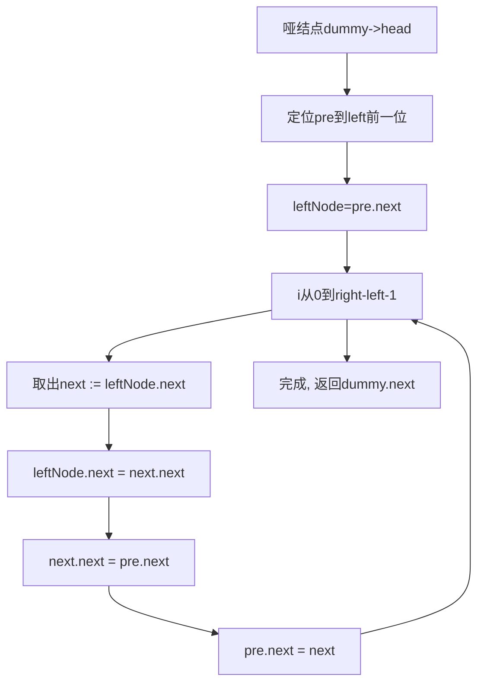
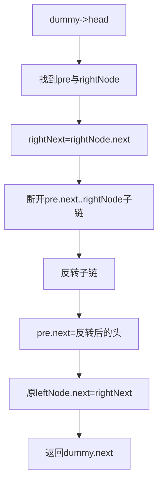

# 92. 反转链表 II

## 题目描述

给你单链表的头指针 head 和两个整数 left 和 right ，其中 left <= right 。请你反转从位置 left 到位置 right 的链表节点，返回 反转后的链表 。


## 示例 1：


输入：head = [1,2,3,4,5], left = 2, right = 4
输出：[1,4,3,2,5]


## 示例 2：

输入：head = [5], left = 1, right = 1
输出：[5]


## 提示：

- 链表中节点数目为 n
- 1 <= n <= 500
- -500 <= Node.val <= 500
- 1 <= left <= right <= n


## 进阶： 你可以使用一趟扫描完成反转吗？

## 解题思路

### 问题深度分析

本题要求在单链表中仅反转[left, right]区间节点，其他部分保持原相对顺序，时间O(n)、空间O(1)的一趟扫描是最优思路。核心在于：精确定位边界、断开/接回指针、在区间内进行原地反转。

- 关键指针：`pre`（指向left前一个结点）、`leftNode`（left处结点）、`rightNode`（right处结点）、`rightNext`（right后一个结点）。
- 一趟扫描常用“头插法”在区间内原地重排；或使用常规反转再接回。

### 核心思想对比

- 方法一（头插法一趟扫描，最优）：固定`pre`，每次把`leftNode`后面的结点摘下，插到`pre`之后，实现区间内前插，O(1)空间，O(n)时间。
- 方法二（常规反转再接回）：先走到`pre`与`rightNext`，断开[left,right]，常规反转，再接回，思路直观。
- 方法三（递归：反转前N个 + 偏移）：将问题转为“反转链表前N个”子问题，向右偏移left-1次，递归优雅但实现需小心边界。
- 方法四（栈/数组辅助）：将区间内节点压栈后再弹出拼接，易写但需O(k)额外空间（k=right-left+1）。

### 算法流程图

主流程（以头插法为例）



常规反转+接回



递归思路（反转前N个）

```mermaid
graph TD
    A[reverseBetween(head,left,right)] --> B{left==1?}
    B -->|是| C[reverseN(head, right)]
    B -->|否| D[head.next = reverseBetween(head.next,left-1,right-1)]
    D --> E[返回head]
```

### 复杂度分析
- 时间复杂度：四种方法均为O(n)，n为链表长度。
- 空间复杂度：
  - 头插法与常规反转：O(1)
  - 递归：O(right-left+1) 递归栈
  - 栈法：O(right-left+1) 额外空间

### 关键边界与陷阱
- left==right：无需操作直接返回。
- left==1：`pre`为dummy，注意连接。
- 只有一个节点/空链表：直接返回。
- 区间在尾部：`rightNext`可能为nil，接回时谨慎。
- 指针顺序：先保存`next`再修改指针，避免丢链。

### 方法与代码要点（Go）

- 方法一：头插法一趟扫描（推荐最优）
  - 固定`pre`与`leftNode`，把`leftNode`后面的节点依次插到`pre`后面。
- 方法二：常规反转子链后接回
  - 先切出子链段，再常规反转，然后两端接回。
- 方法三：递归reverseN
  - `reverseBetween(head,l,r)`：若l==1，调用`reverseN(head,r)`；否则`head.next = reverseBetween(head.next,l-1,r-1)`。
- 方法四：栈辅助
  - 遍历区间压栈，随后弹栈重建区间，最后接回。

### 测试用例设计
- [1,2,3,4,5], left=2, right=4 -> [1,4,3,2,5]
- [5], left=1, right=1 -> [5]
- [1,2,3], left=1, right=3 -> [3,2,1]
- [1,2,3,4], left=3, right=4 -> [1,2,4,3]
- [1,2], left=1, right=2 -> [2,1]
- 边界：空/单节点/left==right/区间含尾部

### 实战技巧
- 哑结点`dummy`极大简化头部操作。
- 指针改动顺序：保存next -> 断开 -> 插入/反转 -> 接回。
- 模板化书写，减少出错。