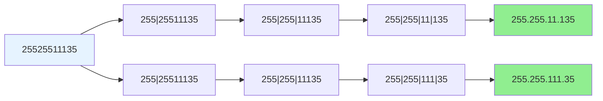

# 93. 复原 IP 地址

## 描述

有效 IP 地址 正好由四个整数（每个整数位于 0 到 255 之间组成，且不能含有前导 0），整数之间用 '.' 分隔。

例如："0.1.2.201" 和 "192.168.1.1" 是 有效 IP 地址，但是 "0.011.255.245"、"192.168.1.312" 和 "192.168@1.1" 是 无效 IP 地址。
给定一个只包含数字的字符串 s ，用以表示一个 IP 地址，返回所有可能的有效 IP 地址，这些地址可以通过在 s 中插入 '.' 来形成。你 不能 重新排序或删除 s 中的任何数字。你可以按 任何 顺序返回答案。

## 示例 1：

输入：s = "25525511135"
输出：["255.255.11.135","255.255.111.35"]

## 示例 2：

输入：s = "0000"
输出：["0.0.0.0"]

## 示例 3：

输入：s = "101023"
输出：["1.0.10.23","1.0.102.3","10.1.0.23","10.10.2.3","101.0.2.3"]

## 示例 4：

输入：s = "1111"
输出：["1.1.1.1"]

## 提示：

- 1 <= s.length <= 20
- s 仅由数字组成

## 解题思路

### 方法一：回溯算法（推荐）

**核心思想**：
- 使用回溯算法尝试所有可能的分割方式
- 每次选择一个有效的数字段（0-255，无前导0）
- 当分割出4个有效段时，检查是否用完所有字符

**算法步骤**：
1. 初始化结果列表和当前路径
2. 递归函数：`backtrack(s, start, segments, result)`
3. 对于每个位置，尝试取1-3位数字
4. 验证数字段的有效性：
   - 范围在0-255之间
   - 不能有前导0（除非是单个0）
5. 当segments达到4个时，检查是否用完所有字符
6. 回溯时移除最后添加的段

**时间复杂度**：O(3^4) = O(81)，因为每个段最多3位数字
**空间复杂度**：O(n)，递归栈深度

### 方法二：暴力枚举

**核心思想**：
- 枚举所有可能的分割点
- 检查每种分割方式是否有效

**时间复杂度**：O(3^4)
**空间复杂度**：O(n)

### 方法三：动态规划

**核心思想**：
- 使用DP记录所有可能的分割方式
- 状态转移：dp[i][j]表示前i个字符分成j段的所有可能

**时间复杂度**：O(n^2)
**空间复杂度**：O(n^2)

## 代码实现

```go
// 回溯算法解法
func restoreIpAddresses(s string) []string {
    var result []string
    var segments []string
    
    backtrack(s, 0, segments, &result)
    return result
}

func backtrack(s string, start int, segments []string, result *[]string) {
    // 如果已经有4个段，检查是否用完所有字符
    if len(segments) == 4 {
        if start == len(s) {
            *result = append(*result, strings.Join(segments, "."))
        }
        return
    }
    
    // 尝试取1-3位数字
    for i := 1; i <= 3 && start+i <= len(s); i++ {
        segment := s[start : start+i]
        
        // 验证段的有效性
        if isValidSegment(segment) {
            segments = append(segments, segment)
            backtrack(s, start+i, segments, result)
            segments = segments[:len(segments)-1] // 回溯
        }
    }
}

func isValidSegment(segment string) bool {
    // 长度检查
    if len(segment) == 0 || len(segment) > 3 {
        return false
    }
    
    // 前导0检查
    if len(segment) > 1 && segment[0] == '0' {
        return false
    }
    
    // 数值范围检查
    num, err := strconv.Atoi(segment)
    if err != nil {
        return false
    }
    
    return num >= 0 && num <= 255
}
```

## 复杂度分析

| 方法     | 时间复杂度 | 空间复杂度 | 适用场景     |
| -------- | ---------- | ---------- | ------------ |
| 回溯算法 | O(3^4)     | O(n)       | 推荐，最优解 |
| 暴力枚举 | O(3^4)     | O(n)       | 简单理解     |
| 动态规划 | O(n²)      | O(n²)      | 复杂实现     |

## 算法图解

### 回溯算法搜索树

```mermaid
graph TD
    A[开始: s="25525511135"] --> B[取1位: "2"]
    A --> C[取2位: "25"]
    A --> D[取3位: "255"]
    
    B --> E[继续分割剩余: "5525511135"]
    C --> F[继续分割剩余: "525511135"]
    D --> G[继续分割剩余: "25511135"]
    
    G --> H[取1位: "2"]
    G --> I[取2位: "25"]
    G --> J[取3位: "255"]
    
    H --> K[segments=["255","2"]]
    I --> L[segments=["255","25"]]
    J --> M[segments=["255","255"]]
    
    M --> N[取1位: "1"]
    M --> O[取2位: "11"]
    M --> P[取3位: "111"]
    
    N --> Q[segments=["255","255","1"]]
    O --> R[segments=["255","255","11"]]
    P --> S[segments=["255","255","111"]]
    
    R --> T[取1位: "1"]
    R --> U[取2位: "13"]
    R --> V[取3位: "135"]
    
    S --> W[取1位: "3"]
    S --> X[取2位: "35"]
    
    V --> Y[有效IP: "255.255.11.135"]
    X --> Z[有效IP: "255.255.111.35"]
    
    style Y fill:#90EE90
    style Z fill:#90EE90
    style A fill:#E6F3FF
```

### IP地址段验证规则

```mermaid
graph TD
    A[验证IP段] --> B{长度检查<br/>len(segment) <= 3?}
    B -->|否| C[无效]
    B -->|是| D{前导0检查<br/>len > 1 且 segment[0] == '0'?}
    D -->|是| E[无效]
    D -->|否| F{数值范围检查<br/>0 <= num <= 255?}
    F -->|否| G[无效]
    F -->|是| H[有效]
    
    style H fill:#90EE90
    style C fill:#FFB6C1
    style E fill:#FFB6C1
    style G fill:#FFB6C1
    style A fill:#E6F3FF
```

### 回溯算法流程图

```mermaid
graph TD
    A[开始回溯] --> B{segments数量 == 4?}
    B -->|是| C{start == len(s)?}
    C -->|是| D[添加到结果]
    C -->|否| E[返回]
    B -->|否| F[尝试取1-3位数字]
    
    F --> G{取1位有效?}
    G -->|是| H[添加到segments]
    H --> I[递归处理剩余字符串]
    I --> J[回溯: 移除最后一段]
    
    F --> K{取2位有效?}
    K -->|是| L[添加到segments]
    L --> M[递归处理剩余字符串]
    M --> N[回溯: 移除最后一段]
    
    F --> O{取3位有效?}
    O -->|是| P[添加到segments]
    P --> Q[递归处理剩余字符串]
    Q --> R[回溯: 移除最后一段]
    
    J --> S{继续尝试?}
    N --> S
    R --> S
    S -->|是| F
    S -->|否| T[返回]
    
    style D fill:#90EE90
    style A fill:#E6F3FF
    style F fill:#FFF2CC
```

### 示例回溯过程



## 边界情况处理

1. **字符串长度**：必须正好用完所有字符
2. **前导0**：单个0是有效的，但"01"、"001"等无效
3. **数值范围**：每个段必须在0-255之间
4. **段数限制**：必须正好4个段
5. **空字符串**：返回空列表

## 测试用例

```go
func main() {
    // 测试用例1
    s1 := "25525511135"
    fmt.Printf("测试用例1: s=%s\n", s1)
    fmt.Printf("结果: %v\n", restoreIpAddresses(s1))
    
    // 测试用例2
    s2 := "0000"
    fmt.Printf("测试用例2: s=%s\n", s2)
    fmt.Printf("结果: %v\n", restoreIpAddresses(s2))
    
    // 测试用例3
    s3 := "101023"
    fmt.Printf("测试用例3: s=%s\n", s3)
    fmt.Printf("结果: %v\n", restoreIpAddresses(s3))
    
    // 边界测试
    s4 := "1111"
    fmt.Printf("边界测试1: s=%s\n", s4)
    fmt.Printf("结果: %v\n", restoreIpAddresses(s4))
}
```
