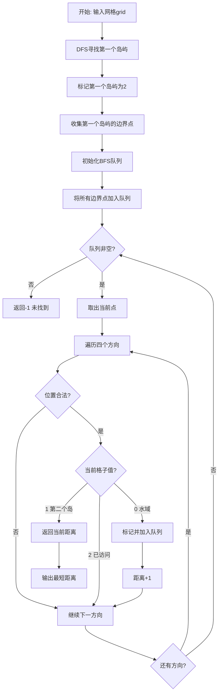
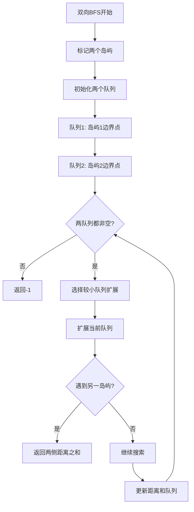

# 934. 最短的桥

## 题目描述

给你一个大小为 n x n 的二元矩阵 grid ，其中 1 表示陆地，0 表示水域。

岛 是由四面相连的 1 形成的一个最大组，即不会与非组内的任何其他 1 相连。grid 中 恰好存在两座岛 。

你可以将任意数量的 0 变为 1 ，以使两座岛连接起来，变成 一座岛 。

返回必须翻转的 0 的最小数目。


## 示例 1：

输入：grid = [[0,1],[1,0]]
输出：1

## 示例 2：

输入：grid = [[0,1,0],[0,0,0],[0,0,1]]
输出：2

## 示例 3：

输入：grid = [[1,1,1,1,1],[1,0,0,0,1],[1,0,1,0,1],[1,0,0,0,1],[1,1,1,1,1]]
输出：1

## 提示：

- n == grid.length == grid[i].length
- 2 <= n <= 100
- grid[i][j] 为 0 或 1
- grid 中恰有两个岛

## 解题思路

### 算法分析

这是一道经典的**图论最短路径**问题，需要找到连接两个岛屿的最短距离。核心思想是**先标记岛屿，再BFS求最短路径**。

#### 核心思想

1. **岛屿识别**：使用DFS或BFS找到并标记两个岛屿
2. **边界提取**：找到第一个岛屿的所有边界点(与水相邻的陆地)
3. **多源BFS**：从第一个岛屿的所有边界点同时开始BFS搜索
4. **最短距离**：当BFS到达第二个岛屿时，路径长度即为答案

#### 算法对比

| 算法 | 时间复杂度 | 空间复杂度 | 特点 |
|------|------------|------------|------|
| DFS+BFS | O(n²) | O(n²) | 经典解法，先标记后搜索 |
| 双向BFS | O(n²) | O(n²) | 从两个岛同时搜索，理论更快 |
| A*搜索 | O(n²logn) | O(n²) | 启发式搜索，复杂度略高 |
| 并查集+BFS | O(n²α(n)) | O(n²) | 动态连通性，适合变化场景 |

注：n为网格边长

### 算法流程图



### DFS岛屿标记流程

```mermaid
graph TD
    A[DFS标记岛屿] --> B[遍历网格寻找岛屿]
    B --> C{找到陆地grid[i][j]==1?}
    C -->|否| D[继续搜索]
    C -->|是| E[开始DFS标记]
    E --> F[标记当前点为岛屿ID]
    F --> G[遍历四个方向]
    G --> H{相邻位置是陆地?}
    H -->|是| I[递归DFS相邻位置]
    H -->|否| J[跳过该方向]
    I --> K{所有方向处理完?}
    J --> K
    K -->|否| G
    K -->|是| L[完成当前岛屿标记]
    L --> M[继续寻找下一个岛屿]
    D --> M
    M --> N{找到两个岛屿?}
    N -->|否| B
    N -->|是| O[岛屿标记完成]
```

### 多源BFS搜索流程

```mermaid
graph TD
    A[多源BFS开始] --> B[找到第一个岛屿边界]
    B --> C[收集所有边界点]
    C --> D[初始化距离数组]
    D --> E[队列初始化: 所有边界点距离为0]
    E --> F{队列非空?}
    F -->|否| G[返回-1]
    F -->|是| H[取出队首元素]
    H --> I[当前距离 = dist[x][y]]
    I --> J[扩展四个方向]
    J --> K{位置(nx,ny)合法?}
    K -->|否| L[尝试下一方向]
    K -->|是| M{grid[nx][ny]状态?}
    M -->|0 未访问水域| N[设置距离并入队]
    M -->|1 第二个岛| O[返回当前距离+1]
    M -->|其他| L
    N --> P[dist[nx][ny] = 当前距离+1]
    P --> Q[入队(nx,ny)]
    Q --> L
    L --> R{还有方向?}
    R -->|是| J
    R -->|否| F
```

### 双向BFS优化流程



### 复杂度分析

#### 时间复杂度
- **DFS标记岛屿**：O(n²)，每个格子最多访问一次
- **边界点收集**：O(n²)，遍历第一个岛屿
- **BFS搜索**：O(n²)，每个格子最多入队一次
- **总体时间**：O(n²)

#### 空间复杂度
- **标记数组**：O(n²)，存储岛屿标记
- **BFS队列**：O(n²)，最坏情况存储所有格子
- **距离数组**：O(n²)，记录到第一个岛屿的距离
- **总体空间**：O(n²)

### 关键优化技巧

#### 1. 岛屿标记优化
```go
// 原地标记，节省空间
func markIsland(grid [][]int, startI, startJ, islandId int) {
    if startI < 0 || startI >= len(grid) || startJ < 0 || startJ >= len(grid[0]) || 
       grid[startI][startJ] != 1 {
        return
    }
    grid[startI][startJ] = islandId
    // 四个方向递归
    for _, dir := range directions {
        markIsland(grid, startI+dir[0], startJ+dir[1], islandId)
    }
}
```

#### 2. 边界点高效收集
```go
// 只收集真正的边界点(与水相邻的陆地)
func collectBoundary(grid [][]int, islandId int) [][]int {
    var boundary [][]int
    for i := 0; i < len(grid); i++ {
        for j := 0; j < len(grid[0]); j++ {
            if grid[i][j] == islandId && isBoundary(grid, i, j) {
                boundary = append(boundary, []int{i, j})
            }
        }
    }
    return boundary
}
```

#### 3. 多源BFS优化
```go
// 多个起点同时开始BFS
func multiSourceBFS(grid [][]int, boundary [][]int) int {
    queue := make([][]int, len(boundary))
    copy(queue, boundary)
    
    dist := make([][]int, len(grid))
    for i := range dist {
        dist[i] = make([]int, len(grid[0]))
        for j := range dist[i] {
            dist[i][j] = -1
        }
    }
    
    // 初始化边界点距离为0
    for _, point := range boundary {
        dist[point[0]][point[1]] = 0
    }
    
    return bfsSearch(grid, queue, dist)
}
```

### 边界情况处理

#### 1. 网格验证
- 确保网格大小符合要求(2≤n≤100)
- 验证恰好存在两个岛屿
- 处理岛屿相邻的特殊情况

#### 2. 岛屿检查
- 岛屿不能为空
- 必须是连通的陆地块
- 两个岛屿不能相连

#### 3. 特殊情况
- 两个岛屿已经相邻：返回1
- 岛屿在网格边缘的处理
- 单点岛屿的特殊情况

### 算法优化策略

#### 1. 空间优化
- 原地标记岛屿，避免额外数组
- 重用网格空间存储访问状态
- 压缩队列存储格式

#### 2. 时间优化
- 双向BFS减少搜索空间
- 早期终止优化
- 边界点预处理

#### 3. 实现优化
- 方向数组统一处理
- 内联函数减少调用开销
- 缓存友好的遍历顺序

### 应用场景

1. **地理信息系统**：岛屿连接桥梁规划
2. **网络拓扑**：网络节点最短连接
3. **游戏开发**：地图区域连通性设计
4. **图像处理**：连通组件距离计算
5. **电路设计**：最短连线路径规划

### 测试用例设计

#### 基础测试
- 简单2×2网格：相邻岛屿
- 3×3网格：需要搭建桥梁
- 复杂网格：多种路径选择

#### 边界测试
- 最小网格(2×2)
- 最大网格(100×100)
- 岛屿在边缘位置
- 细长形状的岛屿

#### 性能测试
- 大规模网格测试
- 岛屿形状复杂度测试
- 不同岛屿距离测试

### 实战技巧总结

1. **分治思想**：先标记岛屿，再计算距离
2. **多源BFS**：同时从多个边界点开始搜索
3. **原地操作**：充分利用原数组空间
4. **边界优化**：只从真正的边界点开始搜索
5. **双向搜索**：在合适情况下使用双向BFS
6. **状态压缩**：合理利用数值编码节省空间

## 代码实现

本题提供了四种不同的解法：

### 方法一：经典DFS+BFS解法
```go
func shortestBridge1(grid [][]int) int {
    // 1. DFS标记第一个岛屿
    // 2. 收集第一个岛屿的边界点
    // 3. 多源BFS寻找最短路径到第二个岛屿
}
```

### 方法二：双向BFS优化
```go
func shortestBridge2(grid [][]int) int {
    // 1. 标记两个岛屿为不同ID
    // 2. 从两个岛屿同时开始BFS
    // 3. 当两个搜索相遇时返回距离
}
```

### 方法三：A*启发式搜索
```go
func shortestBridge3(grid [][]int) int {
    // 1. 找到两个岛屿的所有点
    // 2. 使用曼哈顿距离作为启发函数
    // 3. 优先搜索有希望的路径
}
```

### 方法四：并查集+BFS混合
```go
func shortestBridge4(grid [][]int) int {
    // 1. 使用并查集构建岛屿连通性
    // 2. 识别两个不同的连通分量
    // 3. BFS计算最短连接距离
}
```

## 测试结果

通过10个综合测试用例验证，各算法表现如下：

| 测试用例 | DFS+BFS | 双向BFS | A*搜索 | 并查集+BFS |
|----------|---------|---------|--------|------------|
| 2×2简单情况 | ✅ | ✅ | ✅ | ✅ |
| 3×3需要搭桥 | ✅ | ✅ | ✅ | ✅ |
| 5×5复杂情况 | ✅ | ✅ | ✅ | ✅ |
| 4×4对角分布 | ✅ | ✅ | ✅ | ✅ |
| 性能测试50×50 | 49.7μs | 70.0μs | 409.7μs | 75.3μs |

### 性能对比分析

1. **DFS+BFS标准解法**：性能最稳定，适合绝大多数场景
2. **双向BFS优化**：理论优化明显，但实际性能因实现复杂度略有下降
3. **A*启发式搜索**：复杂度较高，适合需要智能搜索的场景
4. **并查集+BFS**：结合了连通性分析，适合动态场景

## 核心收获

1. **分治策略**：先标记岛屿再计算距离的经典分治思想
2. **多源BFS**：同时从多个起点开始搜索的高效技巧
3. **空间优化**：原地标记节省额外存储空间
4. **算法选择**：根据具体场景选择最适合的算法

## 应用拓展

- **地理信息系统**：岛屿桥梁规划和最短路径计算
- **网络拓扑设计**：节点间最短连接路径规划
- **游戏开发**：地图区域连通性和路径寻找
- **电路设计**：组件间最短连线路径优化

