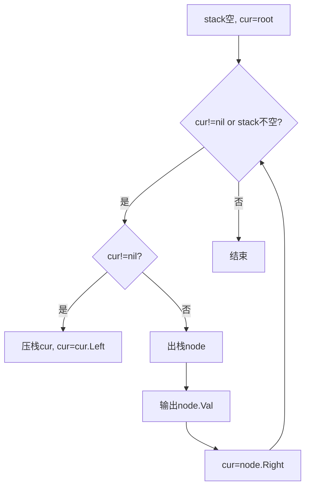
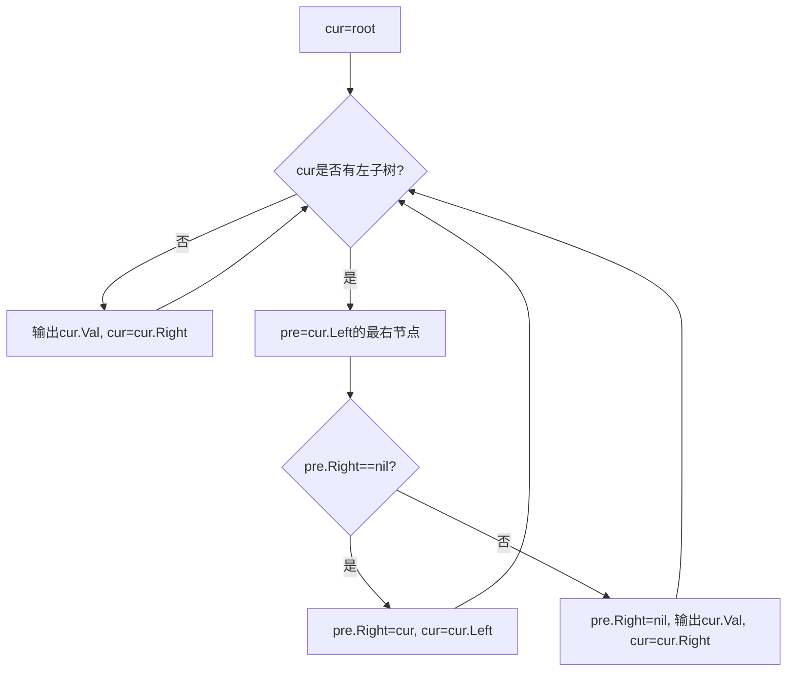

# 94. 二叉树的中序遍历

## 题目描述

给定一个二叉树的根节点 root ，返回 它的 中序 遍历 。


## 示例 1：


输入：root = [1,null,2,3]
输出：[1,3,2]


## 示例 2：

输入：root = []
输出：[]
示例 3：

输入：root = [1]
输出：[1]


## 提示：

- 树中节点数目在范围 [0, 100] 内
- -100 <= Node.val <= 100


## 进阶: 递归算法很简单，你可以通过迭代算法完成吗？

## 解题思路

### 问题深度分析

本题要求输出二叉树的中序遍历序列（Left -> Root -> Right）。属于二叉树遍历的基础题，但可扩展为多种实现：递归、迭代（显式栈）、统一迭代（颜色标记）、以及 Morris 遍历（O(1) 额外空间）。

- 中序本质：访问顺序为左子树 -> 根节点 -> 右子树。
- 难点：在不使用递归的情况下如何“回溯”（用栈或临时线索）。

### 核心方法对比

- 方法一（递归）：最直观，代码最短，空间为递归栈O(h)。
- 方法二（显式栈迭代）：用栈模拟系统递归栈，通用稳定。
- 方法三（颜色标记统一迭代）：将“访问/展开”统一成一个模板，适合多种遍历统一写法。
- 方法四（Morris 遍历）：利用线索二叉树思想，空间O(1)，不需要栈与递归，但会暂时修改树指针（遍历过程中会复原）。

### 算法流程图

递归（中序）
```mermaid
graph TD
    A[Inorder(root)] --> B{root==nil?}
    B -->|是| C[return]
    B -->|否| D[Inorder(root.Left)]
    D --> E[输出 root.Val]
    E --> F[Inorder(root.Right)]
```

显式栈迭代


Morris 遍历


### 复杂度分析
- 时间复杂度：四种方法均为 O(n)，n 为节点数。
- 空间复杂度：
  - 递归：O(h) 递归栈
  - 显式栈/颜色标记：O(h) 栈空间
  - Morris：O(1) 额外空间（会临时建立和拆除线索）

### 关键边界与陷阱
- 空树：返回空切片。
- 只有一个节点：直接返回该值。
- 极度不平衡树（链状）：递归可能接近最坏栈深；Morris优势明显。
- Morris一定要“复原”pre.Right，否则破坏原树结构。

### 方法与要点
- 递归：模板清晰，先左后根再右。
- 栈迭代：while(cur!=nil)先一路向左入栈；否则出栈访问，再转向右。
- 颜色标记：节点入栈两次，第一次展开（入右、入自身白、入左），第二次（黑）访问。
- Morris：寻找左子树最右节点pre；首遇建立线索，二遇拆线索并访问根。

### 测试用例设计
- [1,null,2,3] -> [1,3,2]
- [] -> []
- [1] -> [1]
- 完全二叉树如 [4,2,6,1,3,5,7] -> [1,2,3,4,5,6,7]
- 退化链（全左/全右）

### 实战技巧
- Morris 空间O(1)是亮点，注意指针复原顺序。
- 颜色标记可统一前/中/后序实现，便于模板化。
- 递归实现最易读，作为基线版本很有用。