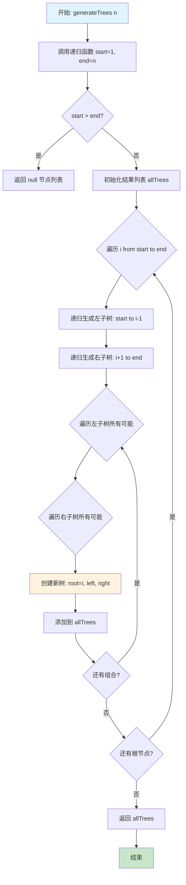
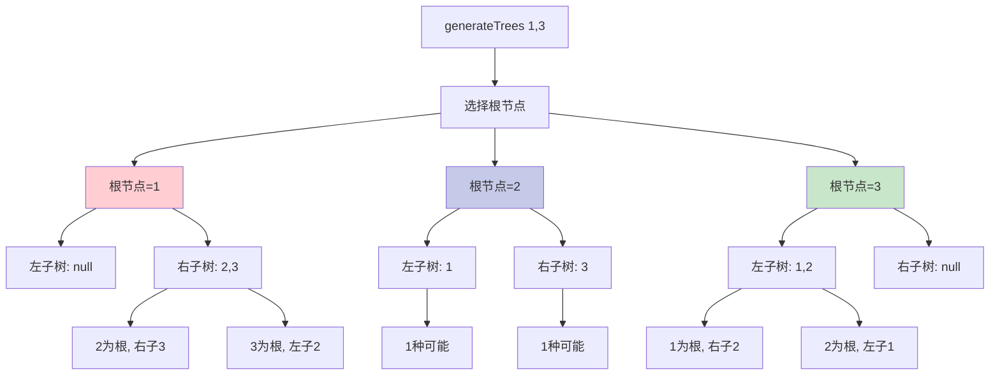
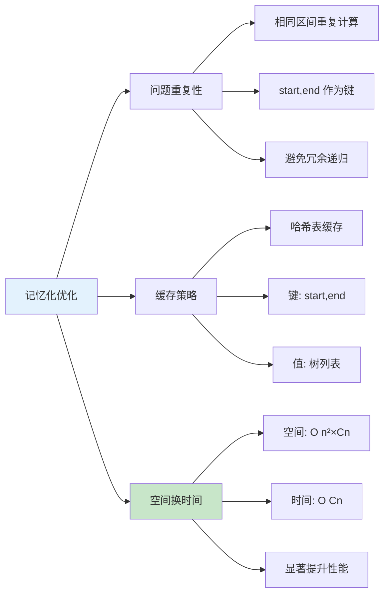
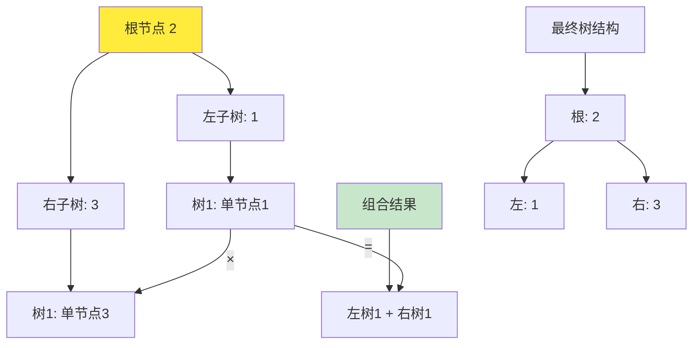
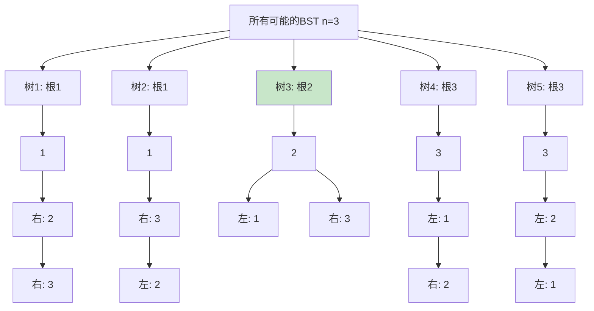

# 95. 不同的二叉搜索树 II

## 题目描述

给你一个整数 n ，请你生成并返回所有由 n 个节点组成且节点值从 1 到 n 互不相同的不同 二叉搜索树 。可以按 任意顺序 返回答案。


## 示例 1：


输入：n = 3
输出：[[1,null,2,null,3],[1,null,3,2],[2,1,3],[3,1,null,null,2],[3,2,null,1]]

## 示例 2：

输入：n = 1
输出：[[1]]


## 提示：

- 1 <= n <= 8

## 解题思路

### 问题分析

这是一道经典的**递归构造二叉搜索树(BST)**问题。与第96题只需要计算数量不同，这道题要求返回所有可能的BST结构。

### 核心思想

利用**分治递归**的思想：
- **选择根节点**：从1到n，每个数字都可以作为根节点
- **递归构造**：以i为根，左子树包含[1...i-1]，右子树包含[i+1...n]
- **笛卡尔积**：左子树的所有可能 × 右子树的所有可能
- **记忆化优化**：缓存已计算的区间结果

### BST性质回顾

**二叉搜索树(Binary Search Tree)**的性质：
1. 左子树所有节点的值 < 根节点的值
2. 右子树所有节点的值 > 根节点的值
3. 左右子树也都是二叉搜索树

### 算法流程图



### 递归构造详解



### 记忆化优化策略



### 复杂度分析对比

```mermaid
graph TD
    A[算法复杂度对比] --> B[递归分治]
    A --> C[记忆化递归]
    A --> D[动态规划]
    A --> E[回溯枚举]
    
    B --> B1[时间: O Cn ×n]
    B --> B2[空间: O Cn]
    B --> B3[最直观]
    
    C --> C1[时间: O Cn]
    C --> C2[空间: O n²×Cn]
    C --> C3[最优解法]
    
    D --> D1[时间: O Cn ×n]
    D --> D2[空间: O n²×Cn]
    D --> D3[自底向上]
    
    E --> E1[时间: O Cn ×n²]
    E --> E2[空间: O Cn]
    E → E3[会超时]
    
    style C fill:#4caf50
    style E fill:#f44336
    
    subgraph "说明"
        F[Cn = 第n个卡塔兰数]
        G[Cn = 2n!/n+1!×n!]
        H[C1=1, C2=2, C3=5]
        I[C8=1430]
    end
```

### 笛卡尔积组合图解

以n=3为例，选择根节点2：



### 实际构造示例 (n=3)



## 算法实现要点

1. **递归终止条件**：start > end时返回包含null的列表
2. **根节点选择**：遍历start到end，每个值都可作为根
3. **子树构造**：递归生成左右子树的所有可能
4. **笛卡尔积组合**：嵌套循环组合左右子树
5. **节点克隆**：每次创建新的树节点，避免引用问题
6. **记忆化优化**：使用哈希表缓存区间结果
7. **边界处理**：空树、单节点树的特殊情况

## 相关题目

- LeetCode 96. 不同的二叉搜索树（只计算数量）
- LeetCode 108. 将有序数组转换为二叉搜索树
- LeetCode 109. 有序链表转换二叉搜索树
- LeetCode 894. 所有可能的满二叉树
- 卡塔兰数相关问题
