# 97. 交错字符串

## 题目描述

给定三个字符串 s1、s2、s3，请你帮忙验证 s3 是否是由 s1 和 s2 交错 组成的。

两个字符串 s 和 t 交错 的定义与过程如下，其中每个字符串都会被分割成若干 非空 子字符串：

s = s1 + s2 + ... + sn
t = t1 + t2 + ... + tm
|n - m| <= 1
交错 是 s1 + t1 + s2 + t2 + s3 + t3 + ... 或者 t1 + s1 + t2 + s2 + t3 + s3 + ...
注意：a + b 意味着字符串 a 和 b 连接。


## 示例 1：


输入：s1 = "aabcc", s2 = "dbbca", s3 = "aadbbcbcac"
输出：true


## 示例 2：

输入：s1 = "aabcc", s2 = "dbbca", s3 = "aadbbbaccc"
输出：false


## 示例 3：

输入：s1 = "", s2 = "", s3 = ""
输出：true


## 提示：

- 0 <= s1.length, s2.length <= 100
- 0 <= s3.length <= 200
- s1、s2、和 s3 都由小写英文字母组成
 

## 进阶：您能否仅使用 O(s2.length) 额外的内存空间来解决它?

## 解题思路

### 核心思想

交错字符串问题本质上是判断 **s3 能否由 s1 和 s2 通过某种交错方式组合而成**。关键点在于：

1. **长度验证**：如果 `len(s1) + len(s2) ≠ len(s3)`，直接返回 false
2. **字符匹配**：s3 的每个字符必须来自 s1 或 s2，且保持各自的相对顺序
3. **路径选择**：对于 s3 的每个位置，我们要决定该字符是从 s1 还是 s2 取来的

这是一个典型的**动态规划**问题，也可以用**DFS/BFS**搜索求解。

---

## 算法实现

### 方法一：二维动态规划（经典解法）

#### 算法思路

定义 `dp[i][j]` 表示 **s1 的前 i 个字符** 和 **s2 的前 j 个字符** 能否交错组成 **s3 的前 i+j 个字符**。

**状态转移方程**：

```
dp[i][j] = (dp[i-1][j] && s1[i-1] == s3[i+j-1]) ||  // 从 s1 取字符
           (dp[i][j-1] && s2[j-1] == s3[i+j-1])     // 从 s2 取字符
```

**初始化**：
- `dp[0][0] = true`（空字符串匹配）
- `dp[i][0]`：只用 s1 的前 i 个字符匹配 s3 的前 i 个字符
- `dp[0][j]`：只用 s2 的前 j 个字符匹配 s3 的前 j 个字符

#### 可视化流程

```mermaid
graph TD
    A[开始] --> B{长度验证}
    B -->|len不匹配| C[返回 false]
    B -->|len匹配| D[初始化 dp数组]
    D --> E[dp&#91;0&#93;&#91;0&#93; = true]
    E --> F[初始化第一行 dp&#91;0&#93;&#91;j&#93;]
    F --> G[初始化第一列 dp&#91;i&#93;&#91;0&#93;]
    G --> H[双层循环遍历]
    H --> I{s1&#91;i-1&#93; == s3&#91;i+j-1&#93;?}
    I -->|是| J[dp&#91;i&#93;&#91;j&#93; |= dp&#91;i-1&#93;&#91;j&#93;]
    I -->|否| K{s2&#91;j-1&#93; == s3&#91;i+j-1&#93;?}
    K -->|是| L[dp&#91;i&#93;&#91;j&#93; |= dp&#91;i&#93;&#91;j-1&#93;]
    K -->|否| M[dp&#91;i&#93;&#91;j&#93; = false]
    J --> N{遍历完成?}
    L --> N
    M --> N
    N -->|否| H
    N -->|是| O[返回 dp&#91;len1&#93;&#91;len2&#93;]
    O --> P[结束]
    
    style A fill:#e1f5ff
    style P fill:#e1f5ff
    style C fill:#ffe1e1
    style O fill:#e1ffe1
```

#### 状态转移详解

```mermaid
graph LR
    A["dp&#91;i-1&#93;&#91;j&#93;<br/>（从上方来）"] -->|s1&#91;i-1&#93;==s3&#91;i+j-1&#93;| C["dp&#91;i&#93;&#91;j&#93;<br/>（当前状态）"]
    B["dp&#91;i&#93;&#91;j-1&#93;<br/>（从左方来）"] -->|s2&#91;j-1&#93;==s3&#91;i+j-1&#93;| C
    
    style A fill:#fff4e1
    style B fill:#fff4e1
    style C fill:#e1ffe1
```



**含义解释**：
- **从上方来**：使用 s1 的第 i 个字符
- **从左方来**：使用 s2 的第 j 个字符
- **当前状态**：只要有一条路径可达，dp[i][j] 就为 true

---

### 方法二：一维动态规划（空间优化）

#### 算法思路

观察到 dp[i][j] 只依赖于 **dp[i-1][j]**（上一行）和 **dp[i][j-1]**（当前行左侧），因此可以**滚动数组**优化空间。

**优化策略**：
- 只保留一维数组 `dp[j]`，表示当前行的状态
- 从左到右更新，`dp[j]` 本身保留了上一行的值（相当于 dp[i-1][j]）
- `dp[j-1]` 是当前行左侧的值（相当于 dp[i][j-1]）

#### 空间优化流程

```mermaid
graph TD
    A[二维 dp 数组<br/>dp&#91;i&#93;&#91;j&#93;] --> B{依赖关系分析}
    B --> C[dp&#91;i&#93;&#91;j&#93; 依赖 dp&#91;i-1&#93;&#91;j&#93;<br/>上一行同列]
    B --> D[dp&#91;i&#93;&#91;j&#93; 依赖 dp&#91;i&#93;&#91;j-1&#93;<br/>当前行前一列]
    C --> E[滚动数组优化]
    D --> E
    E --> F[一维 dp 数组<br/>dp&#91;j&#93;]
    F --> G[更新前: dp&#91;j&#93; = 旧 dp&#91;i-1&#93;&#91;j&#93;]
    F --> H[更新后: dp&#91;j&#93; = 新 dp&#91;i&#93;&#91;j&#93;]
    G --> I[空间复杂度: O&#40;n&#41;]
    H --> I
    
    style A fill:#ffe1e1
    style F fill:#e1ffe1
    style I fill:#e1f5ff
```



---

### 方法三：记忆化递归（DFS + Memo）

#### 算法思路

递归定义：`dfs(i, j)` 表示 s1[i:] 和 s2[j:] 能否交错组成 s3[i+j:]

**递归终止条件**：
- 如果 `i + j == len(s3)`，返回 true（匹配完成）
- 如果状态已计算过，直接返回缓存结果

**递归逻辑**：
```
dfs(i, j) = (s1[i] == s3[i+j] && dfs(i+1, j)) ||
            (s2[j] == s3[i+j] && dfs(i, j+1))
```

#### 递归搜索树

```mermaid
graph TD
    A["dfs&#40;0, 0&#41;<br/>匹配 s3&#91;0&#93;"] --> B["s1&#91;0&#93; == s3&#91;0&#93;?"]
    A --> C["s2&#91;0&#93; == s3&#91;0&#93;?"]
    
    B -->|是| D["dfs&#40;1, 0&#41;<br/>匹配 s3&#91;1&#93;"]
    C -->|是| E["dfs&#40;0, 1&#41;<br/>匹配 s3&#91;1&#93;"]
    
    D --> F["继续递归..."]
    E --> G["继续递归..."]
    
    F --> H["i+j == len&#40;s3&#41;"]
    G --> H
    
    H -->|是| I[返回 true]
    H -->|否| J[继续搜索]
    
    style A fill:#e1f5ff
    style I fill:#e1ffe1
    style J fill:#fff4e1
```



**记忆化优化**：使用哈希表或二维数组缓存 `(i, j)` 的计算结果，避免重复计算。

---

### 方法四：BFS 搜索

#### 算法思路

将问题建模为**图搜索**：
- **状态**：(i, j) 表示 s1 已用 i 个字符，s2 已用 j 个字符
- **目标**：到达状态 (len(s1), len(s2))
- **转移**：如果 s1[i] 匹配 s3[i+j]，则 (i,j) → (i+1,j)；如果 s2[j] 匹配，则 (i,j) → (i,j+1)

使用 **BFS + 访问标记** 避免重复访问。

#### BFS 搜索流程

```mermaid
graph TD
    A[初始化队列] --> B[队列加入 &#40;0, 0&#41;]
    B --> C[初始化 visited 集合]
    C --> D{队列非空?}
    D -->|否| E[返回 false]
    D -->|是| F[队列弹出 &#40;i, j&#41;]
    F --> G{i+j == len&#40;s3&#41;?}
    G -->|是| H[返回 true]
    G -->|否| I{s1&#91;i&#93; == s3&#91;i+j&#93;?}
    I -->|是| J{&#40;i+1, j&#41; 未访问?}
    J -->|是| K[队列加入 &#40;i+1, j&#41;]
    J -->|否| L{s2&#91;j&#93; == s3&#91;i+j&#93;?}
    I -->|否| L
    K --> L
    L -->|是| M{&#40;i, j+1&#41; 未访问?}
    M -->|是| N[队列加入 &#40;i, j+1&#41;]
    M -->|否| D
    L -->|否| D
    N --> D
    
    style A fill:#e1f5ff
    style H fill:#e1ffe1
    style E fill:#ffe1e1
```



---

### 方法五：DFS 回溯（暴力搜索）

#### 算法思路

纯粹的递归回溯，不使用记忆化（时间复杂度较高）。

**搜索逻辑**：
1. 对于 s3 的每个位置，尝试从 s1 或 s2 匹配
2. 匹配成功则递归下一个位置
3. 如果某条路径失败，回溯尝试另一条路径

#### 复杂度对比

```mermaid
graph LR
    A[二维 DP] --> B[时间: O&#40;m×n&#41;<br/>空间: O&#40;m×n&#41;]
    C[一维 DP] --> D[时间: O&#40;m×n&#41;<br/>空间: O&#40;n&#41;]
    E[记忆化递归] --> F[时间: O&#40;m×n&#41;<br/>空间: O&#40;m×n&#41;]
    G[BFS 搜索] --> H[时间: O&#40;m×n&#41;<br/>空间: O&#40;m×n&#41;]
    I[DFS 回溯] --> J[时间: O&#40;2^&#40;m+n&#41;&#41;<br/>空间: O&#40;m+n&#41;]
    
    style B fill:#e1ffe1
    style D fill:#e1ffe1
    style F fill:#fff4e1
    style H fill:#fff4e1
    style J fill:#ffe1e1
```



**推荐方案**：
- **最优解**：一维 DP（时间优，空间优）
- **易理解**：二维 DP（状态清晰）
- **递归风格**：记忆化递归（代码简洁）

---

## 算法示例

### 示例 1 演示

**输入**：s1 = "aabcc", s2 = "dbbca", s3 = "aadbbcbcac"

#### DP 表构建过程

|     | ε   | d   | db  | dbb | dbbc | dbbca |
|-----|-----|-----|-----|-----|------|-------|
| ε   | T   | T   | F   | F   | F    | F     |
| a   | T   | T   | T   | T   | T    | F     |
| aa  | T   | F   | T   | F   | T    | T     |
| aab | F   | T   | T   | T   | T    | T     |
| aabc| F   | F   | T   | T   | T    | T     |
|aabcc| F   | F   | F   | T   | F    | **T** |

**路径追踪**：
```
(0,0) → (1,0) → (2,0) → (2,1) → (2,2) → (3,2) → (4,2) → (4,3) → (5,3) → (5,4) → (5,5)
  a  →   a   →  (d)  →  (b) →  (b) →  b   →   c  →  (c) →  c   →  (a) → ✓
```

括号表示从 s2 取字符，其余从 s1 取。

#### 状态转移可视化

```mermaid
graph LR
    A["&#40;0,0&#41;<br/>T"] --> B["&#40;1,0&#41;<br/>a→T"]
    B --> C["&#40;2,0&#41;<br/>a→T"]
    C --> D["&#40;2,1&#41;<br/>d→T"]
    D --> E["&#40;2,2&#41;<br/>b→T"]
    E --> F["&#40;3,2&#41;<br/>b→T"]
    F --> G["&#40;4,2&#41;<br/>c→T"]
    G --> H["&#40;4,3&#41;<br/>b→T"]
    H --> I["&#40;5,3&#41;<br/>c→T"]
    I --> J["&#40;5,4&#41;<br/>c→T"]
    J --> K["&#40;5,5&#41;<br/>a→T"]
    
    style A fill:#e1f5ff
    style K fill:#e1ffe1
```



---

## 复杂度分析

| 方法         | 时间复杂度      | 空间复杂度    | 特点                     |
|--------------|-----------------|---------------|--------------------------|
| 二维 DP      | O(m × n)        | O(m × n)      | 经典解法，易理解         |
| 一维 DP      | O(m × n)        | O(n)          | **最优空间**，符合进阶要求 |
| 记忆化递归   | O(m × n)        | O(m × n)      | 代码简洁，递归风格       |
| BFS 搜索     | O(m × n)        | O(m × n)      | 图搜索思路，直观         |
| DFS 回溯     | O(2^(m+n))      | O(m + n)      | 暴力搜索，不推荐         |

**m = len(s1), n = len(s2)**

---

## 关键点总结

### 1. 状态定义
- **DP 状态**：`dp[i][j]` 表示 s1[0:i] 和 s2[0:j] 能否交错组成 s3[0:i+j]
- **递归状态**：`dfs(i, j)` 表示 s1[i:] 和 s2[j:] 能否交错组成 s3[i+j:]

### 2. 边界处理
- **长度验证**：`len(s1) + len(s2) == len(s3)`
- **空字符串**：`dp[0][0] = true`
- **单串匹配**：初始化第一行和第一列

### 3. 优化技巧
- **滚动数组**：将二维 DP 降为一维，空间 O(n)
- **记忆化**：避免递归重复计算
- **剪枝**：长度不匹配时提前返回

### 4. 易错点
- ❌ 忘记检查长度
- ❌ DP 数组边界越界
- ❌ 递归忘记记忆化导致超时
- ❌ BFS 忘记标记访问导致死循环

---

## 测试用例设计

```go
测试用例 1：基本交错
输入：s1 = "aabcc", s2 = "dbbca", s3 = "aadbbcbcac"
输出：true

测试用例 2：无法交错
输入：s1 = "aabcc", s2 = "dbbca", s3 = "aadbbbaccc"
输出：false

测试用例 3：空字符串
输入：s1 = "", s2 = "", s3 = ""
输出：true

测试用例 4：一个为空
输入：s1 = "abc", s2 = "", s3 = "abc"
输出：true

测试用例 5：长度不匹配
输入：s1 = "ab", s2 = "cd", s3 = "abcdef"
输出：false

测试用例 6：重复字符
输入：s1 = "aaa", s2 = "aaa", s3 = "aaaaaa"
输出：true

测试用例 7：复杂交错
输入：s1 = "bbbbbabbbbabaababaaaabbababbaaabbabbaaabaaaaababbbababbbbbabbbbababbabaabababbbaabababababbbaaababaa"
      s2 = "babaaaabbababbbabbbbaabaabbaabbbbaabaaabaababaaaabaaabbaaabaaaabaabaabbbbbbbbbbbabaaabbababbabbabaab"
      s3 = "babbbabbbaaabbababbbbababaabbabaabaaabbbbabbbaaabbbaaaaabbbbaabbaaabababbaaaaaabababbababaababbababbbababbbbaaaabaabbabbaaaaabbabbaaaabbbaabaaabaababaababbaaabbbbbabbbbaabbabaabbbbabaaabbababbabbabbab"
输出：true
```
