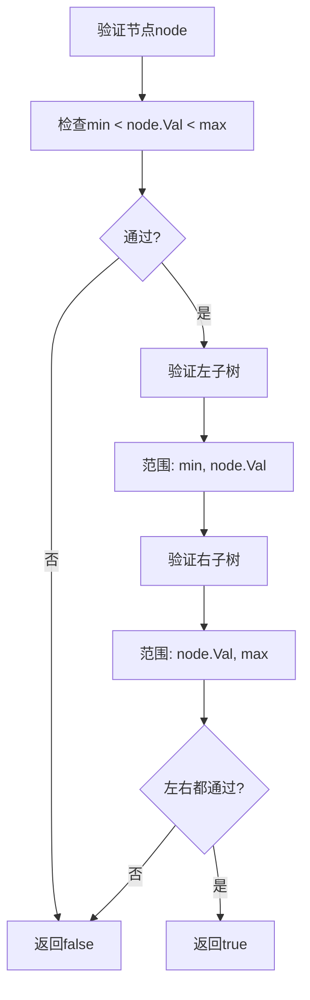

# 98. 验证二叉搜索树

## 题目描述

给你一个二叉树的根节点 root ，判断其是否是一个有效的二叉搜索树。

有效 二叉搜索树定义如下：

节点的左子树只包含 严格小于 当前节点的数。
节点的右子树只包含 严格大于 当前节点的数。
所有左子树和右子树自身必须也是二叉搜索树。


## 示例 1：


输入：root = [2,1,3]
输出：true


## 示例 2：


输入：root = [5,1,4,null,null,3,6]
输出：false
解释：根节点的值是 5 ，但是右子节点的值是 4 。


## 提示：

- 树中节点数目范围在[1, 10^4] 内
- -2^31 <= Node.val <= 2^31 - 1

## 解题思路

### 问题深度分析

这是经典的**二叉树验证**问题，也是**BST性质**的典型应用。核心在于**验证BST的三个约束条件**：左子树严格小于根节点，右子树严格大于根节点，且左右子树本身也是BST。

#### 问题本质

给定一个二叉树，判断它是否满足BST的定义。这是一个**树遍历**问题，需要验证每个节点都满足BST的性质。

#### 核心思想

**BST的性质验证**：
1. **上下界约束**：每个节点必须在合理的上下界范围内
2. **递归验证**：左右子树必须也是BST
3. **中序递增性**：BST的中序遍历结果必须是严格递增的
4. **严格性**：左子树**严格小于**，右子树**严格大于**（不能等于）

**关键技巧**：
- 使用递归传递上下界（min, max）
- 利用中序遍历的递增性质
- 处理整数边界问题（使用指针或特殊值）
- 注意严格性的要求（< 和 >，不是 <= 和 >=）

#### 关键难点分析

**难点1：上下界的传递**
- 需要为每个节点维护合理的上下界
- 左子树的上界是父节点值，下界继承父节点
- 右子树的下界是父节点值，上界继承父节点
- 需要处理整数边界（-2^31 到 2^31-1）

**难点2：严格性的要求**
- 左子树必须**严格小于**父节点（<）
- 右子树必须**严格大于**父节点（>）
- 不能使用 <= 或 >=，否则会错误接受重复值

**难点3：中序遍历的递增性**
- BST的中序遍历必须是严格递增的
- 需要记录前一个访问的节点值
- 需要处理边界情况（第一个节点）

#### 典型情况分析

**情况1：有效BST**
```
     2
    / \
   1   3
```
- 节点2：范围(-∞, +∞)，值2在范围内 ✓
- 节点1：范围(-∞, 2)，值1 < 2 ✓
- 节点3：范围(2, +∞)，值3 > 2 ✓
结果：true

**情况2：无效BST（右子树小于根）**
```
     5
    / \
   1   4
      / \
     3   6
```
- 节点5：范围(-∞, +∞)，值5在范围内 ✓
- 节点1：范围(-∞, 5)，值1 < 5 ✓
- 节点4：范围(5, +∞)，值4 < 5 ✗（违反BST性质）
结果：false

**情况3：无效BST（左子树大于根）**
```
     5
    / \
   6   7
```
- 节点5：范围(-∞, +∞)，值5在范围内 ✓
- 节点6：范围(-∞, 5)，值6 > 5 ✗（违反BST性质）
结果：false

**情况4：无效BST（重复值）**
```
     2
    / \
   2   3
```
- 节点2：范围(-∞, +∞)，值2在范围内 ✓
- 左节点2：范围(-∞, 2)，值2 < 2 ✗（违反严格性）
结果：false

#### 算法对比

| 算法         | 时间复杂度 | 空间复杂度 | 特点                   |
| ------------ | ---------- | ---------- | ---------------------- |
| 递归上下界   | O(n)       | O(h)       | **最优解法**，直观易懂 |
| 中序遍历递归 | O(n)       | O(h)       | 利用BST性质，经典方法  |
| 中序遍历迭代 | O(n)       | O(n)       | 避免递归栈溢出         |
| Morris遍历   | O(n)       | O(1)       | 空间最优，但会修改树   |

注：n为节点数，h为树高度

### 算法流程图

#### 主算法流程（递归上下界）

```mermaid
graph TD
    A[isValidBST(root)] --> B{root==nil?}
    B -->|是| C[return true]
    B -->|否| D[检查root.Val是否在范围内]
    D --> E{min < root.Val < max?}
    E -->|否| F[return false]
    E -->|是| G[递归验证左子树]
    G --> H[递归验证右子树]
    H --> I{左右子树都有效?}
    I -->|是| J[return true]
    I -->|否| F
```

#### 上下界传递流程



#### 中序遍历验证流程

```mermaid
graph TD
    A[inorder(root)] --> B{root==nil?}
    B -->|是| C[return]
    B -->|否| D[inorder(root.Left)]
    D --> E{prev != nil?}
    E -->|是| F{prev.Val < root.Val?}
    F -->|否| G[标记无效]
    F -->|是| H[更新prev]
    E -->|否| H
    H --> I[inorder(root.Right)]
    I --> J[继续遍历]
    G --> J
```

### 复杂度分析

#### 时间复杂度详解

**递归上下界算法**：O(n)
- 每个节点最多被访问一次
- 每次访问进行常数时间检查
- 总时间：O(n)

**中序遍历算法**：O(n)
- 需要遍历所有节点
- 每次访问检查与前一个节点的关系
- 总时间：O(n)

#### 空间复杂度详解

**递归上下界算法**：O(h)
- 递归调用栈深度为树高度
- 最坏情况（链状树）：O(n)
- 最好情况（平衡树）：O(log n)

**中序遍历迭代算法**：O(n)
- 需要显式栈存储节点
- 最坏情况栈大小为n
- 总空间：O(n)

**Morris遍历算法**：O(1)
- 只使用常数额外空间
- 通过修改树指针实现遍历
- 总空间：O(1)

### 关键优化技巧

#### 技巧1：递归上下界验证（最优解法）

```go
func isValidBST(root *TreeNode) bool {
    return isValidBSTHelper(root, nil, nil)
}

func isValidBSTHelper(node *TreeNode, min, max *int) bool {
    if node == nil {
        return true
    }
    
    // 检查当前节点值是否在范围内
    if min != nil && node.Val <= *min {
        return false
    }
    if max != nil && node.Val >= *max {
        return false
    }
    
    // 递归验证左右子树
    // 左子树：上界更新为当前节点值
    // 右子树：下界更新为当前节点值
    return isValidBSTHelper(node.Left, min, &node.Val) &&
           isValidBSTHelper(node.Right, &node.Val, max)
}
```

**优势**：
- 时间复杂度：O(n)
- 空间复杂度：O(h)
- 逻辑清晰，易于理解
- 使用指针避免整数边界问题

#### 技巧2：中序遍历递归验证

```go
var prev *int

func isValidBST(root *TreeNode) bool {
    prev = nil
    return inorder(root)
}

func inorder(root *TreeNode) bool {
    if root == nil {
        return true
    }
    
    // 验证左子树
    if !inorder(root.Left) {
        return false
    }
    
    // 检查当前节点
    if prev != nil && root.Val <= *prev {
        return false
    }
    prev = &root.Val
    
    // 验证右子树
    return inorder(root.Right)
}
```

**特点**：利用BST中序遍历递增的性质，代码简洁

#### 技巧3：中序遍历迭代验证

```go
func isValidBST(root *TreeNode) bool {
    stack := []*TreeNode{}
    cur := root
    var prev *int
    
    for cur != nil || len(stack) > 0 {
        // 一路向左
        for cur != nil {
            stack = append(stack, cur)
            cur = cur.Left
        }
        
        // 访问节点
        n := len(stack) - 1
        node := stack[n]
        stack = stack[:n]
        
        // 检查递增性
        if prev != nil && node.Val <= *prev {
            return false
        }
        prev = &node.Val
        
        // 转向右子树
        cur = node.Right
    }
    
    return true
}
```

**特点**：避免递归，适合深度很大的树

#### 技巧4：Morris遍历验证

```go
func isValidBST(root *TreeNode) bool {
    cur := root
    var prev *int
    
    for cur != nil {
        if cur.Left == nil {
            // 访问当前节点
            if prev != nil && cur.Val <= *prev {
                return false
            }
            prev = &cur.Val
            cur = cur.Right
        } else {
            // 寻找前驱节点
            pre := cur.Left
            for pre.Right != nil && pre.Right != cur {
                pre = pre.Right
            }
            
            if pre.Right == nil {
                // 建立线索
                pre.Right = cur
                cur = cur.Left
            } else {
                // 拆除线索并访问
                pre.Right = nil
                if prev != nil && cur.Val <= *prev {
                    return false
                }
                prev = &cur.Val
                cur = cur.Right
            }
        }
    }
    
    return true
}
```

**特点**：空间复杂度O(1)，但会临时修改树结构

### 边界条件处理

#### 边界情况1：空树
- **处理**：空树不是有效的BST（根据题目约束，节点数>=1）
- **但为安全考虑**：可以返回true或false，根据题目要求

#### 边界情况2：单节点树
- **处理**：单个节点总是有效的BST
- **验证**：值在(-∞, +∞)范围内 ✓

#### 边界情况3：整数边界
- **处理**：使用指针(*int)而不是int值传递边界
- **原因**：需要区分"无边界"和"边界值为-2^31或2^31-1"
- **替代方案**：使用特殊值或更大的数据类型

#### 边界情况4：重复值
- **处理**：严格检查 < 和 >，不允许 <= 和 >=
- **示例**：如果左子节点值等于父节点，应该返回false

#### 边界情况5：极端不平衡树
- **处理**：递归方法可能栈溢出（但题目约束节点数<=10^4，通常不会）
- **优化**：使用迭代方法避免栈溢出

### 测试用例设计

#### 基础测试用例

1. **有效BST**：`[2,1,3]` → `true`
2. **无效BST（右子树小于根）**：`[5,1,4,null,null,3,6]` → `false`
3. **空树**：`[]` → `true`（或根据题目要求）
4. **单节点**：`[1]` → `true`

#### 进阶测试用例

5. **重复值**：`[2,2,3]` → `false`
6. **左子树大于根**：`[5,6,7]` → `false`
7. **完全BST**：`[4,2,6,1,3,5,7]` → `true`
8. **链状BST**：`[1,null,2,null,null,null,3]` → `true`
9. **边界值**：包含`-2^31`和`2^31-1`的BST
10. **深度不平衡**：极端左偏或右偏的BST

### 常见错误和陷阱

#### 错误1：使用 <= 和 >= 而不是 < 和 >
```go
// 错误写法
if node.Val <= min || node.Val >= max {
    return false
}

// 正确写法
if node.Val < min || node.Val > max {
    return false
}
```
**原因**：BST要求严格小于和严格大于

#### 错误2：整数边界处理不当
```go
// 错误写法：使用int传递边界
func isValidBSTHelper(node *TreeNode, min, max int) bool {
    // 无法区分"无边界"和"边界值为0"
}

// 正确写法：使用指针
func isValidBSTHelper(node *TreeNode, min, max *int) bool {
    // 可以区分nil（无边界）和具体值
}
```

#### 错误3：中序遍历时忘记更新prev
```go
// 错误写法
if prev != nil && root.Val <= *prev {
    return false
}
// 忘记更新prev

// 正确写法
if prev != nil && root.Val <= *prev {
    return false
}
prev = &root.Val  // 必须更新
```

#### 错误4：Morris遍历后未恢复树结构
- **问题**：Morris遍历会修改树指针，但遍历过程中会恢复
- **注意**：如果在遍历中断，需要手动恢复

### 实用技巧

1. **优先使用递归上下界方法**：逻辑清晰，易于理解和调试
2. **处理整数边界**：使用指针或更大的数据类型（如int64）
3. **注意严格性**：牢记BST的严格小于/大于要求
4. **中序遍历方法**：适合需要同时验证多个BST性质的情况
5. **迭代方法**：适合深度很大的树，避免栈溢出
6. **Morris遍历**：适合空间受限的场景

### 进阶扩展

#### 扩展1：验证BST并返回错误信息
- 不仅返回true/false，还返回具体的错误节点和原因

#### 扩展2：修复无效BST
- 将无效BST转换为有效BST（可能需要重建树）

#### 扩展3：验证BST的多种定义
- 有些定义允许相等值，有些不允许
- 需要根据具体定义调整验证逻辑

#### 扩展4：并行验证
- 对于大型树，可以使用并行算法加速验证

### 应用场景

1. **数据库索引验证**：验证B树/B+树索引是否有效
2. **数据结构验证**：验证树结构是否符合BST定义
3. **算法正确性检查**：验证BST构建算法的正确性
4. **代码审查**：检查BST相关代码的实现
5. **树结构修复**：在修复无效BST前先验证

### 总结

验证BST是一个经典的树遍历问题，核心在于：
1. **理解BST的定义**：左子树严格小于，右子树严格大于
2. **选择合适的方法**：递归上下界最直观，中序遍历利用性质
3. **注意边界条件**：整数边界、空树、重复值
4. **严格性要求**：必须使用 < 和 >，不能使用 <= 和 >=

通过系统学习和练习，可以熟练掌握BST验证的各种方法！