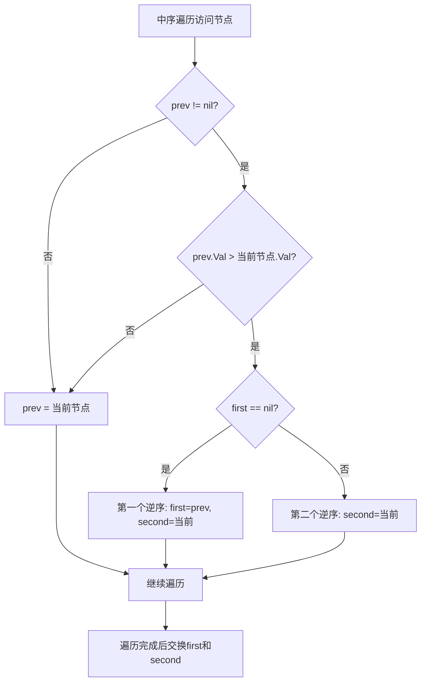
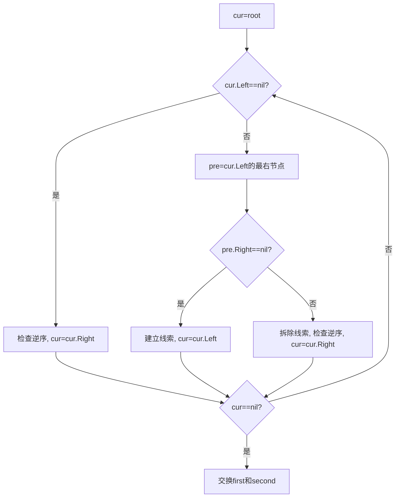

# 99. 恢复二叉搜索树

## 题目描述

给你二叉搜索树的根节点 root ，该树中的 恰好 两个节点的值被错误地交换。请在不改变其结构的情况下，恢复这棵树 。


## 示例 1：


输入：root = [1,3,null,null,2]
输出：[3,1,null,null,2]
解释：3 不能是 1 的左孩子，因为 3 > 1 。交换 1 和 3 使二叉搜索树有效。


## 示例 2：


输入：root = [3,1,4,null,null,2]
输出：[2,1,4,null,null,3]
解释：2 不能在 3 的右子树中，因为 2 < 3 。交换 2 和 3 使二叉搜索树有效。


## 提示：

- 树上节点的数目在范围 [2, 1000] 内
- -2^31 <= Node.val <= 2^31 - 1


## 进阶：使用 O(n) 空间复杂度的解法很容易实现。你能想出一个只使用 O(1) 空间的解决方案吗？


## 解题思路

### 问题深度分析

这是经典的**BST修复**问题，也是**中序遍历**的典型应用。核心在于**利用BST中序遍历严格递增的性质**，找出违反递增关系的两个节点并交换它们的值。

#### 问题本质

给定一个BST，其中恰好两个节点的值被错误交换，需要在不改变树结构的情况下恢复BST。这是一个**树遍历 + 错误检测**问题，需要找到两个错误节点并交换它们的值。

#### 核心思想

**BST中序遍历的递增性**：
1. **中序遍历BST**：得到严格递增的序列
2. **错误检测**：找出违反递增关系的节点对
3. **错误分类**：
   - **情况1（相邻交换）**：中序遍历中只有一个逆序对，如 `[1,3,2,4]` → 交换3和2
   - **情况2（非相邻交换）**：中序遍历中有两个逆序对，如 `[1,5,3,4,2,6]` → 交换5和2
4. **节点交换**：交换找到的两个错误节点的值

**关键技巧**：
- 利用中序遍历严格递增的性质
- 记录前一个访问的节点，检测逆序对
- 分类处理相邻和非相邻交换的情况
- 使用Morris遍历实现O(1)空间复杂度

#### 关键难点分析

**难点1：错误节点的识别**
- 需要准确识别两个错误交换的节点
- 相邻交换：只有一个逆序对，两个节点都需要交换
- 非相邻交换：有两个逆序对，第一个逆序对的前一个节点和第二个逆序对的后一个节点需要交换

**难点2：逆序对的判断**
- 中序遍历中，如果前一个节点值 > 当前节点值，说明存在逆序
- 第一个逆序对：记录前一个节点为first错误节点
- 第二个逆序对：记录当前节点为second错误节点

**难点3：O(1)空间实现**
- 传统中序遍历需要O(n)或O(h)空间
- Morris遍历可以在O(1)空间内完成中序遍历
- 需要在Morris遍历过程中记录错误节点

#### 典型情况分析

**情况1：相邻节点交换**
```
原始BST:       中序遍历: [1,2,3,4,5]
错误BST:       中序遍历: [1,3,2,4,5]
               错误位置:     ↑  ↑
               逆序对: (3,2)
               交换: 3 ↔ 2
结果: [1,2,3,4,5] ✓
```

**情况2：非相邻节点交换**
```
原始BST:       中序遍历: [1,2,3,4,5,6]
错误BST:       中序遍历: [1,5,3,4,2,6]
               错误位置:   ↑     ↑ ↑
               逆序对1: (5,3)
               逆序对2: (4,2)
               交换: 5 ↔ 2
结果: [1,2,3,4,5,6] ✓
```

**情况3：根节点参与交换**
```
原始BST:       中序遍历: [1,2,3]
错误BST:       中序遍历: [3,2,1]
               错误位置: ↑ ↑   ↑
               逆序对1: (3,2)
               逆序对2: (2,1)
               交换: 3 ↔ 1
结果: [1,2,3] ✓
```

**情况4：叶子节点交换**
```
原始BST:       中序遍历: [1,2,3,4]
错误BST:       中序遍历: [1,4,3,2]
               错误位置:   ↑   ↑ ↑
               逆序对1: (4,3)
               逆序对2: (3,2)
               交换: 4 ↔ 2
结果: [1,2,3,4] ✓
```

#### 算法对比

| 算法         | 时间复杂度 | 空间复杂度 | 特点                   |
| ------------ | ---------- | ---------- | ---------------------- |
| 中序遍历递归 | O(n)       | O(h)       | 代码简洁，易于理解     |
| 中序遍历迭代 | O(n)       | O(n)       | 避免递归栈溢出         |
| 中序遍历优化 | O(n)       | O(h)       | 只记录错误节点，优化   |
| Morris遍历   | O(n)       | O(1)       | **最优解法**，空间最优 |

注：n为节点数，h为树高度

### 算法流程图

#### 主算法流程（中序遍历递归）

```mermaid
graph TD
    A[recoverTree(root)] --> B[初始化prev, first, second]
    B --> C[inorder(root)]
    C --> D{root==nil?}
    D -->|是| E[return]
    D -->|否| F[inorder(root.Left)]
    F --> G{prev != nil?}
    G -->|是| H{prev.Val > root.Val?}
    H -->|是| I{first == nil?}
    I -->|是| J[first = prev, second = root]
    I -->|否| K[second = root]
    H -->|否| L[更新prev]
    G -->|否| M[更新prev]
    J --> L
    K --> L
    M --> N[inorder(root.Right)]
    L --> N
    N --> O[交换first和second的值]
```

#### 错误节点识别流程



#### Morris遍历流程



### 复杂度分析

#### 时间复杂度详解

**中序遍历算法**：O(n)
- 需要遍历所有节点一次
- 每次访问进行常数时间检查
- 总时间：O(n)

**Morris遍历算法**：O(n)
- 每个节点最多被访问两次（建立线索和拆除线索）
- 每次访问进行常数时间检查
- 总时间：O(n)

#### 空间复杂度详解

**中序遍历递归算法**：O(h)
- 递归调用栈深度为树高度
- 最坏情况（链状树）：O(n)
- 最好情况（平衡树）：O(log n)

**中序遍历迭代算法**：O(n)
- 需要显式栈存储节点
- 最坏情况栈大小为n
- 总空间：O(n)

**Morris遍历算法**：O(1)
- 只使用常数额外空间（几个指针变量）
- 通过修改树指针实现遍历
- 总空间：O(1)

### 关键优化技巧

#### 技巧1：中序遍历递归 + 错误节点记录（推荐解法）

```go
var prev, first, second *TreeNode

func recoverTree(root *TreeNode) {
    prev, first, second = nil, nil, nil
    inorder(root)
    // 交换两个错误节点的值
    first.Val, second.Val = second.Val, first.Val
}

func inorder(root *TreeNode) {
    if root == nil {
        return
    }
    
    inorder(root.Left)
    
    // 检查逆序
    if prev != nil && prev.Val > root.Val {
        if first == nil {
            // 第一个逆序对
            first = prev
        }
        // 第二个逆序对（可能不存在，如果相邻交换）
        second = root
    }
    prev = root
    
    inorder(root.Right)
}
```

**优势**：
- 时间复杂度：O(n)
- 空间复杂度：O(h)
- 代码简洁，逻辑清晰
- 正确处理相邻和非相邻交换

#### 技巧2：中序遍历迭代

```go
func recoverTree(root *TreeNode) {
    var prev, first, second *TreeNode
    stack := []*TreeNode{}
    cur := root
    
    for cur != nil || len(stack) > 0 {
        // 一路向左
        for cur != nil {
            stack = append(stack, cur)
            cur = cur.Left
        }
        
        // 访问节点
        n := len(stack) - 1
        node := stack[n]
        stack = stack[:n]
        
        // 检查逆序
        if prev != nil && prev.Val > node.Val {
            if first == nil {
                first = prev
            }
            second = node
        }
        prev = node
        
        // 转向右子树
        cur = node.Right
    }
    
    // 交换
    first.Val, second.Val = second.Val, first.Val
}
```

**特点**：避免递归，适合深度很大的树

#### 技巧3：中序遍历优化（只记录错误节点）

```go
func recoverTree(root *TreeNode) {
    var prev, first, second *TreeNode
    
    var dfs func(*TreeNode)
    dfs = func(node *TreeNode) {
        if node == nil {
            return
        }
        dfs(node.Left)
        
        if prev != nil && prev.Val > node.Val {
            if first == nil {
                first = prev
            }
            second = node
        }
        prev = node
        
        dfs(node.Right)
    }
    
    dfs(root)
    first.Val, second.Val = second.Val, first.Val
}
```

**特点**：使用闭包，代码更简洁

#### 技巧4：Morris遍历（O(1)空间，最优解法）

```go
func recoverTree(root *TreeNode) {
    var prev, first, second *TreeNode
    cur := root
    
    for cur != nil {
        if cur.Left == nil {
            // 访问当前节点
            if prev != nil && prev.Val > cur.Val {
                if first == nil {
                    first = prev
                }
                second = cur
            }
            prev = cur
            cur = cur.Right
        } else {
            // 寻找前驱节点
            pre := cur.Left
            for pre.Right != nil && pre.Right != cur {
                pre = pre.Right
            }
            
            if pre.Right == nil {
                // 建立线索
                pre.Right = cur
                cur = cur.Left
            } else {
                // 拆除线索并访问
                pre.Right = nil
                if prev != nil && prev.Val > cur.Val {
                    if first == nil {
                        first = prev
                    }
                    second = cur
                }
                prev = cur
                cur = cur.Right
            }
        }
    }
    
    // 交换
    first.Val, second.Val = second.Val, first.Val
}
```

**优势**：
- 时间复杂度：O(n)
- 空间复杂度：O(1)
- 满足进阶要求
- 适合空间受限的场景

### 边界条件处理

#### 边界情况1：只有两个节点
- **处理**：两个节点值交换，中序遍历检测到一个逆序对
- **验证**：first和second都正确设置，交换即可

#### 边界情况2：相邻节点交换
- **处理**：只有一个逆序对，first和second都指向这个逆序对的两个节点
- **验证**：交换这两个节点即可

#### 边界情况3：非相邻节点交换
- **处理**：有两个逆序对，first指向第一个逆序对的前一个节点，second指向第二个逆序对的后一个节点
- **验证**：交换first和second即可

#### 边界情况4：根节点参与交换
- **处理**：中序遍历从根节点开始，第一个逆序对可能包含根节点
- **验证**：算法正确处理，first或second可能指向根节点

#### 边界情况5：整数边界值
- **处理**：节点值可能为-2^31或2^31-1
- **验证**：使用标准比较操作，不受边界值影响

### 测试用例设计

#### 基础测试用例

1. **相邻交换**：`[1,3,null,null,2]` → `[3,1,null,null,2]`（交换1和3）
2. **非相邻交换**：`[3,1,4,null,null,2]` → `[2,1,4,null,null,3]`（交换3和2）
3. **两个节点**：`[2,1]` → `[1,2]`（交换1和2）
4. **根节点交换**：`[2,1,3]` → `[1,2,3]`（交换2和1）

#### 进阶测试用例

5. **完全BST相邻交换**：`[4,2,6,1,5,5,7]` → 交换两个5
6. **链状BST交换**：`[3,2,null,1]` → `[1,2,null,3]`
7. **深度不平衡交换**：极端左偏或右偏的BST
8. **大值交换**：包含边界值的BST
9. **复杂交换**：多层级BST中的非相邻交换
10. **对称交换**：交换后BST结构对称的情况

### 常见错误和陷阱

#### 错误1：只记录一个错误节点
```go
// 错误写法
if prev != nil && prev.Val > root.Val {
    first = prev
    // 忘记设置second
}

// 正确写法
if prev != nil && prev.Val > root.Val {
    if first == nil {
        first = prev
    }
    second = root  // 必须更新second
}
```
**原因**：相邻交换时，second需要指向当前节点；非相邻交换时，second需要更新为第二个逆序对的节点

#### 错误2：交换节点而不是交换值
```go
// 错误写法：交换节点指针
first, second = second, first

// 正确写法：交换节点值
first.Val, second.Val = second.Val, first.Val
```
**原因**：题目要求不改变树结构，只能交换值

#### 错误3：Morris遍历后未恢复树结构
- **问题**：Morris遍历会修改树指针，但遍历过程中会恢复
- **注意**：如果在遍历中断，需要手动恢复所有线索

#### 错误4：prev更新时机错误
```go
// 错误写法：在检查逆序前更新prev
prev = root
if prev != nil && prev.Val > root.Val {
    // prev已经指向root，无法检测逆序
}

// 正确写法：先检查逆序，再更新prev
if prev != nil && prev.Val > root.Val {
    // 检测逆序
}
prev = root  // 检查后更新
```

### 实用技巧

1. **优先使用中序遍历递归方法**：代码简洁，逻辑清晰，易于理解和调试
2. **理解错误节点识别**：相邻交换vs非相邻交换的处理方式不同
3. **Morris遍历**：适合空间受限的场景，但代码复杂度较高
4. **测试各种情况**：相邻交换、非相邻交换、根节点交换等
5. **注意值交换**：只能交换值，不能交换节点指针
6. **边界值处理**：确保算法在极端情况下也能正确工作

### 进阶扩展

#### 扩展1：恢复多个错误节点
- 如果BST中有多个节点被错误交换，需要找出所有错误并修复

#### 扩展2：恢复并返回错误信息
- 不仅恢复BST，还返回具体哪些节点被交换了

#### 扩展3：验证恢复后的BST
- 恢复后验证BST是否有效

#### 扩展4：最小交换次数
- 如果允许多次交换，找出恢复BST所需的最少交换次数

### 应用场景

1. **数据库索引修复**：修复B树/B+树索引中的错误
2. **数据结构修复**：修复BST相关代码中的bug导致的错误
3. **算法调试**：在BST构建算法中检测和修复错误
4. **数据恢复**：从损坏的BST数据中恢复正确结构
5. **系统维护**：定期检查和修复BST结构中的错误

### 总结

恢复BST是一个经典的树遍历 + 错误检测问题，核心在于：
1. **利用BST中序遍历递增性质**：找出违反递增关系的节点
2. **正确识别错误节点**：区分相邻和非相邻交换的情况
3. **只交换值不交换结构**：保持树结构不变
4. **优化空间复杂度**：使用Morris遍历实现O(1)空间

通过系统学习和练习，可以熟练掌握BST恢复的各种方法！