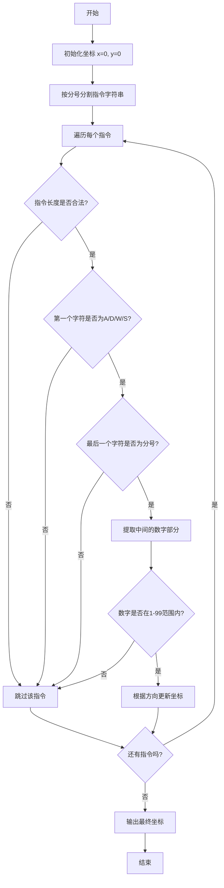
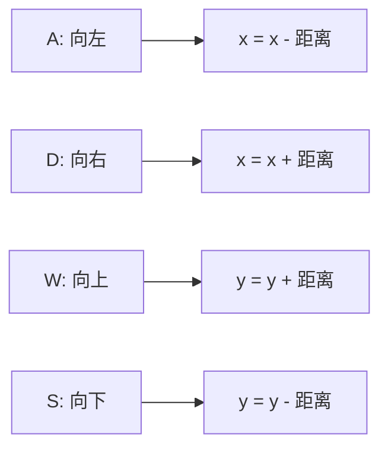
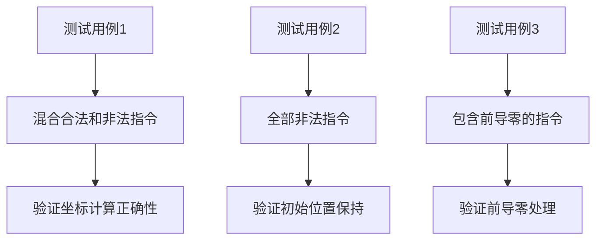

# HJ17 坐标移动

## 描述
我们定义一个无限大的二维网格上有一个小人，小人初始位置为(0,0) 点，小人可以读取指令上下左右移动。一个合法的指令由三至四个符号组成：

- 第一个符号为 
"A/D/W/S" 中的一个，代表小人移动的方向；分别代表向左、向右、向上、向下移动；记某个时刻小人的坐标为 (x,y)，向左移动一格即抵达(x−1,y)、向右移动一格即抵达(x+1,y)、向上移动一格即抵达(x,y+1)、向下移动一格即抵达(x,y−1)。
- 最后一个符号为‘;’，代表指令的结束，该符号固定存在；
- 中间为一个大于 0 且小于 100 的数字，代表小人移动的距离。特别地，如果这个数字小于10，那么它可能包含一个前导零，此时也视为合法。

如果你遇到了一个不合法的指令，则直接忽略；例如，指令"A100;" 是不合法的，因为100 超出了规定的数字范围；"Y10;" 也是不合法的，因为 Y 不是 "A/D/W/S" 中的一个。
输出小人最终的坐标。

### 输入描述
在一行上输入一个长度 1<= length(s) <=10^4，由大写字母、数字和分号（'；'）构成的字符串s，代表输入的指令序列。保证字符串中至少存在一个 '；'，且末尾一定为 '；'。

### 输出描述
在一行上输出一个两个整数，代表小人最终位置的横纵坐标，使用逗号间隔。

## 示例1
输入：A10;S20;W10;D30;X;A1A;B10A11;;A10;
输出：10,-10
说明：
对于这个样例，我们模拟小人的移动过程：
- 第一个指令 "A10;" 是合法的，向左移动 10 个单位，到达 (−10,0) 点；
- 第二个指令 "S20;" 是合法的，向下移动 20 个单位，到达 (−10,−20) 点；
- 第三个指令 "W10;" 是合法的，向上移动 10 个单位，到达 (−10,−10) 点；
- 第四个指令 "D30;" 是合法的，向右移动 30 个单位，到达 (20,−10) 点；
- 第五个指令 "X;" 不合法，跳过；
- 第六个指令 "A1A;" 不合法，跳过；
- 第七个指令 "B10A11;" 不合法，跳过；
- 第八个指令 ";" 不合法，跳过；
- 第九个指令 "A10;" 是合法的，向左移动 10 个单位，到达 (10,−10) 点。

## 示例2
输入：ABC;AKL;DA1;D001;W023;A100;S00;
输出：0,0
说明：在这个样例中，全部指令均不合法，因此小人不移动。

## 示例3
输入：A00;S01;W2;
输出：0,1

## 解题思路

### 算法分析

这道题的核心是**字符串解析**和**坐标模拟**。我们需要：

1. **解析指令字符串**：按分号分割指令
2. **验证指令合法性**：检查格式和数值范围
3. **执行移动**：根据合法指令更新坐标

### 指令格式分析

合法指令格式：`[方向][距离];`
- 方向：A(左)、D(右)、W(上)、S(下)
- 距离：1-99的数字（可以包含前导零）
- 结束符：分号

### 算法流程图

### 坐标移动规则

### 代码实现思路

1. **字符串分割**：使用`strings.Split()`按分号分割
2. **指令验证**：
   - 检查长度（至少3个字符）
   - 验证方向字符
   - 验证结束符
   - 解析并验证数字范围
3. **坐标更新**：使用switch语句处理不同方向

### 时间复杂度分析

- **时间复杂度**：O(n)，其中n是字符串长度
- **空间复杂度**：O(n)，用于存储分割后的指令数组

### 边界情况处理

1. **空指令**：直接跳过
2. **非法格式**：长度不足、方向错误、数字超出范围
3. **前导零**：如"A01;"是合法的
4. **全部非法**：最终位置仍为(0,0)

### 测试用例分析

这个问题的关键在于**仔细的字符串解析**和**严格的格式验证**，确保只有完全符合规则的指令才会被执行。

