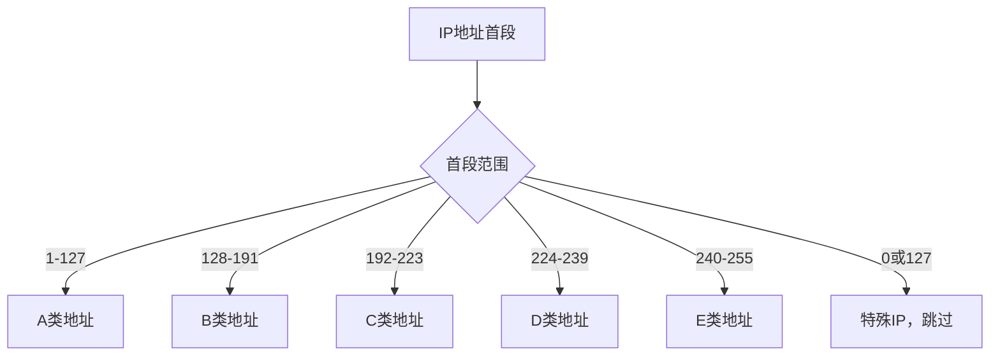
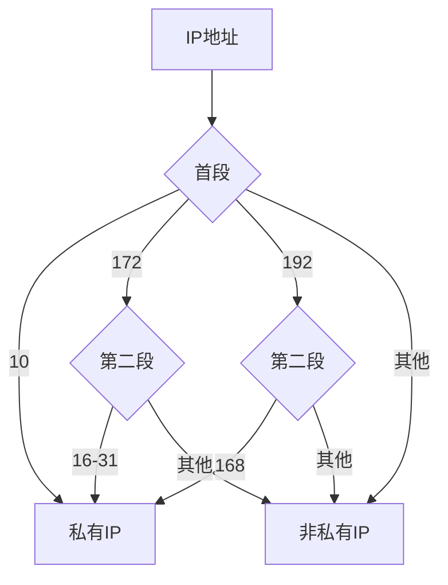
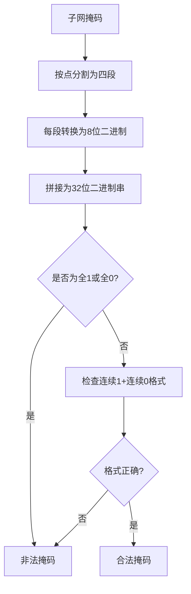
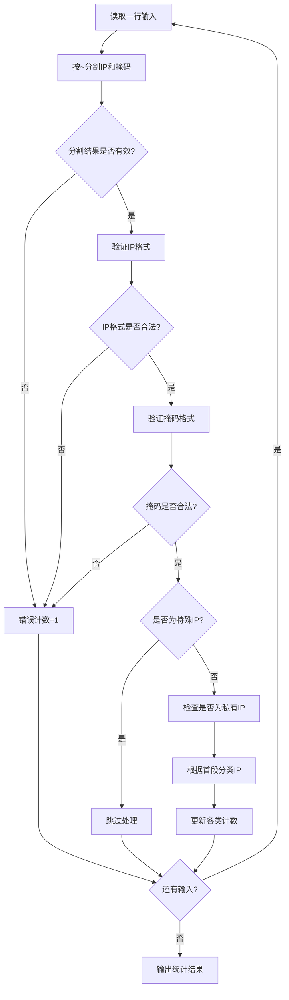
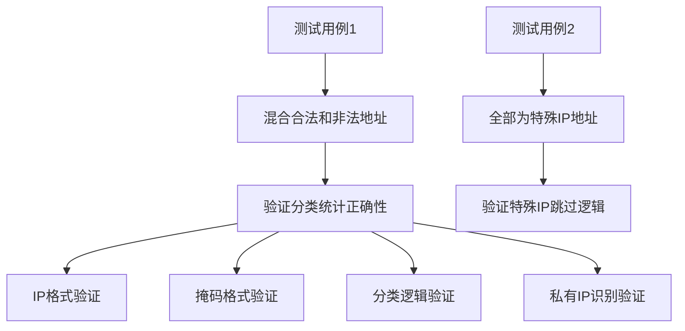

# HJ18 识别有效的IP地址和掩码并进行分类统计

## 描述
在本题中，我们需要处理地址信息，其由 IP 地址和子网掩码组成，这两者均形如 "*.*.*.*"，由四段数字组成（每一个 '*' 表示一个数字），每一段的数字均为 0 到 255 之间的一个整数，每段数字之间以点分隔。

我们定义五类 IP 地址：
- A 类："1.0.0.0"∼"127.255.255.255";
- B 类："128.0.0.0"∼"191.255.255.255";
- C 类："192.0.0.0"∼"223.255.255.255";
- D 类："224.0.0.0"∼"239.255.255.255";
- E 类："240.0.0.0"∼"255.255.255.255";

我们定义私有 IP 地址：
- "10.0.0.0"∼"10.255.255.255";
- "172.16.0.0"∼"172.31.255.255";
- "192.168.0.0"∼"192.168.255.255";

我们定义合法的子网掩码为：将掩码的每一段数字依次转换为八位长度的二进制字符串并进行拼接，这个字符串必须由若干个连续的 1 后跟若干个连续的 0 组成，才视为子网掩码合法。例如，掩码 "255.254.255.0" 转换拼接得到字符串 11111111 11111110 11111111 00000000，显然不合法；掩码 "255.255.255.248" 转换拼接得到字符串 11111111 11111111 11111111 11111000，合法。注意，全为 1 或全为 0 的掩码也视为非法。

我们定义错误的 IP 地址和错误的子网掩码为不符合上述定义的 IP 地址和子网掩码。例如，格式错误、数字超出范围等等。

现在，你需要分类统计 A、B、C、D、E 类地址的数量、错误 IP 或错误子网掩码的数量、私有 IP 的数量。

特别地：
- 类似 "0.*.*.*" 和 "127.*.*.*" 的 IP 地址不计入任何类别，也不计入非法统计，直接跳过；
- 一个 IP 既可计入私有 IP，也可计入五类地址之一，二者分别累计。

## 输入描述
本题将会给出 1<=T<=1000 条地址信息，确切数字未知，您需要一直读取至文件结尾；您也可以参考 牛客网在线判题系统使用帮助 获得更多的使用帮助。每条地址信息描述如下：
每行输入一个 "*.*.*.*" 形式的 IP 地址和一个 "*.*.*.*" 形式的子网掩码，中间用波浪线（∼）分隔。保证 '*' 要么为空，要么是一个 0 到 255 间的整数。

## 输出描述
在一行上输出七个整数，分别代表 A 类地址数、B 类地址数、C 类地址数、D 类地址数、E 类地址数、错误 IP 或错误子网掩码数、私有 IP 数。

## 示例1
输入：
10.70.44.68~1.1.1.5
1.0.0.1~255.0.0.0
192.168.0.2~255.255.255.0
19..0.~255.255.255.0

输出：
1 0 1 0 0 2 1

说明:
在这个样例中： 
- 第一条地址信息：掩码非法； 
- 第二条地址信息：IP 格式和掩码均合法，属于 A 类； 
- 第三条地址信息：IP 格式和掩码均合法，属于 C 类私有地址；
- 第四条地址信息：IP 格式非法。 
统计得到 
1 个 A 类，0 个 B 类，1 个 C 类，0 个 D 类，0 个 E 类，2 个错误条目，1 个私有地址。

## 示例2
输入：
0.201.56.50~255.255.255.0
127.201.56.50~255.255.111.255

输出：
0 0 0 0 0 0 0

说明：
在这个样例中，两条地址信息均属于上方提示中提到的特殊 IP 地址，不需要处理，直接跳过。特别需要注意地，第二条地址的子网掩码是非法的。但是因为该条为特殊 IP 地址，此优先级更高，所以不进入统计。

## 解题思路

### 算法分析

这道题的核心是**IP地址分类**和**子网掩码验证**。主要涉及：

1. **IP地址格式验证**：检查四段数字格式和范围
2. **子网掩码合法性验证**：转换为二进制并检查连续1+连续0的格式
3. **IP地址分类**：根据首段数字范围分类
4. **私有IP识别**：检查特定的IP段范围
5. **特殊IP处理**：跳过0.*.*.*和127.*.*.*的IP

### IP地址分类规则



### 私有IP地址识别



### 子网掩码验证流程



### 算法流程图



### 代码实现思路

1. **输入处理**：逐行读取，按`~`分割IP和掩码
2. **格式验证**：
   - IP验证：四段数字，每段0-255
   - 掩码验证：转换为二进制检查连续1+连续0格式
3. **分类统计**：
   - 根据首段数字范围分类A-E类
   - 检查私有IP范围
   - 跳过特殊IP（0.*.*.*和127.*.*.*）

### 时间复杂度分析

- **时间复杂度**：O(n)，其中n是输入行数
- **空间复杂度**：O(1)，只使用固定数量的计数器

### 关键优化点

1. **位操作优化**：使用`(maskInt & (maskInt + 1)) == 0`巧妙判断连续1+连续0格式
2. **整数表示**：将四段IP转换为32位整数，避免字符串操作
3. **范围判断优化**：直接比较首段数字，避免字符串比较
4. **提前返回**：发现格式错误立即跳过，减少不必要的计算

### 边界情况处理

1. **格式错误**：分割符错误、段数不对、空段
2. **数值越界**：超出0-255范围
3. **特殊IP**：0.*.*.*和127.*.*.*直接跳过
4. **掩码特殊值**：全1或全0掩码视为非法

### 测试用例分析



### 位操作技巧详解

**连续1+连续0格式判断的巧妙方法**：

```mermaid
graph TD
    A[掩码整数 maskInt] --> B[maskInt + 1]
    B --> C[maskInt & (maskInt + 1)]
    C --> D{结果是否为0?}
    D -->|是| E[格式正确：连续1+连续0]
    D -->|否| F[格式错误：存在01模式]
    
    G[示例：255.255.255.248] --> H[11111111 11111111 11111111 11111000]
    H --> I[+1 = 11111111 11111111 11111111 11111001]
    I --> J[&运算 = 11111111 11111111 11111111 11111000 ≠ 0]
    J --> K[错误！应该是0]
    
    L[正确示例：255.255.255.0] --> M[11111111 11111111 11111111 00000000]
    M --> N[+1 = 11111111 11111111 11111111 00000001]
    N --> O[&运算 = 00000000 00000000 00000000 00000000 = 0]
    O --> P[正确！]
```

**原理解析**：
- 如果掩码是连续1+连续0格式，那么`maskInt + 1`会在第一个0位产生进位
- 进位后的结果与原掩码进行`&`运算，如果结果为0，说明没有01模式
- 这是判断二进制数是否为连续1+连续0格式的最优算法

这个问题的关键在于**严格的格式验证**和**正确的分类逻辑**，特别是子网掩码的二进制格式验证和特殊IP的处理优先级。
