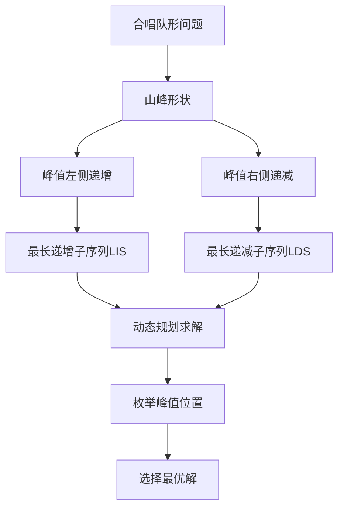
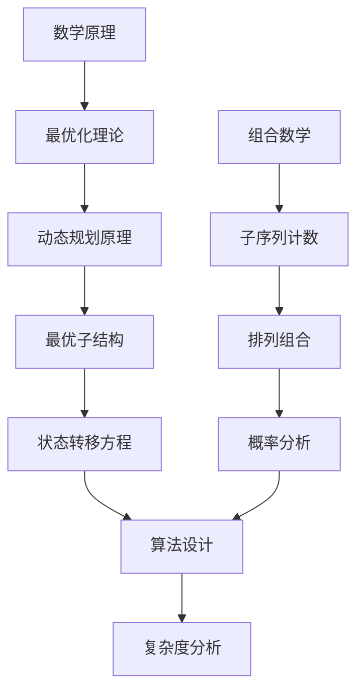

# HJ24 合唱队

## 描述

音乐课上，老师将 n 位同学排成一排。老师希望在不改变同学相对位置的前提下，从队伍中选出最少数量的同学，使得剩下的同学排成合唱队形。

记合唱队形中一共有 k 位同学，记编号为 1,2,…,k ，第 i 个人的身高为 hi。要求：存在一位同学编号为 i(1<i<k) ，使得
h1,h2,...,hi-1严格递增，且hi+1,hi+2,...,hk严格递减；更具体地，合唱队形呈 h1 < h2 < ... < hi-1 < hi 、hi > hi+1 > ... > hk。
你能帮助老师计算，最少需要出列多少位同学，才能使得剩下的同学排成合唱队形？

## 输入描述

- 第一行输入一个整数 n(1<=n<=3000) 代表同学数量。
- 第二行输入 n 个整数 代表每一位同学的身高。

## 输出描述

输出一个整数，代表最少需要出列的同学数量。


## 示例1

输入：
8
186 186 150 200 160 130 197 200

输出：
4

说明：
在这个样例中，有且仅有两种出列方式，剩下的同学分别为 {186,200,160,130} 和 {150,200,160,130} 。

## 解题思路

### 算法分析

这道题的核心是**最长递增子序列（LIS）**和**最长递减子序列（LDS）**的组合应用。主要涉及：

1. **合唱队形特点**：先严格递增，再严格递减，呈山峰形状
2. **动态规划思想**：分别计算每个位置的LIS和LDS
3. **峰值枚举**：枚举每个位置作为峰值的可能性
4. **优化策略**：减少不必要的计算和比较

### 问题本质分析



### 合唱队形结构分析

```mermaid
graph TD
    A[合唱队形结构] --> B[峰值位置i]
    B --> C[左侧: h1 < h2 < ... < hi-1 < hi]
    B --> D[右侧: hi > hi+1 > ... > hk]
    
    C --> E[LIS[i]: 以i结尾的最长递增序列]
    D --> F[LDS[i]: 以i开始的最长递减序列]
    
    E --> G[合唱队形长度]
    F --> G
    G --> H[LIS[i] + LDS[i] - 1]
```

### 动态规划状态设计

```mermaid
graph TD
    A[状态定义] --> B[LIS[i]]
    A --> C[LDS[i]]
    
    B --> D[以位置i结尾的最长递增子序列长度]
    C --> E[以位置i开始的最长递减子序列长度]
    
    F[状态转移] --> G[LIS[i] = max(LIS[j] + 1)]
    G --> H[其中j < i且height[j] < height[i]]
    
    F --> I[LDS[i] = max(LDS[j] + 1)]
    I --> J[其中j > i且height[j] < height[i]]
```

### 算法流程详解

```mermaid
flowchart TD
    A[输入同学身高数组] --> B[计算LIS数组]
    B --> C[正向遍历每个位置]
    C --> D[计算以i结尾的最长递增序列]
    D --> E[LIS[i] = max(LIS[j] + 1)]
    
    E --> F[计算LDS数组]
    F --> G[反向遍历每个位置]
    G --> H[计算以i开始的最长递减序列]
    H --> I[LDS[i] = max(LDS[j] + 1)]
    
    I --> J[枚举每个峰值位置]
    J --> K[计算合唱队形长度]
    K --> L[length = LIS[i] + LDS[i] - 1]
    L --> M[找出最大长度]
    M --> N[输出: n - maxLength]
```

### LIS和LDS计算过程

```mermaid
graph TD
    A[LIS计算] --> B[初始化LIS[i] = 1]
    B --> C[对每个位置i]
    C --> D[检查所有j < i]
    D --> E{height[j] < height[i]?}
    E -->|是| F[LIS[i] = max(LIS[i], LIS[j] + 1)]
    E -->|否| G[跳过]
    F --> H[继续下一个j]
    G --> H
    
    I[LDS计算] --> J[初始化LDS[i] = 1]
    J --> K[对每个位置i]
    K --> L[检查所有j > i]
    L --> M{height[j] < height[i]?}
    M -->|是| N[LDS[i] = max(LDS[i], LDS[j] + 1)]
    M -->|否| O[跳过]
    N --> P[继续下一个j]
    O --> P
```

### 示例推导过程

```mermaid
graph TD
    A[示例: 186 186 150 200 160 130 197 200] --> B[计算LIS]
    B --> C[LIS: 1 1 1 2 2 1 3 3]
    C --> D[计算LDS]
    D --> E[LDS: 1 1 1 3 2 1 2 1]
    E --> F[计算合唱队形长度]
    F --> G[位置3: LIS[3]+LDS[3]-1 = 2+3-1 = 4]
    G --> H[最大长度: 4]
    H --> I[需要出列: 8-4 = 4人]
```

### 代码实现思路

1. **LIS计算**：
   - 对每个位置i，检查所有j < i
   - 如果height[j] < height[i]，更新LIS[i]
   - 时间复杂度O(n²)

2. **LDS计算**：
   - 对每个位置i，检查所有j > i
   - 如果height[j] < height[i]，更新LDS[i]
   - 时间复杂度O(n²)

3. **峰值枚举**：
   - 对每个位置i，计算LIS[i] + LDS[i] - 1
   - 找出最大值作为最长合唱队形
   - 时间复杂度O(n)

### 时间复杂度分析

- **时间复杂度**：O(n²)，其中n是同学数量
- **空间复杂度**：O(n)，存储LIS和LDS数组

### 关键优化点

1. **状态转移优化**：只考虑有效的前驱状态
2. **边界处理**：正确处理数组边界
3. **初值设置**：每个位置初始长度为1
4. **结果计算**：峰值位置被计算两次，需要减1

### 边界情况处理

1. **单个同学**：n=1时，不需要出列
2. **全部相同**：所有身高相同，需要出列n-1人
3. **严格递增**：整个序列递增，峰值在最后
4. **严格递减**：整个序列递减，峰值在最前

### 算法正确性证明

```mermaid
graph TD
    A[算法正确性] --> B[LIS正确性]
    B --> C[动态规划经典问题]
    C --> D[状态转移方程正确]
    
    A --> E[LDS正确性]
    E --> F[LIS的镜像问题]
    F --> G[反向计算确保正确]
    
    A --> H[合唱队形构造]
    H --> I[LIS[i] + LDS[i] - 1]
    I --> J[峰值i被计算两次]
    J --> K[减1得到正确长度]
```

### 测试用例分析

```mermaid
graph TD
    A[示例分析] --> B[186 186 150 200 160 130 197 200]
    B --> C[可能的合唱队形]
    C --> D[{186,200,160,130}]
    C --> E[{150,200,160,130}]
    
    D --> F[长度4，出列4人]
    E --> F
    
    G[边界测试] --> H[单个同学]
    G --> I[全部相同]
    G --> J[严格递增]
    G --> K[严格递减]
    
    F --> L[验证算法正确]
    H --> L
    I --> L
    J --> L
    K --> L
```

### 算法特点

1. **经典DP**：LIS和LDS的经典应用
2. **双向计算**：正向和反向动态规划
3. **峰值枚举**：考虑所有可能的峰值位置
4. **最优子结构**：具有最优子结构性质

### 实际应用场景

1. **排队问题**：各种需要特定顺序的排队场景
2. **数据分析**：寻找数据中的峰值模式
3. **序列处理**：序列中的特殊子序列问题
4. **优化问题**：最少删除元素的优化问题

### 相关问题扩展

```mermaid
graph TD
    A[相关问题] --> B[最长递增子序列LIS]
    A --> C[最长递减子序列LDS]
    A --> D[最长公共子序列LCS]
    A --> E[编辑距离问题]
    
    B --> F[O(nlogn)算法]
    C --> G[二分查找优化]
    D --> H[动态规划经典]
    E --> I[字符串处理]
    
    F --> J[算法优化思路]
    G --> J
    H --> J
    I --> J
```

### 数学原理



### 进阶优化

```mermaid
graph TD
    A[进阶优化] --> B[时间复杂度优化]
    B --> C[O(nlogn)算法]
    C --> D[二分查找 + 贪心]
    
    A --> E[空间复杂度优化]
    E --> F[滚动数组]
    F --> G[原地算法]
    
    D --> H[性能提升]
    G --> H
    H --> I[实际应用优化]
```

这个问题的关键在于**正确理解合唱队形的结构**和**巧妙应用LIS和LDS的组合**，通过动态规划高效求解最优的合唱队形配置。
