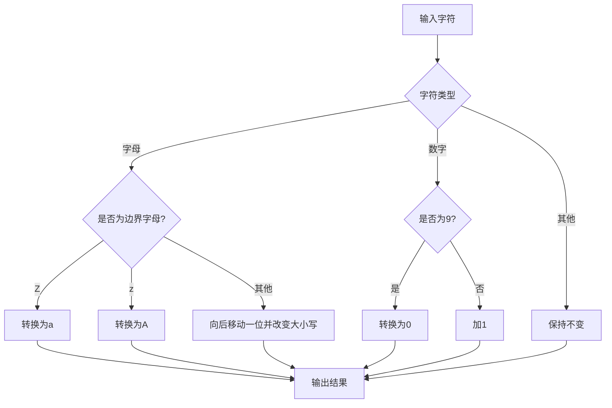
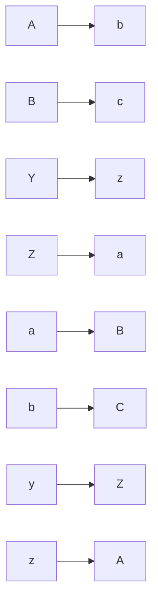
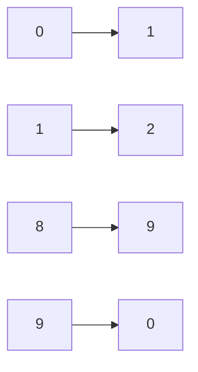
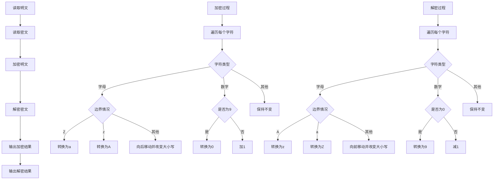
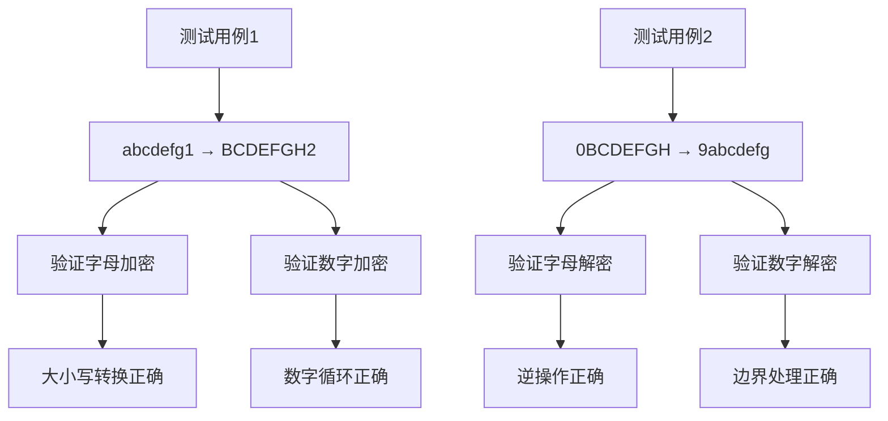

# HJ29 字符串加解密

## 描述
规定这样一种密码的加密方法：
- 对于密码中的英文字母，按照字母表顺序，向后移动一位，同时改变大小写，即 Z 转换为 a ，A 转换为 b ，B 转换为 c ，⋯ ，Y 转换为 z ，Z 转换为 a 。

- 对于密码中的数字，增加 1 ，9 转换为 0 。
字符串的解密方法即为加密方法的逆过程。

现在，对于给定的明文字符串 s ，将其加密；对于给定的密文字符串 t ，将其解密。

## 输入描述

第一行输入一个长度为 1<=length(s)<=10^3 的字符串 s ，代表给定的明文字符串；
第二行输入一个长度为 1<=length(t)<=10^3 的字符串 t ，代表给定的密文字符串。

除此之外，保证字符串 s 和 t 中仅包含英文字母和数字。

## 输出描述
第一行输出一个字符串，代表加密后的 s 。
第二行输出一个字符串，代表解密后的 t 。

## 示例1

输入：
abcdefg1
0BCDEFGH

输出：
BCDEFGH2
9abcdefg

## 解题思路

### 算法分析

这道题的核心是**字符映射转换**。主要涉及：

1. **字母加密**：向后移动一位并改变大小写
2. **数字加密**：加1，9变为0
3. **解密过程**：加密的逆操作
4. **边界处理**：Z→a, z→A, 9→0, 0→9

### 加密规则详解

### 字母映射表

### 数字映射表

### 算法流程图

### 代码实现思路

1. **字符分类处理**：
   - 使用`unicode.IsLetter()`判断字母
   - 使用`unicode.IsDigit()`判断数字
   - 其他字符保持不变

2. **字母加密逻辑**：
   - 边界情况：Z→a, z→A
   - 一般情况：向后移动一位并改变大小写
   - 使用`unicode.ToUpper()`和`unicode.ToLower()`转换大小写

3. **数字加密逻辑**：
   - 边界情况：9→0
   - 一般情况：加1

4. **解密逻辑**：
   - 字母：A→z, a→Z，其他向前移动并改变大小写
   - 数字：0→9，其他减1

### 时间复杂度分析

- **时间复杂度**：O(n)，其中n是字符串长度
- **空间复杂度**：O(n)，用于存储结果字符串

### 关键优化点

1. **字符分类优化**：使用unicode包的标准函数
2. **内存分配优化**：预分配结果数组
3. **边界处理优化**：特殊处理Z/z和9/0的情况
4. **大小写转换优化**：使用unicode包的内置函数

### 边界情况处理

1. **字母边界**：Z→a, z→A, A→z, a→Z
2. **数字边界**：9→0, 0→9
3. **非字母数字字符**：保持不变
4. **空字符串**：直接返回

### 测试用例分析

### 算法特点

1. **对称性**：加密和解密是互逆操作
2. **循环性**：字母和数字都有循环特性
3. **大小写转换**：字母在移动时同时改变大小写
4. **简单高效**：单次遍历即可完成转换

这个问题的关键在于**正确处理边界情况**和**实现对称的加密解密操作**，特别是字母的大小写转换和数字的循环处理。
