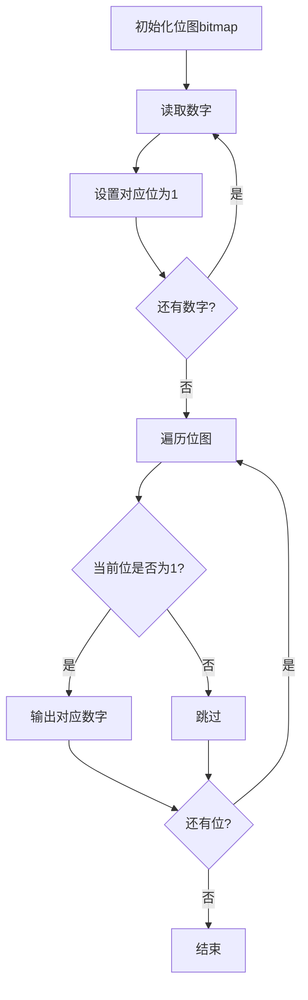

# HJ3 明明的随机数

## 题目描述
对于明明生成的 n 个 1 到 500 之间的随机整数，你需要帮助他完成以下任务：
- 删去重复的数字，即相同的数字只保留一个，把其余相同的数去掉；
- 然后再把这些数从小到大排序，按照排好的顺序输出。

你只需要输出最终的排序结果。

## 输入描述
第一行输入一个整数 n (1<=n<=1000)，代表明明生成的数字个数。
此后 n 行，第 i 行输入一个整数 ai(1<=ai<=500)，代表明明生成的随机整数。

## 输出描述
输出若干行，每行输出一个整数，代表输入数据排序后的结果。第一行输出最小的数字。

## 示例1
输入： 
3
2
2
1

输出：
1
2

## 解题思路

### 算法分析

这道题的核心是**去重排序**。由于数据范围限制在1-500，我们可以设计多种高效算法：

1. **朴素解法**：排序后去重，时间复杂度O(n log n)
2. **位图算法**：利用数据范围小的特点，时间复杂度O(n + k)
3. **布尔数组**：类似位图但更直观，空间换时间
4. **计数排序**：统计每个数字出现次数，天然去重

### 多种解法对比

```mermaid
graph TD
    A[输入数据] --> B{选择算法}
    B -->|数据量大| C[排序+去重 O(n log n)]
    B -->|数据范围小| D[位图算法 O(n + k)]
    B -->|空间充足| E[布尔数组 O(n + k)]
    B -->|需要统计| F[计数排序 O(n + k)]
    
    C --> G[sort.Ints + 去重遍历]
    D --> H[位运算操作]
    E --> I[布尔数组标记]
    F --> J[计数数组统计]
    
    G --> K[输出结果]
    H --> K
    I --> K
    J --> K
```

### 位图算法详解



### 计数排序优化

```mermaid
graph LR
    A[数字1] --> B[count[1]++]
    C[数字2] --> D[count[2]++]
    E[数字2] --> D
    F[遍历count数组] --> G[输出非零位置]
```

### 时间复杂度对比

| 算法      | 时间复杂度 | 空间复杂度 | 适用场景   |
| --------- | ---------- | ---------- | ---------- |
| 排序+去重 | O(n log n) | O(1)       | 通用解法   |
| 位图算法  | O(n + k)   | O(k/8)     | 数据范围小 |
| 布尔数组  | O(n + k)   | O(k)       | 空间充足   |
| 计数排序  | O(n + k)   | O(k)       | 需要统计   |

*其中k为数据范围，本题k=500*

### 位运算技巧

```mermaid
graph TD
    A[数字x] --> B[字节位置: x/32]
    A --> C[位偏移: x%32]
    B --> D[bitmap[x/32]]
    C --> E[1 << (x%32)]
    D --> F[位或运算设置位]
    E --> F
    F --> G[bitmap[x/32] |= (1 << (x%32))]
```

### 空间优化技巧

1. **位图压缩**：用uint32数组，每个元素存储32个数字的存在状态
2. **稀疏数组**：如果数据稀疏，可以用map存储
3. **流式处理**：边读边处理，不存储所有数据

### 实际应用场景

1. **大数据去重**：处理海量重复数据
2. **布隆过滤器**：快速判断元素是否存在
3. **数据库索引**：位图索引在数据库中的应用
4. **缓存优化**：内存中快速查找和去重

这个问题虽然简单，但可以展示多种算法思维和优化技巧，特别是**利用数据范围特点进行空间换时间的优化思想**。
