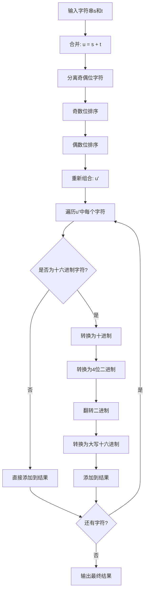
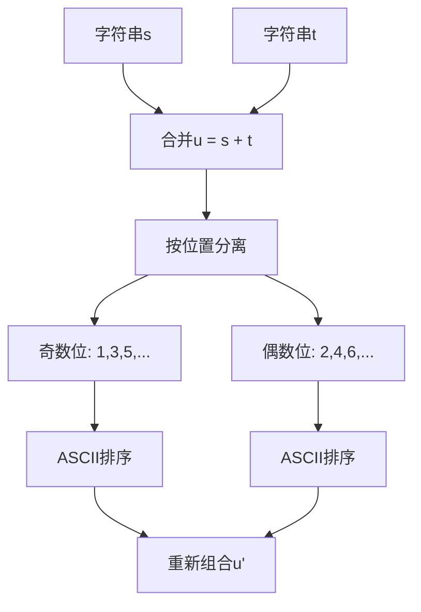
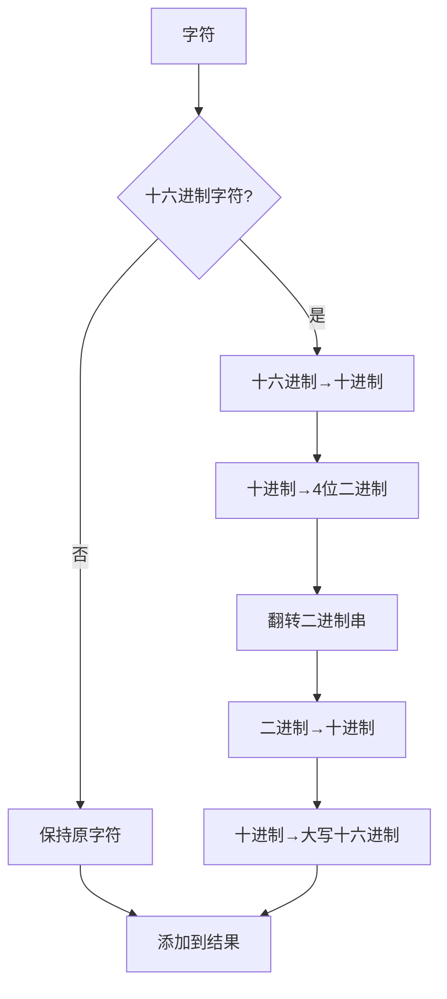
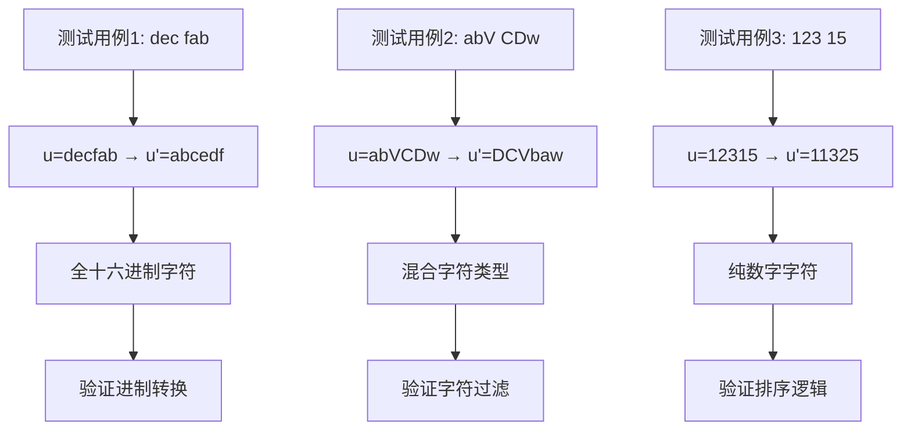
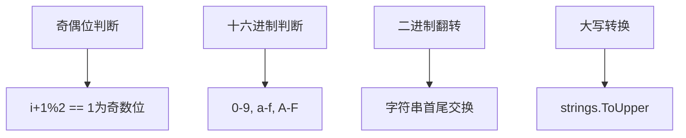

# HJ30 字符串合并处理

## 题目描述
对于给定的由大小写字母和数字构成的字符串 s 和 t，记下标从 1 开始。按以下两个阶段进行处理：

【合并阶段】
- 第一步，将 s 和 t 合并，形成一个新字符串 u。
- 第二步，将 u 中奇数位字符按 Ascii 码从小到大（'A'<'B'<⋯<'Z'<'a'<⋯<'z'）进行排序，随后将偶数位字符也按 Ascii 码从小到大进行排序，得到 u'。

【调整阶段】
随后，从左到右遍历 u' 中的每一个字符 u'i：
- 第一步，若 u'i 不是合法十六进制字符（即不为0-9、a-f、A-F），则保留原字符，直接追加到结果中；否则，将其转换为十进制数。
- 第二步，将该十进制数转换为四位二进制数（高位不足补 0，例如 (5)10 = (0101)2）；
- 第三步，将该二进制数翻转（反过来书写）；
- 第四步，将该二进制数转换为大写的十六进制数，追加到结果中。

最终输出上述拼接而成的字符串。

## 输入描述
在一行上输入两个长度 1<=length(s),length(t)<=100，由大小写字母和数字构成的字符串 s 和 t，代表待处理的字符串。

## 输出描述
输出处理后的最终字符串。

## 示例1
输入：dec fab
输出：5D37BF

说明: 在这个样例中，全过程描述如下：
    【合并阶段】
    - 第一步合并得到 u="decfab"；
    - 第二步排序得到 u'="abcedf"。  
    【调整阶段】
    - 对于第一个字符 (a)16，其十进制数为 (10)10，二进制数为 (1010)2，翻转后得到 (0101)2；再转换回十六进制数为 (5)16;
    - 对于第二个字符 (b)16，其十进制数为 (11)10，二进制数为 (1011)2，翻转后得到 (1101)2；再转换回十六进制数为 (D)16；
    - 对于第三个字符 (c)16，其十进制数为 (12)10，二进制数为 (1100)2，翻转后得到 (0011)2；再转换回十六进制数为 (3)16；
    - 对于第四个字符 (d)16，其十进制数为 (13)10，二进制数为 (1101)2，翻转后得到 (1011)2；再转换回十六进制数为 (B)16；
    - 对于第五个字符 (e)16，其十进制数为 (14)10，二进制数为 (1110)2，翻转后得到 (0111)2；再转换回十六进制数为 (7)16；
    - 对于第六个字符 (f)16，其十进制数为 (15)10，二进制数为 (1111)2，翻转后得到 (1111)2；再转换回十六进制数为 (F)16；
    - 最终输出拼接而成的字符串。

## 示例2
输入：abV CDw
输出：B3VD5w

说明：在这个样例中，全过程描述如下：
    【合并阶段】
    - 第一步合并得到 u="abVCDw"；
    - 第二步排序得到 u'="DCVbaw"。
    【调整阶段】
    - 对于第一个字符 (D)16，其十进制数为 (13)10，二进制数为 (1101)2，翻转后得到 (1011)2；再转换回十六进制数为 (B)16；
    - 对于第二个字符 (C)16，其十进制数为 (12)10，二进制数为 (1100)2，翻转后得到 (0011)2；再转换回十六进制数为 (3)16；   
    - 对于第三个字符 (V)16，跳过该字符；
    - 对于第四个字符 (b)16，其十进制数为 (11)10，二进制数为 (1011)2，翻转后得到 (1101)2；再转换回十六进制数为 (D)16；
    - 对于第五个字符 (a)16，其十进制数为 (10)10，二进制数为 (1010)2，翻转后得到 (0101)2；再转换回十六进制数为 (5)16；
    - 对于第六个字符 (w)16，跳过该字符；

## 示例3
输入：123 15
输出：88C4A

说明：在这个样例中，全过程描述如下：
    【合并阶段】
    - 第一步合并得到 u="12315";
    - 第二步排序得到 u'="11325"。
    【调整阶段】
    - 对于第一个字符 (1)16，其十进制数为 (1)10，二进制数为 (0001)2，翻转后得到 (1000)2；再转换回十六进制数为 (8)16；
    - 对于第二个字符 (1)16，其十进制数为 (1)10，二进制数为 (0001)2，翻转后得到 (1000)2；再转换回十六进制数为 (8)16；   
    - 对于第三个字符 (3)16，其十进制数为 (3)10，二进制数为 (0011)2，翻转后得到 (1100)2；再转换回十六进制数为 (C)16；
    - 对于第四个字符 (2)16，其十进制数为 (2)10，二进制数为 (0010)2，翻转后得到 (0100)2；再转换回十六进制数为 (4)16；
    - 对于第五个字符 (5)16，其十进制数为 (5)10，二进制数为 (0101)2，翻转后得到 (1010)2；再转换回十六进制数为 (A)16；

## 解题思路

### 算法分析

这道题的核心是**字符串处理**和**进制转换**。主要涉及：

1. **字符串合并**：简单拼接两个字符串
2. **奇偶位分离排序**：按位置分离字符并分别排序
3. **十六进制字符识别**：判断字符是否为0-9、a-f、A-F
4. **进制转换**：十六进制→十进制→二进制→翻转→十六进制

### 算法流程图

### 合并阶段详解

### 调整阶段详解

### 进制转换过程

### 代码实现思路

1. **合并阶段**：
   - 字符串拼接：`u = s + t`
   - 奇偶位分离：按下标(i+1)%2判断
   - ASCII排序：使用`sort.Slice()`
   - 重新组合：奇数位在前，偶数位在后

2. **调整阶段**：
   - 十六进制判断：范围检查0-9、a-f、A-F
   - 进制转换：使用标准库函数
   - 二进制翻转：字符串反转算法
   - 结果拼接：使用`strings.Builder`

### 时间复杂度分析

- **时间复杂度**：O(n log n)，主要是排序操作
- **空间复杂度**：O(n)，用于存储分离的字符和结果

### 关键优化点

1. **字符分离优化**：一次遍历分离奇偶位
2. **排序优化**：使用Go标准库的高效排序
3. **字符串构建优化**：使用`strings.Builder`避免频繁内存分配
4. **进制转换优化**：使用标准库函数和格式化

### 边界情况处理

1. **空字符串**：合并后为空或单个字符
2. **全十六进制字符**：所有字符都需要转换
3. **无十六进制字符**：所有字符都保持原样
4. **单字符字符串**：只有奇数位或偶数位

### 测试用例分析

### 算法特点

1. **多阶段处理**：合并阶段和调整阶段分离
2. **复杂转换**：涉及多种进制转换
3. **字符分类**：需要识别十六进制字符
4. **位置相关**：奇偶位分别处理

### 实现细节

这个问题的关键在于**正确理解题目的两个阶段**和**准确实现进制转换过程**，特别是二进制翻转和十六进制字符的识别处理。
