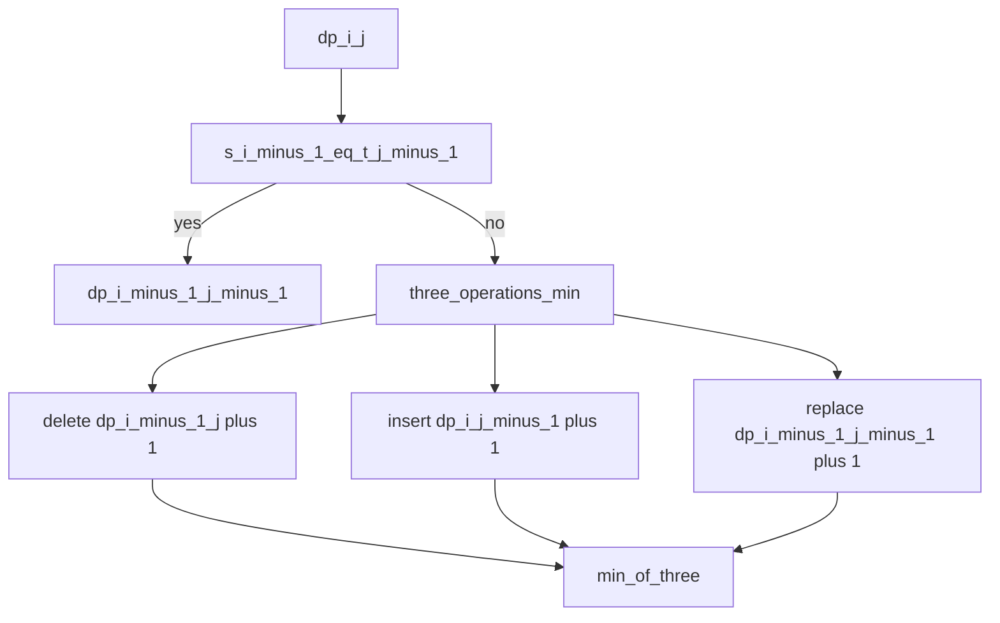
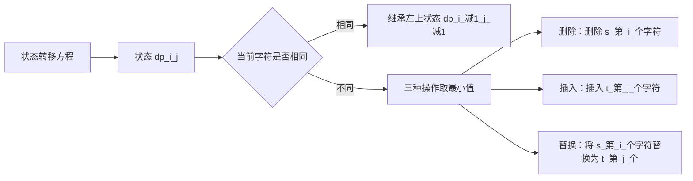
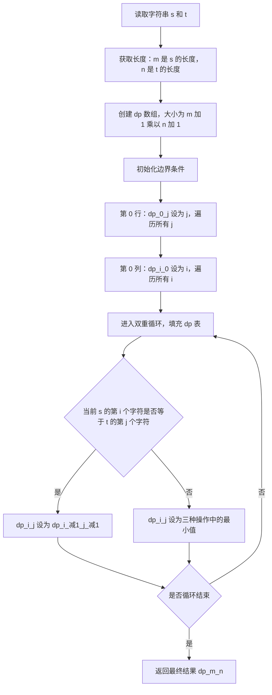
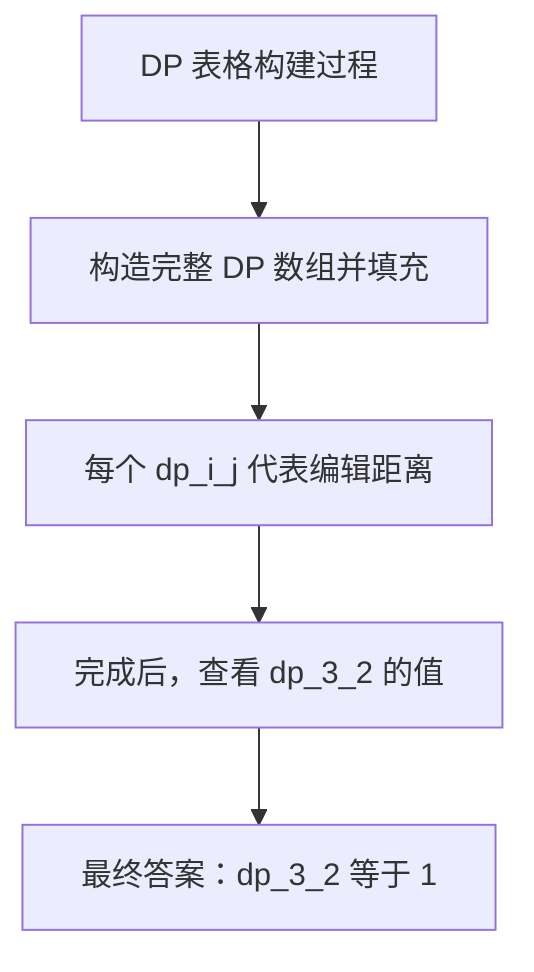
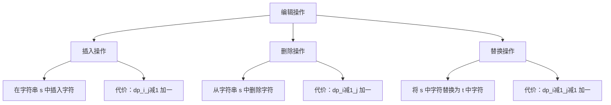
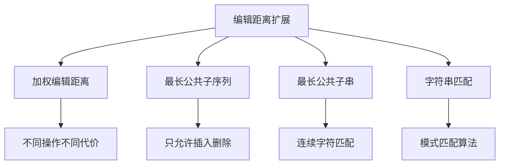
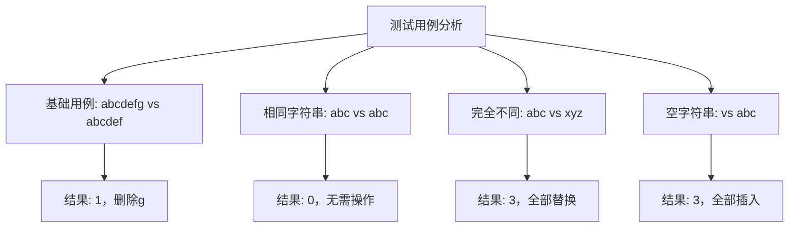

# HJ52 计算字符串的编辑距离


## 描述

Levenshtein 距离，又称编辑距离，指的是两个字符串之间，由一个转变成另一个所需的最少单字符编辑操作次数。被允许的转变包括：

- 对于任意一个字符串，在任意位置插入一个字符；
- 对于任意一个字符串，删除任意一个字符；
- 对于任意一个字符串，替换任意一个字符。

现在，对于给定的字符串 s 和 t，请计算出它们的编辑距离。

## 输入描述

第一行输入一个长度为 1<=len(s)<=10^3，仅由小写字母组成的字符串 s。
第二行输入一个长度为 1<=len(t)<=10^3，仅由小写字母组成的字符串 t。

## 输出描述

输出一个整数，表示 s 和 t 的编辑距离。

## 示例1

输入：
abcdefg
abcdef

输出：
1

说明：
在这个样例中，可以选择将 s 末尾的 'g' 删除。当然，也可以选择在 t 末尾插入 'g'。

## 解题思路

### 算法分析

这道题是经典的**动态规划问题**——编辑距离（Levenshtein距离）。主要涉及：

1. **状态定义**：dp[i][j]表示s[0:i]和t[0:j]的编辑距离
2. **状态转移**：根据字符是否相同选择最优操作
3. **边界处理**：空字符串的初始化
4. **空间优化**：滚动数组优化空间复杂度

### 动态规划状态转移



### 状态转移方程



### 算法流程图



### DP表格示例

以s="abc", t="ab"为例：



### 三种操作详解



### 代码实现思路

1. **基础DP版本**：
   - 二维数组存储所有状态
   - 时间复杂度O(mn)，空间复杂度O(mn)
   - 易于理解和调试

2. **空间优化版本**：
   - 滚动数组优化空间
   - 时间复杂度O(mn)，空间复杂度O(min(m,n))
   - 适用于大规模数据

3. **记忆化递归版本**：
   - 自顶向下的思考方式
   - 代码更直观，容易理解递归关系
   - 适合面试讲解

### 时间复杂度分析

| 算法版本   | 时间复杂度 | 空间复杂度  | 特点     |
| ---------- | ---------- | ----------- | -------- |
| 基础DP     | O(mn)      | O(mn)       | 经典实现 |
| 空间优化   | O(mn)      | O(min(m,n)) | 节省空间 |
| 记忆化递归 | O(mn)      | O(mn)       | 易于理解 |

### 关键优化技巧

1. **空间优化**：
   ```go
   // 只需要两行数组
   prev := make([]int, m+1)
   curr := make([]int, m+1)
   ```

2. **字符串长度优化**：
   ```go
   // 确保s是较短的字符串
   if m > n {
       s, t = t, s
       m, n = n, m
   }
   ```

3. **边界条件处理**：
   ```go
   // 空字符串的初始化
   dp[0][j] = j  // 需要j次插入
   dp[i][0] = i  // 需要i次删除
   ```

### 实际应用场景

1. **文本相似度计算**：搜索引擎的模糊匹配
2. **拼写检查**：单词纠错功能
3. **DNA序列比对**：生物信息学中的序列分析
4. **版本控制**：Git中的文件差异比较
5. **自然语言处理**：文本相似度度量

### 算法扩展



### 面试考点

1. **状态定义能力**：正确定义DP状态
2. **状态转移推导**：理解三种操作的含义
3. **边界条件处理**：空字符串的初始化
4. **空间优化思维**：滚动数组的使用
5. **实际应用理解**：算法的实际价值

### 测试用例分析



这个问题是**动态规划的经典应用**，展示了如何将复杂问题分解为子问题，并通过状态转移方程求解最优解。编辑距离算法在实际工程中有广泛应用，是面试中的高频考点。

