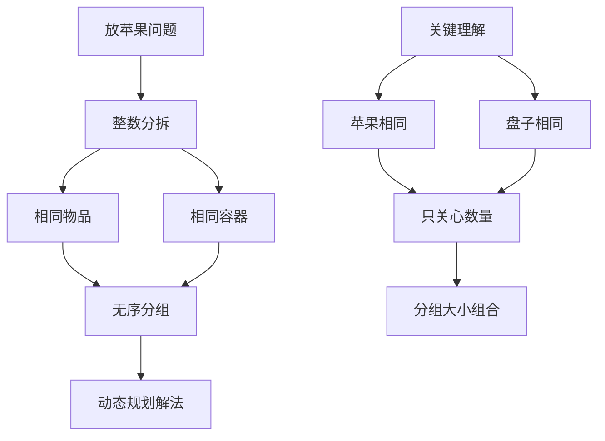
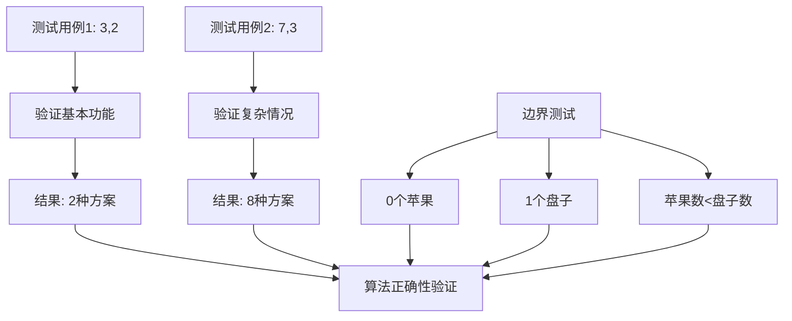

# HJ61 放苹果

## 描述

我们需要将 m 个相同的苹果放入 n 个相同的盘子中，允许有的盘子空着不放。求解有多少种不同的分法。

## 输入描述

输入两个整数 m,n(0<=m<=10; 1<=n<=10) 代表苹果数、盘子数。

## 输出描述

输出一个整数，代表不同的分法数量。

## 示例1

输入：
3 2

输出：
2

说明：
在这个样例中，有 (0,3)、(1,2) 这两种不同的分法。

## 示例2

输入：
7 3

输出：
8

说明：
注意，由于苹果和盘子都是相同的，所以 (5,1,1) 和 (1,5,1) 是同一种分法。

## 解题思路

### 算法分析

这道题的核心是**整数分拆问题**和**动态规划**。主要涉及：

1. **整数分拆**：将m个相同物品分成若干组
2. **动态规划**：使用二维DP表示状态转移
3. **组合数学**：理解相同物品的分组本质
4. **递推关系**：建立状态转移方程

### 问题本质分析



### 状态定义与转移

```mermaid
graph TD
    A[状态定义] --> B[dp[i][j]]
    B --> C[i个苹果放入j个盘子的方案数]
    
    D[状态转移] --> E{i与j的关系}
    E -->|i < j| F[dp[i][j] = dp[i][i]]
    E -->|i >= j| G[两种情况相加]
    
    G --> H[有空盘子: dp[i][j-1]]
    G --> I[无空盘子: dp[i-j][j]]
    
    F --> J[最终状态]
    H --> J
    I --> J
```

### 递推关系详解

```mermaid
flowchart TD
    A[递推分析] --> B{苹果数与盘子数}
    B -->|m < n| C[必有空盘子]
    B -->|m >= n| D[分两种情况]
    
    C --> E[dp[m][n] = dp[m][m]]
    D --> F[情况1: 有空盘子]
    D --> G[情况2: 无空盘子]
    
    F --> H[dp[m][n-1]]
    G --> I[每个盘子至少1个]
    I --> J[dp[m-n][n]]
    
    H --> K[状态合并]
    J --> K
    E --> K
    K --> L[dp[m][n] = dp[m][n-1] + dp[m-n][n]]
```

### 动态规划表构建

```mermaid
graph TD
    A[DP表初始化] --> B[边界条件]
    B --> C[dp[0][j] = 1]
    B --> D[dp[i][1] = 1]
    
    E[填表过程] --> F[按行填充]
    F --> G[i: 1 to m]
    G --> H[j: 1 to n]
    H --> I[应用转移方程]
    
    C --> J[状态转移]
    D --> J
    I --> J
    J --> K[最终结果dp[m][n]]
```

### 算法流程图

```mermaid
flowchart TD
    A[读取m和n] --> B[初始化DP表]
    B --> C[设置边界条件]
    C --> D[dp[0][j] = 1, dp[i][1] = 1]
    
    D --> E[外层循环: i从1到m]
    E --> F[内层循环: j从2到n]
    F --> G{i < j?}
    
    G -->|是| H[dp[i][j] = dp[i][i]]
    G -->|否| I[dp[i][j] = dp[i][j-1] + dp[i-j][j]]
    
    H --> J{内层循环结束?}
    I --> J
    J -->|否| F
    J -->|是| K{外层循环结束?}
    K -->|否| E
    K -->|是| L[输出dp[m][n]]
```

### 示例推导过程

```mermaid
graph TD
    A[示例1: 3个苹果, 2个盘子] --> B[DP表构建]
    B --> C[dp[0][1]=1, dp[0][2]=1]
    B --> D[dp[1][1]=1, dp[2][1]=1, dp[3][1]=1]
    
    C --> E[dp[1][2] = dp[1][1] = 1]
    D --> F[dp[2][2] = dp[2][1] + dp[0][2] = 1+1 = 2]
    E --> G[dp[3][2] = dp[3][1] + dp[1][2] = 1+1 = 2]
    
    F --> H[结果验证]
    G --> H
    H --> I[方案: (0,3), (1,2)]
```

### 代码实现思路

1. **动态规划实现**：
   - 创建二维DP数组
   - 初始化边界条件
   - 按状态转移方程填表

2. **状态转移优化**：
   - 处理苹果数小于盘子数的情况
   - 正确应用递推关系
   - 确保状态转移的正确性

3. **边界处理**：
   - 0个苹果的情况
   - 1个盘子的情况
   - 苹果数等于盘子数的情况

### 时间复杂度分析

- **时间复杂度**：O(m×n)，其中m是苹果数，n是盘子数
- **空间复杂度**：O(m×n)，存储DP表

### 关键优化点

1. **状态压缩**：可以优化为一维数组
2. **边界优化**：提前处理特殊情况
3. **递推优化**：减少重复计算
4. **内存优化**：使用滚动数组

### 边界情况处理

1. **m = 0**：只有一种分法（都不放）
2. **n = 1**：只有一种分法（全放一个盘子）
3. **m < n**：等价于m个苹果放m个盘子
4. **m = n**：每个盘子最多放一个

### 递归解法对比

```mermaid
graph TD
    A[递归解法] --> B[函数定义]
    B --> C[solve(m, n)]
    C --> D{递归基}
    D -->|m=0 or n=1| E[返回1]
    D -->|m<n| F[solve(m, m)]
    D -->|其他| G[solve(m, n-1) + solve(m-n, n)]
    
    H[动态规划优势] --> I[避免重复计算]
    I --> J[自底向上构建]
    J --> K[时间复杂度更优]
```

### 实际应用场景

1. **资源分配**：相同资源分配到不同部门
2. **组合问题**：相同物品的分组方案
3. **数学建模**：整数分拆相关问题
4. **算法竞赛**：经典动态规划题型

### 测试用例分析



### 算法特点

1. **经典DP**：典型的二维动态规划问题
2. **状态简洁**：状态定义清晰明确
3. **转移清晰**：递推关系容易理解
4. **应用广泛**：整数分拆的经典应用

### 数学原理

```mermaid
graph TD
    A[数学原理] --> B[整数分拆]
    B --> C[分拆函数p(n,k)]
    C --> D[n个数分成k组]
    
    E[组合数学] --> F[相同物品排列]
    F --> G[无序分组]
    G --> H[分组大小统计]
    
    D --> I[递推关系]
    H --> I
    I --> J[p(n,k) = p(n,k-1) + p(n-k,k)]
```

这个问题的关键在于**正确理解整数分拆的本质**和**设计合理的状态转移方程**，通过动态规划高效求解相同物品的分组方案数。

