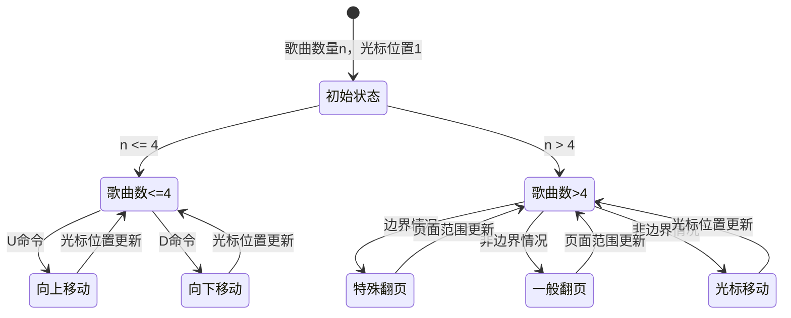
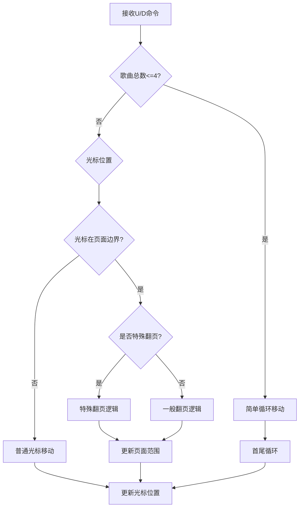
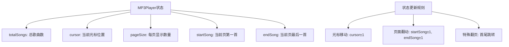
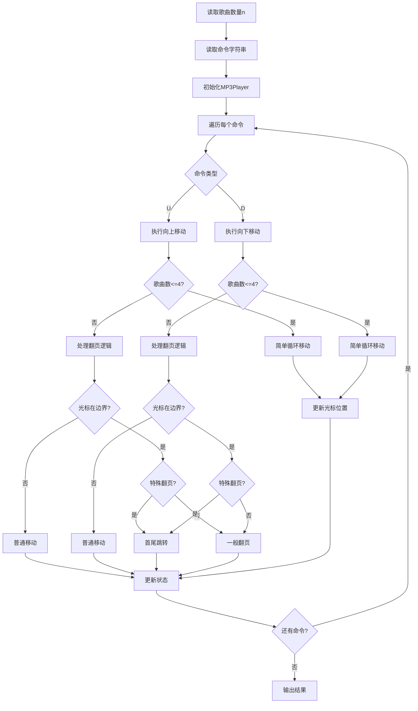
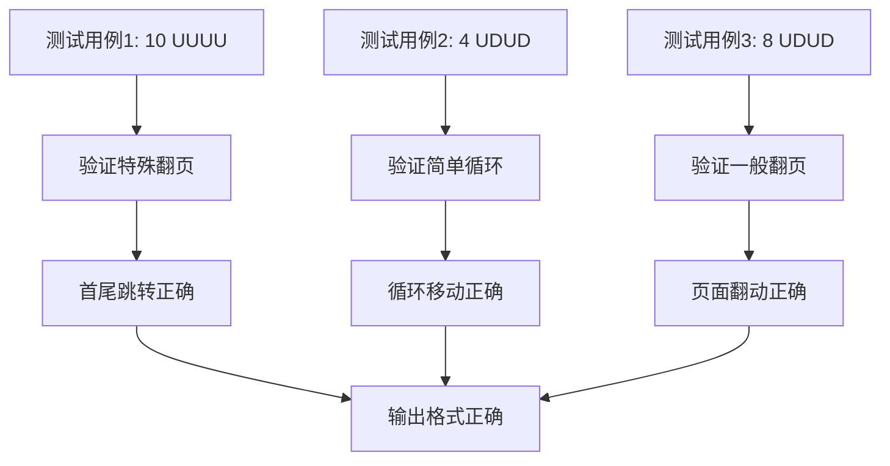

# HJ64 MP3光标位置

## 题目描述
MP3 Player因为屏幕较小，显示歌曲列表的时候每屏只能显示几首歌曲，用户要通过上下键才能浏览所有的歌曲。为了简化处理，假设每屏只能显示4首歌曲，光标初始的位置为第1首歌。

现在要实现通过上下键控制光标移动来浏览歌曲列表，控制逻辑如下：

1. 歌曲总数<=4的时候，不需要翻页，只是挪动光标位置。

光标在第一首歌曲上时，按Up键光标挪到最后一首歌曲；光标在最后一首歌曲时，按Down键光标挪到第一首歌曲。

其他情况下用户按Up键，光标挪到上一首歌曲；用户按Down键，光标挪到下一首歌曲。

2. 歌曲总数大于4的时候（以一共有10首歌为例）：
特殊翻页：屏幕显示的是第一页（即显示第1 – 4首）时，光标在第一首歌曲上，用户按Up键后，屏幕要显示最后一页（即显示第7-10首歌），同时光标放到最后一首歌上。同样的，屏幕显示最后一页时，光标在最后一首歌曲上，用户按Down键，屏幕要显示第一页，光标挪到第一首歌上。

一般翻页：屏幕显示的不是第一页时，光标在当前屏幕显示的第一首歌曲时，用户按Up键后，屏幕从当前歌曲的上一首开始显示，光标也挪到上一首歌曲。光标当前屏幕的最后一首歌时的Down键处理也类似。

其他情况，不用翻页，只是挪动光标就行。

数据范围：命令长度1<=s<=100 ，歌曲数量1<=n<=150 
进阶：时间复杂度：O(n) ，空间复杂度：O(n) 

## 输入描述
输入说明：
1 输入歌曲数量
2 输入命令 U或者D

## 输出描述
输出说明
1 输出当前列表
2 输出当前选中歌曲

## 示例1
输入：
10
UUUU

输出：
7 8 9 10
7

## 解题思路

### 算法分析

这道题的核心是**状态机模拟**和**分页逻辑处理**。主要涉及：

1. **状态管理**：维护当前页面范围、光标位置
2. **翻页逻辑**：处理特殊翻页和一般翻页
3. **边界处理**：首尾歌曲的循环移动
4. **命令解析**：逐个处理U/D命令

### 状态机设计

### 翻页逻辑详解

### 页面状态管理

### 算法流程图

### 代码实现思路

1. **状态管理**：
   - 使用结构体封装MP3播放器状态
   - 维护页面范围（startSong, endSong）和光标位置
   - 提供清晰的状态更新接口

2. **翻页逻辑**：
   - 区分特殊翻页（首尾跳转）和一般翻页
   - 根据光标位置判断是否需要翻页
   - 同步更新页面范围和光标位置

3. **边界处理**：
   - 歌曲数<=4时的简单循环
   - 歌曲数>4时的复杂翻页逻辑
   - 正确处理首尾歌曲的跳转

### 时间复杂度分析

- **时间复杂度**：O(s)，其中s是命令长度
- **空间复杂度**：O(1)，只使用固定数量的状态变量

### 关键优化点

1. **状态封装**：使用结构体封装相关状态，提高代码可读性
2. **逻辑分离**：将翻页逻辑和光标移动逻辑分离
3. **边界处理**：正确处理各种边界情况
4. **代码复用**：避免重复代码，提高维护性

### 边界情况处理

1. **歌曲数<=4**：简单循环，无需翻页
2. **歌曲数>4**：
   - 特殊翻页：首尾跳转
   - 一般翻页：正常翻页
   - 普通移动：光标在页面中间
3. **命令为空**：直接输出初始状态
4. **单个命令**：正确处理单个U/D命令

### 测试用例分析

### 算法特点

1. **状态机设计**：清晰的状态转换逻辑
2. **分页处理**：正确处理复杂的分页场景
3. **边界处理**：全面覆盖各种边界情况
4. **代码结构**：面向对象设计，易于扩展

### 实际应用场景

1. **UI界面设计**：分页列表的光标控制
2. **游戏开发**：菜单系统的光标移动
3. **嵌入式系统**：小屏幕设备的分页显示
4. **移动应用**：触摸屏的列表浏览

这个问题的关键在于**正确理解翻页逻辑**和**设计清晰的状态管理机制**，特别是特殊翻页和一般翻页的区别处理。

