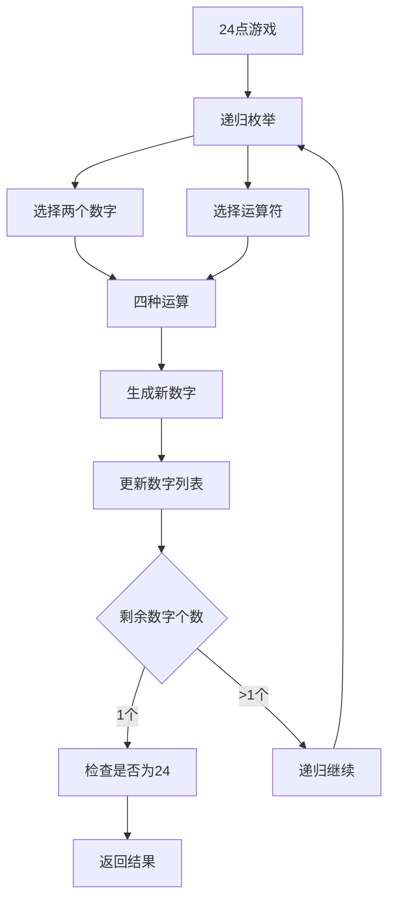
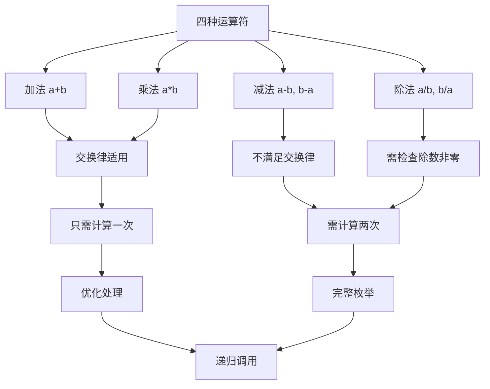

# HJ67 24点游戏算法

## 描述

对于给定的四个小于 10 的正整数，你需要计算它们能否通过计算得到数字 24。让我们来回忆标准二十四点游戏的规则：

- 输入的数字可能会重复，每一个数字必须用且只能用一次；
- 运算顺序可以任意安排，且可以使用括号进一步地改变运算优先级；
- 允许使用加、减、乘、除四种算数运算符，其中除法是实数除法；

如果可以得到 24，输出 true，否则，直接输出 false。

## 输入描述

在一行上输入四个整数 a,b,c,d(1<=a,b,c,d<=10) 代表等待计算的数字。

## 输出描述

如果可以通过规定的计算得到 24，输出 true，否则，直接输出 false。

## 示例1

输入：
7 2 1 10

输出：
true

说明：
在这个样例中，7×1×2+10=24，因此输出 true。

## 示例2

输入：
2 2 2 9

输出：
true

说明：
在这个样例中，2+2×(2+9)=24，因此输出 true。

## 示例3

输入：
10 9 6 9

输出：
true

说明：
在这个样例中，10×9÷6+9=24，因此输出 true。

## 示例4

输入：
3 3 8 8

输出：
true

说明：
在这个样例中，8÷(3−8÷3)=24，因此输出 true。

## 示例5

输入：
1 1 1 1

输出：
false

## 解题思路

### 算法分析

这道题的核心是**递归回溯**和**表达式求值**。主要涉及：

1. **递归枚举**：所有可能的数字组合和运算符组合
2. **回溯搜索**：尝试所有可能的计算路径
3. **浮点数处理**：处理除法运算的精度问题
4. **剪枝优化**：提前终止不可能的计算路径

### 问题本质分析



### 递归搜索策略

```mermaid
graph TD
    A[递归搜索] --> B[终止条件]
    B --> C[只剩一个数字]
    C --> D[检查是否接近24]
    
    E[递归过程] --> F[选择两个数字]
    F --> G[尝试四种运算]
    G --> H[+ 加法]
    G --> I[- 减法]
    G --> J[* 乘法] 
    G --> K[/ 除法]
    
    H --> L[递归调用]
    I --> L
    J --> L
    K --> M[检查除数非零]
    M --> L
    L --> N[回溯还原]
```

### 运算符处理详解



### 浮点数精度处理

```mermaid
graph TD
    A[浮点数精度] --> B[IEEE 754标准]
    B --> C[精度误差]
    C --> D[比较策略]
    
    D --> E[绝对误差法]
    E --> F[abs(x - 24) < ε]
    F --> G[ε = 1e-6]
    
    H[除法处理] --> I[除数检查]
    I --> J[abs(divisor) < ε]
    J --> K[跳过除法运算]
    
    G --> L[精度控制]
    K --> L
```

### 算法流程图

```mermaid
flowchart TD
    A[输入四个数字] --> B[调用递归函数]
    B --> C[判断数字个数]
    C --> D{只剩一个数字?}
    D -->|是| E[检查是否为24]
    D -->|否| F[枚举所有数字对]
    
    E --> G{|num - 24| < 1e-6?}
    G -->|是| H[返回true]
    G -->|否| I[返回false]
    
    F --> J[选择数字i和j]
    J --> K[尝试四种运算]
    K --> L[加法: i+j]
    K --> M[减法: i-j, j-i]
    K --> N[乘法: i*j]
    K --> O[除法: i/j, j/i]
    
    L --> P[生成新数字列表]
    M --> Q[检查是否不同]
    N --> R[检查交换律]
    O --> S[检查除数非零]
    
    P --> T[递归调用]
    Q --> T
    R --> T
    S --> T
    T --> U{返回true?}
    U -->|是| H
    U -->|否| V[尝试下一种运算]
    V --> W{所有运算尝试完?}
    W -->|否| K
    W -->|是| X[尝试下一个数字对]
    X --> Y{所有数字对尝试完?}
    Y -->|否| F
    Y -->|是| I
```

### 代码实现思路

1. **递归函数设计**：
   - 参数：当前数字列表
   - 返回值：是否能计算出24
   - 终止条件：只剩一个数字时检查结果

2. **运算符处理**：
   - 加法和乘法：交换律，只需计算一次
   - 减法和除法：不满足交换律，需要计算两次
   - 除法特殊处理：检查除数是否为零

3. **数字列表更新**：
   - 移除参与运算的两个数字
   - 添加运算结果
   - 递归调用后恢复原状态

### 时间复杂度分析

- **时间复杂度**：O(4^3 × 3!)，其中4是运算符数量，3是递归层数
- **空间复杂度**：O(4)，递归栈深度最大为4

### 关键优化点

1. **交换律优化**：加法和乘法只计算一次
2. **提前终止**：找到解后立即返回
3. **精度控制**：使用合适的epsilon值
4. **除零检查**：避免除法运算错误

### 边界情况处理

1. **相同数字**：如1,1,1,1无解
2. **特殊组合**：需要括号改变运算顺序
3. **除法精度**：处理浮点数除法结果
4. **极端情况**：很大或很小的中间结果

### 测试用例分析

```mermaid
graph TD
    A[测试用例1: 7,2,1,10] --> B[7×1×2+10=24]
    B --> C[结果: true]
    
    D[测试用例2: 2,2,2,9] --> E[2+2×(2+9)=24]
    E --> F[结果: true]
    
    G[测试用例3: 10,9,6,9] --> H[10×9÷6+9=24]
    H --> I[结果: true]
    
    J[测试用例4: 3,3,8,8] --> K[8÷(3-8÷3)=24]
    K --> L[结果: true]
    
    M[测试用例5: 1,1,1,1] --> N[无法组合成24]
    N --> O[结果: false]
    
    C --> P[验证算法正确性]
    F --> P
    I --> P
    L --> P
    O --> P
```

### 递归树分析

```mermaid
graph TD
    A[初始: [7,2,1,10]] --> B[选择7和2]
    A --> C[选择7和1]
    A --> D[选择7和10]
    
    B --> E[7+2=9: [9,1,10]]
    B --> F[7-2=5: [5,1,10]]
    B --> G[7*2=14: [14,1,10]]
    B --> H[7/2=3.5: [3.5,1,10]]
    
    E --> I[继续递归...]
    F --> I
    G --> I
    H --> I
    
    I --> J[找到解: 14*1+10=24]
    J --> K[返回true]
```

### 算法特点

1. **完全搜索**：枚举所有可能的计算路径
2. **回溯机制**：尝试失败后自动恢复状态
3. **精度控制**：正确处理浮点数运算
4. **优化剪枝**：利用交换律减少计算量

### 实际应用场景

1. **游戏开发**：24点游戏实现
2. **数学教育**：算术表达式求值
3. **算法竞赛**：递归回溯类问题
4. **表达式计算**：四则运算组合求值

### 关键数学理论

```mermaid
graph TD
    A[数学理论] --> B[排列组合]
    B --> C[C(4,2) = 6种数字选择]
    C --> D[每对数字4种运算]
    D --> E[减法和除法考虑顺序]
    
    F[递归理论] --> G[分治思想]
    G --> H[问题分解]
    H --> I[子问题求解]
    I --> J[结果合并]
    
    E --> K[搜索空间]
    J --> K
    K --> L[总体复杂度分析]
```

### 精度处理策略

```mermaid
graph TD
    A[精度处理] --> B[epsilon选择]
    B --> C[1e-6适中精度]
    C --> D[避免过严格]
    D --> E[避免过宽松]
    
    F[比较函数] --> G[abs(a-b) < eps]
    G --> H[相等判断]
    H --> I[24的判断]
    
    E --> J[精度平衡]
    I --> J
    J --> K[算法稳定性]
```

这个问题的关键在于**正确实现递归回溯搜索**和**妥善处理浮点数精度问题**，通过枚举所有可能的运算组合来判断是否能得到24。
