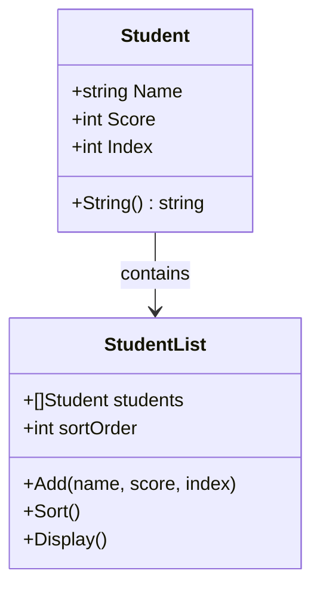
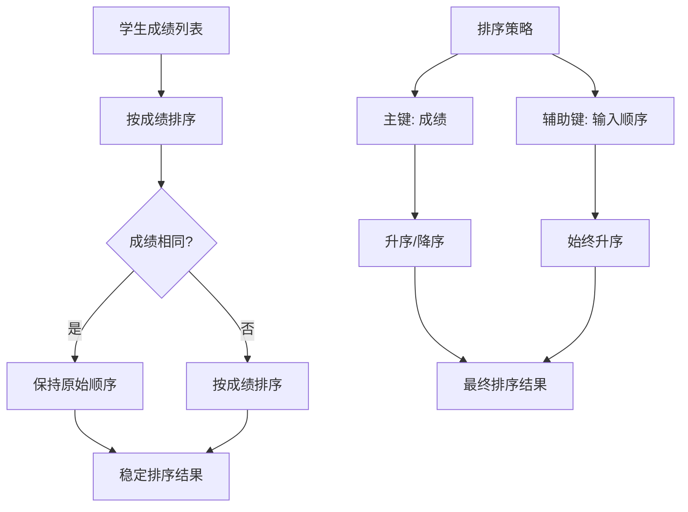
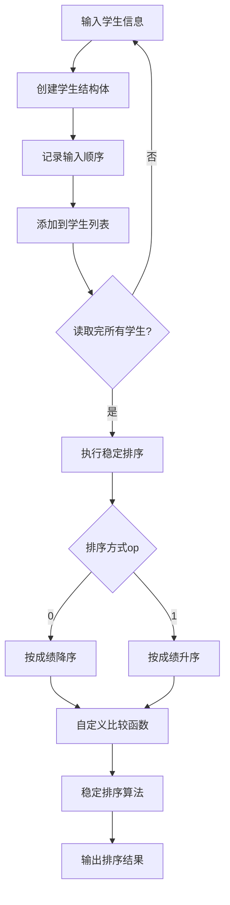
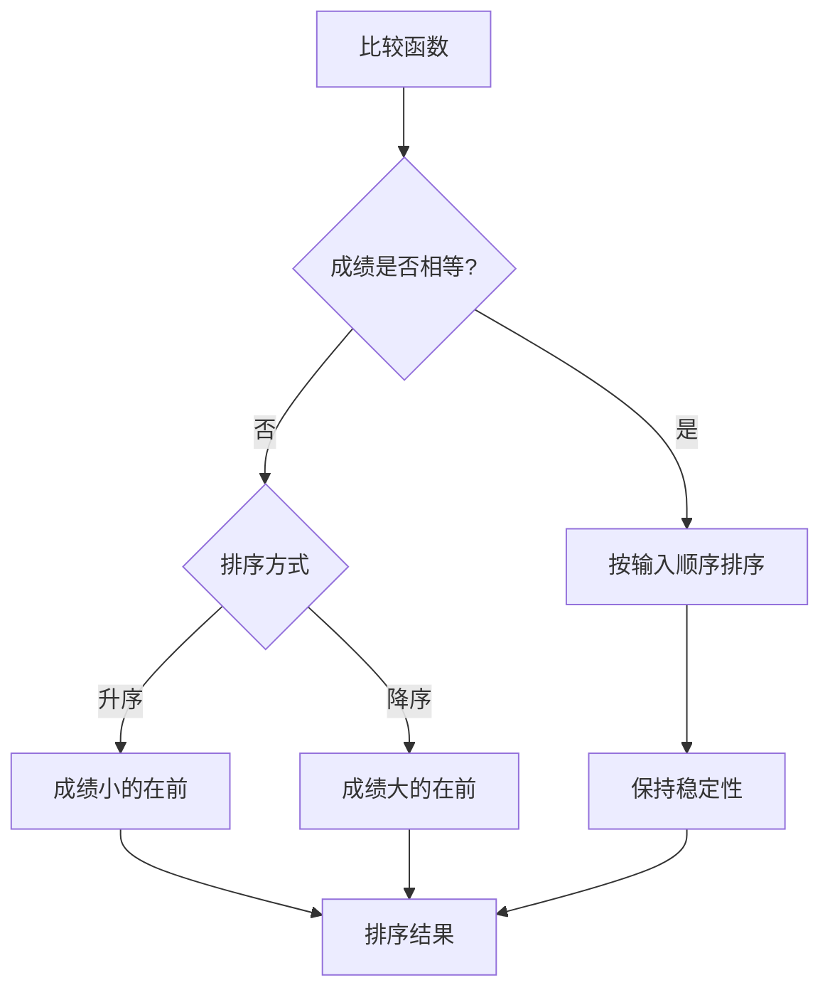
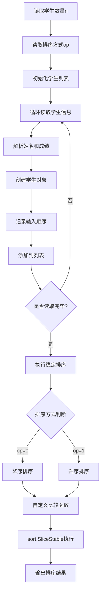
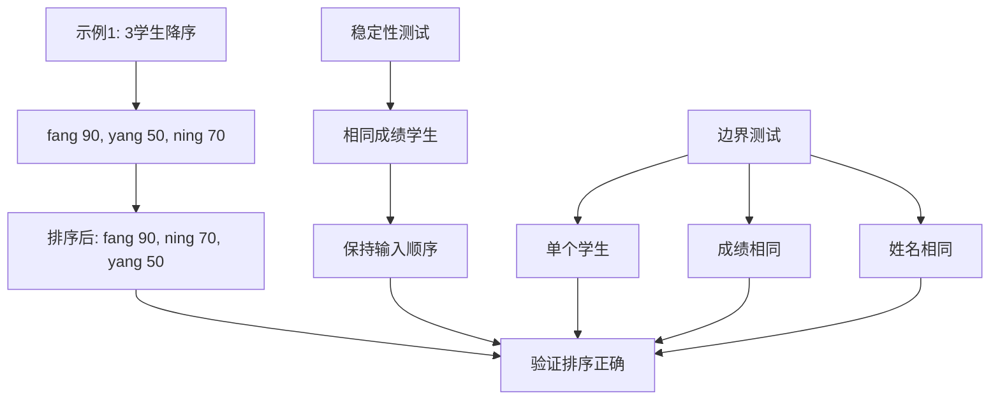
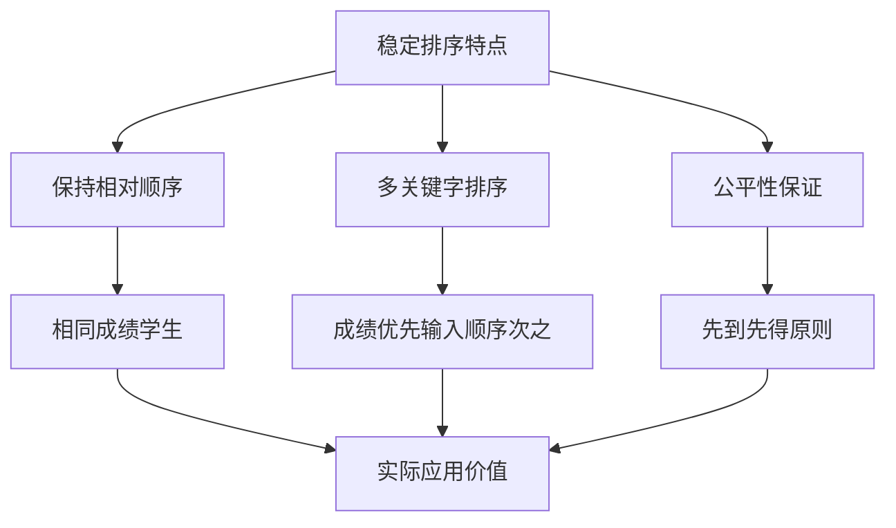

# HJ68 成绩排序

## 描述

对于给出的 n 条姓名和成绩信息，根据指定的排序方式按成绩升序或降序排列并输出。
特别的，成绩相同的同学需要保持输入的先后顺序进行排序。可能存在多条信息的学生姓名一致。

## 输入描述

第一行输入一个整数 n(1<=n<=200) 代表学生人数。
第二行输入一个整数 op(0<=op<=1) 代表排序方式，其中，0 表示按成绩降序，1 表示按成绩升序。
此后 n 行，第 i 行依次输入：
- 一个长度为 1<=len(si)<=20、由大小写字母构成的字符串 si 代表第 i 个学生的姓名；
- 一个整数 ai(0<=ai<=100) 代表这个学生的成绩。

## 输出描述

根据输入的排序方式，按照成绩升序或降序输出所有学生的姓名和成绩。对于每一名学生，新起一行。输出学生的姓名和成绩，用空格分隔。

## 示例1

输入：
3
0
fang 90
yang 50
ning 70

输出：
fang 90
ning 70
yang 50

说明：
在这个样例中，op=0，因此按成绩降序排序。

## 示例2

输入：
4
1
fang 90
yang 50
ning 70
yang 70

输出：
yang 50
ning 70
yang 70
fang 90

说明：
在这个样例中，op=1，因此按成绩升序排序。

## 解题思路

### 算法分析

这道题的核心是**稳定排序**和**学生信息管理**。主要涉及：

1. **数据结构设计**：学生信息的存储和排序
2. **稳定排序算法**：保持相同成绩学生的原始顺序
3. **排序条件控制**：根据op参数决定升序或降序
4. **多关键字排序**：成绩为主键，输入顺序为辅助键

### 数据结构设计

### 稳定排序原理

### 排序逻辑详解

### 比较函数设计

### 算法流程图

### 代码实现思路

1. **学生结构体**：
   - 包含姓名、成绩、输入顺序
   - 提供清晰的数据封装
   - 支持字符串输出格式

2. **稳定排序实现**：
   - 使用Go的sort.SliceStable函数
   - 自定义比较函数处理排序逻辑
   - 确保相同成绩的学生保持原始顺序

3. **排序策略**：
   - 主键：成绩（按op参数升序或降序）
   - 辅助键：输入顺序（始终升序，保证稳定性）
   - 多关键字排序确保结果正确

### 时间复杂度分析

- **时间复杂度**：O(n log n)，其中n是学生数量
- **空间复杂度**：O(n)，存储学生信息

### 关键优化点

1. **稳定排序**：使用sort.SliceStable保证稳定性
2. **输入顺序记录**：为每个学生记录输入顺序
3. **比较函数优化**：先比较成绩，再比较输入顺序
4. **内存管理**：使用切片高效管理学生列表

### 边界情况处理

1. **成绩相同**：按输入顺序排列
2. **姓名相同**：按成绩和输入顺序排列
3. **单个学生**：直接输出
4. **极端成绩**：0分和100分的正确处理

### 测试用例分析

### 算法特点

1. **稳定排序**：保证相同成绩学生的相对位置
2. **灵活排序**：支持升序和降序两种模式
3. **高效实现**：使用标准库的稳定排序算法
4. **易于扩展**：可以轻松添加更多排序关键字

### 实际应用场景

1. **学生成绩管理**：学校成绩排名系统
2. **考试排序**：各类考试成绩排序
3. **竞赛排名**：保持并列名次的相对顺序
4. **数据分析**：需要稳定排序的数据处理

### 稳定排序的重要性

这个问题的关键在于**正确理解稳定排序的含义**和**设计合理的比较函数**，确保在成绩相同的情况下保持学生的原始输入顺序。
