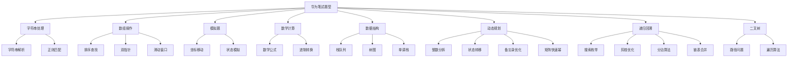

# HuaweiExam - 华为笔试算法题复习仓库

## 📚 项目简介

这是一个专门用于华为笔试算法题复习和练习的代码仓库。本仓库收集了华为笔试中常见的算法题目，并提供详细的解题思路、代码实现和测试用例。

## 🎯 学习目标

- 掌握华为笔试常见算法题型
- 提高算法思维和编程能力
- 熟悉Go语言在算法题中的应用
- 为华为笔试做好充分准备

## 📁 项目结构

```
HuaweiExam/
├── README.md              # 项目总览
├── HJ17/                  # HJ17 坐标移动
│   ├── README.md         # 题目描述和解题思路
│   ├── main.go           # 代码实现
│   └── go.mod            # Go模块文件
├── 11/                   # 11 盛最多水的容器
│   ├── README.md         # 双指针算法详解
│   ├── main.go           # 双指针实现
│   ├── go.mod            # Go模块文件
│   └── test.txt          # 测试用例
├── 3/                    # 3 无重复字符的最长子串
│   ├── README.md         # 滑动窗口算法详解
│   ├── main.go           # 滑动窗口实现
│   ├── go.mod            # Go模块文件
│   └── test.txt          # 测试用例
├── 42/                   # 42 接雨水
│   ├── README.md         # 双指针与单调栈算法详解
│   ├── main.go           # 多种算法实现
│   ├── go.mod            # Go模块文件
│   └── test.txt          # 测试用例
├── 200/                  # 200 岛屿数量
│   ├── README.md         # DFS、BFS、并查集算法详解
│   ├── main.go           # 多种算法实现
│   ├── go.mod            # Go模块文件
│   └── test.txt          # 测试用例
├── 96/                   # 96 不同的二叉搜索树
│   ├── README.md         # 动态规划、卡塔兰数算法详解
│   ├── main.go           # 多种算法实现
│   ├── go.mod            # Go模块文件
│   └── test.txt          # 测试用例
├── 122/                  # 122 买卖股票的最佳时机 II
│   ├── README.md         # 贪心算法、动态规划详解
│   ├── main.go           # 多种算法实现
│   ├── go.mod            # Go模块文件
│   └── test.txt          # 测试用例
├── 123/                  # 123 买卖股票的最佳时机 III
│   ├── README.md         # 五状态DP、分割数组详解
│   ├── main.go           # 多种算法实现
│   ├── go.mod            # Go模块文件
│   └── test.txt          # 测试用例
├── 213/                  # 213 打家劫舍 II
│   ├── README.md         # 环形DP、状态机详解
│   ├── main.go           # 多种算法实现
│   ├── go.mod            # Go模块文件
│   └── test.txt          # 测试用例
├── 70/                   # 70 爬楼梯
│   ├── README.md         # 斐波那契数列、矩阵快速幂详解
│   ├── main.go           # 五种算法实现
│   ├── go.mod            # Go模块文件
│   └── test.txt          # 测试用例
├── 112/                  # 112 路径总和
│   ├── README.md         # 二叉树DFS、递归遍历详解
│   ├── main.go           # 三种算法实现
│   └── go.mod            # Go模块文件
├── 509/                  # 509 斐波那契数
│   ├── README.md         # 备忘录递归、动态规划详解
│   ├── main.go           # 六种算法实现
│   └── go.mod            # Go模块文件
├── 23/                   # 23 合并K个升序链表
│   ├── README.md         # 分治算法、优先队列详解
│   ├── main.go           # 四种算法实现
│   └── go.mod            # Go模块文件
└── [其他题目目录...]      # 更多算法题目
```

## 🚀 使用方法

### 运行特定题目

```bash
# 进入题目目录
cd HJ17

# 运行代码
go run main.go
```

### 学习流程

1. **阅读题目**：仔细理解题目要求和约束条件
2. **分析思路**：查看README中的解题思路和流程图
3. **理解代码**：阅读main.go中的实现代码
4. **运行测试**：执行代码验证结果
5. **自主练习**：尝试修改输入或优化算法

## 📋 题目列表

| 题号 | 题目名称                                        | 难度 | 状态     |
| ---- | ----------------------------------------------- | ---- | -------- |
| HJ17 | [坐标移动](./HJ17/)                             | 简单 | ✅ 已完成 |
| HJ18 | [识别有效的IP地址和掩码并进行分类统计](./HJ18/) | 中等 | ✅ 已完成 |
| HJ24 | [合唱队](./HJ24/)                               | 中等 | ✅ 已完成 |
| HJ29 | [字符串加解密](./HJ29/)                         | 简单 | ✅ 已完成 |
| HJ30 | [字符串合并处理](./HJ30/)                       | 中等 | ✅ 已完成 |
| HJ3  | [明明的随机数](./HJ3/)                          | 简单 | ✅ 已完成 |
| HJ61 | [放苹果](./HJ61/)                               | 中等 | ✅ 已完成 |
| HJ64 | [MP3光标位置](./HJ64/)                          | 中等 | ✅ 已完成 |
| HJ52 | [计算字符串的编辑距离](./HJ52/)                 | 中等 | ✅ 已完成 |
| HJ67 | [24点游戏算法](./HJ67/)                         | 困难 | ✅ 已完成 |
| HJ68 | [成绩排序](./HJ68/)                             | 简单 | ✅ 已完成 |
| 11   | [盛最多水的容器](./11/)                         | 中等 | ✅ 已完成 |
| 3    | [无重复字符的最长子串](./3/)                    | 中等 | ✅ 已完成 |
| 42   | [接雨水](./42/)                                 | 困难 | ✅ 已完成 |
| 200  | [岛屿数量](./200/)                              | 中等 | ✅ 已完成 |
| 96   | [不同的二叉搜索树](./96/)                       | 中等 | ✅ 已完成 |
| 122  | [买卖股票的最佳时机 II](./122/)                 | 中等 | ✅ 已完成 |
| 123  | [买卖股票的最佳时机 III](./123/)                | 困难 | ✅ 已完成 |
| 213  | [打家劫舍 II](./213/)                           | 中等 | ✅ 已完成 |
| 70   | [爬楼梯](./70/)                                 | 简单 | ✅ 已完成 |
| 112  | [路径总和](./112/)                              | 简单 | ✅ 已完成 |
| 509  | [斐波那契数](./509/)                            | 简单 | ✅ 已完成 |
| 23   | [合并K个升序链表](./23/)                        | 困难 | ✅ 已完成 |
| 240  | [搜索二维矩阵 II](./240/)                       | 中等 | ✅ 已完成 |
| 84   | [柱状图中最大的矩形](./84/)                     | 困难 | ✅ 已完成 |
| 85   | [最大矩形](./85/)                               | 困难 | ✅ 已完成 |
| 739  | [每日温度](./739/)                              | 中等 | ✅ 已完成 |
| 503  | [下一个更大元素 II](./503/)                     | 中等 | ✅ 已完成 |
| 209  | [长度最小的子数组](./209/)                      | 中等 | ✅ 已完成 |
| 547  | [省份数量](./547/)                              | 中等 | ✅ 已完成 |
| 684  | [冗余连接](./684/)                              | 中等 | ✅ 已完成 |
| 1004 | [最大连续1的个数 III](./1004/)                  | 中等 | ✅ 已完成 |
| 560  | [和为 K 的子数组](./560/)                       | 中等 | ✅ 已完成 |
| 437  | [路径总和 III](./437/)                          | 中等 | ✅ 已完成 |
| 724  | [寻找数组的中心下标](./724/)                    | 中等 | ✅ 已完成 |
| 1208 | [尽可能使字符串相等](./1208/)                   | 中等 | ✅ 已完成 |

## 🛠️ 技术栈

- **编程语言**：Go
- **算法类型**：字符串处理、模拟、坐标计算、排序算法、动态规划、递归回溯、图遍历、连通性分析、数学计算、组合数学、贪心算法、股票交易、环形约束、斐波那契数列、二叉树遍历、深度优先搜索、记忆化递归、备忘录优化、分治算法、链表合并、矩阵搜索、二分查找、单调栈优化、循环数组处理、并查集、环检测、滑动窗口
- **数据结构**：字符串、数组、结构体、二维数组、浮点数、双指针、滑动窗口、哈希表、单调栈、并查集、队列、二叉树、记忆化表、状态机、环形数组、矩阵快速幂、递归栈、备忘录、链表、优先队列、二维矩阵

## 📖 学习建议

### 1. 系统学习
- 按照题目难度逐步学习
- 每道题都要理解算法思路
- 动手实现代码，不要只看不练

### 2. 重点掌握
- 字符串处理和解析
- 边界条件处理
- 算法复杂度分析
- 代码调试技巧

### 3. 练习方法
- 先独立思考，再查看解题思路
- 多写测试用例验证代码
- 尝试优化算法性能
- 总结解题模式和技巧

## 🔍 题目特点分析

### 华为笔试常见题型



### 解题技巧总结

1. **仔细读题**：理解所有约束条件和边界情况
2. **画图分析**：复杂问题用图表辅助理解
3. **分步实现**：将复杂问题分解为简单步骤
4. **测试验证**：用多种测试用例验证代码正确性
5. **优化改进**：在正确的基础上优化性能

## 📝 贡献指南

欢迎提交新的题目和解题思路！

1. 创建新的题目目录
2. 添加详细的README说明
3. 实现完整的代码
4. 提供测试用例
5. 更新主README的题目列表

## 🎉 祝考试顺利！

通过系统学习和练习，相信你一定能在华为笔试中取得好成绩！

---

*最后更新：2024年*

