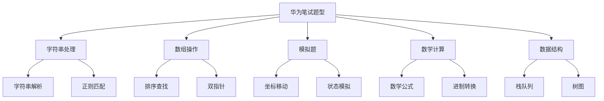

# HuaweiExam - 华为笔试算法题复习仓库

## 📚 项目简介

这是一个专门用于华为笔试算法题复习和练习的代码仓库。本仓库收集了华为笔试中常见的算法题目，并提供详细的解题思路、代码实现和测试用例。

## 🎯 学习目标

- 掌握华为笔试常见算法题型
- 提高算法思维和编程能力
- 熟悉Go语言在算法题中的应用
- 为华为笔试做好充分准备

## 📁 项目结构

```
HuaweiExam/
├── README.md              # 项目总览
├── HJ17/                  # HJ17 坐标移动
│   ├── README.md         # 题目描述和解题思路
│   ├── main.go           # 代码实现
│   └── go.mod            # Go模块文件
└── [其他题目目录...]      # 更多算法题目
```

## 🚀 使用方法

### 运行特定题目

```bash
# 进入题目目录
cd HJ17

# 运行代码
go run main.go
```

### 学习流程

1. **阅读题目**：仔细理解题目要求和约束条件
2. **分析思路**：查看README中的解题思路和流程图
3. **理解代码**：阅读main.go中的实现代码
4. **运行测试**：执行代码验证结果
5. **自主练习**：尝试修改输入或优化算法

## 📋 题目列表

| 题号 | 题目名称 | 难度 | 状态     |
| ---- | -------- | ---- | -------- |
| HJ17 | 坐标移动 | 简单 | ✅ 已完成 |

## 🛠️ 技术栈

- **编程语言**：Go
- **算法类型**：字符串处理、模拟、坐标计算
- **数据结构**：字符串、数组

## 📖 学习建议

### 1. 系统学习
- 按照题目难度逐步学习
- 每道题都要理解算法思路
- 动手实现代码，不要只看不练

### 2. 重点掌握
- 字符串处理和解析
- 边界条件处理
- 算法复杂度分析
- 代码调试技巧

### 3. 练习方法
- 先独立思考，再查看解题思路
- 多写测试用例验证代码
- 尝试优化算法性能
- 总结解题模式和技巧

## 🔍 题目特点分析

### 华为笔试常见题型



### 解题技巧总结

1. **仔细读题**：理解所有约束条件和边界情况
2. **画图分析**：复杂问题用图表辅助理解
3. **分步实现**：将复杂问题分解为简单步骤
4. **测试验证**：用多种测试用例验证代码正确性
5. **优化改进**：在正确的基础上优化性能

## 📝 贡献指南

欢迎提交新的题目和解题思路！

1. 创建新的题目目录
2. 添加详细的README说明
3. 实现完整的代码
4. 提供测试用例
5. 更新主README的题目列表

## 🎉 祝考试顺利！

通过系统学习和练习，相信你一定能在华为笔试中取得好成绩！

---

*最后更新：2024年*

