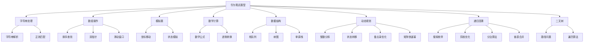

# HuaweiExam - 华为笔试算法题复习仓库

## 📚 项目简介

这是一个专门用于华为笔试算法题复习和练习的代码仓库。本仓库收集了华为笔试中常见的算法题目，并提供详细的解题思路、代码实现和测试用例。

## 🎯 学习目标

- 掌握华为笔试常见算法题型
- 提高算法思维和编程能力
- 熟悉Go语言在算法题中的应用
- 为华为笔试做好充分准备

## 📁 项目结构

```
HuaweiExam/
├── README.md              # 项目总览
├── HJ17/                  # HJ17 坐标移动
│   ├── README.md         # 题目描述和解题思路
│   ├── main.go           # 代码实现
│   └── go.mod            # Go模块文件
├── 11/                   # 11 盛最多水的容器
│   ├── README.md         # 双指针算法详解
│   ├── main.go           # 双指针实现
│   ├── go.mod            # Go模块文件
│   └── test.txt          # 测试用例
├── 3/                    # 3 无重复字符的最长子串
│   ├── README.md         # 滑动窗口算法详解
│   ├── main.go           # 滑动窗口实现
│   ├── go.mod            # Go模块文件
│   └── test.txt          # 测试用例
├── 42/                   # 42 接雨水
│   ├── README.md         # 双指针与单调栈算法详解
│   ├── main.go           # 多种算法实现
│   ├── go.mod            # Go模块文件
│   └── test.txt          # 测试用例
├── 200/                  # 200 岛屿数量
│   ├── README.md         # DFS、BFS、并查集算法详解
│   ├── main.go           # 多种算法实现
│   ├── go.mod            # Go模块文件
│   └── test.txt          # 测试用例
├── 96/                   # 96 不同的二叉搜索树
│   ├── README.md         # 动态规划、卡塔兰数算法详解
│   ├── main.go           # 多种算法实现
│   ├── go.mod            # Go模块文件
│   └── test.txt          # 测试用例
├── 122/                  # 122 买卖股票的最佳时机 II
│   ├── README.md         # 贪心算法、动态规划详解
│   ├── main.go           # 多种算法实现
│   ├── go.mod            # Go模块文件
│   └── test.txt          # 测试用例
├── 123/                  # 123 买卖股票的最佳时机 III
│   ├── README.md         # 五状态DP、分割数组详解
│   ├── main.go           # 多种算法实现
│   ├── go.mod            # Go模块文件
│   └── test.txt          # 测试用例
├── 213/                  # 213 打家劫舍 II
│   ├── README.md         # 环形DP、状态机详解
│   ├── main.go           # 多种算法实现
│   ├── go.mod            # Go模块文件
│   └── test.txt          # 测试用例
├── 70/                   # 70 爬楼梯
│   ├── README.md         # 斐波那契数列、矩阵快速幂详解
│   ├── main.go           # 五种算法实现
│   ├── go.mod            # Go模块文件
│   └── test.txt          # 测试用例
├── 112/                  # 112 路径总和
│   ├── README.md         # 二叉树DFS、递归遍历详解
│   ├── main.go           # 三种算法实现
│   └── go.mod            # Go模块文件
├── 113/                  # 113 路径总和 II
│   ├── README.md         # 二叉树DFS、BFS、回溯算法详解
│   ├── main.go           # 五种算法实现
│   └── go.mod            # Go模块文件
├── 332/                  # 332 重新安排行程
│   ├── README.md         # 欧拉路径、Hierholzer算法详解
│   ├── main.go           # 五种算法实现
│   └── go.mod            # Go模块文件
├── 509/                  # 509 斐波那契数
│   ├── README.md         # 备忘录递归、动态规划详解
│   ├── main.go           # 六种算法实现
│   └── go.mod            # Go模块文件
├── 23/                   # 23 合并K个升序链表
│   ├── README.md         # 分治算法、优先队列详解
│   ├── main.go           # 四种算法实现
│   └── go.mod            # Go模块文件
└── [其他题目目录...]      # 更多算法题目
```

## 🚀 使用方法

### 运行特定题目

```bash
# 进入题目目录
cd HJ17

# 运行代码
go run main.go
```

### 学习流程

1. **阅读题目**：仔细理解题目要求和约束条件
2. **分析思路**：查看README中的解题思路和流程图
3. **理解代码**：阅读main.go中的实现代码
4. **运行测试**：执行代码验证结果
5. **自主练习**：尝试修改输入或优化算法

## 📋 题目列表

| 题号 | 题目名称                                        | 难度 | 状态     |
| ---- | ----------------------------------------------- | ---- | -------- |
| HJ17 | [坐标移动](./HJ17/)                             | 简单 | ✅ 已完成 |
| HJ18 | [识别有效的IP地址和掩码并进行分类统计](./HJ18/) | 中等 | ✅ 已完成 |
| HJ24 | [合唱队](./HJ24/)                               | 中等 | ✅ 已完成 |
| HJ29 | [字符串加解密](./HJ29/)                         | 简单 | ✅ 已完成 |
| HJ30 | [字符串合并处理](./HJ30/)                       | 中等 | ✅ 已完成 |
| HJ3  | [明明的随机数](./HJ3/)                          | 简单 | ✅ 已完成 |
| HJ61 | [放苹果](./HJ61/)                               | 中等 | ✅ 已完成 |
| HJ64 | [MP3光标位置](./HJ64/)                          | 中等 | ✅ 已完成 |
| HJ52 | [计算字符串的编辑距离](./HJ52/)                 | 中等 | ✅ 已完成 |
| HJ67 | [24点游戏算法](./HJ67/)                         | 困难 | ✅ 已完成 |
| HJ68 | [成绩排序](./HJ68/)                             | 简单 | ✅ 已完成 |
| 11   | [盛最多水的容器](./11/)                         | 中等 | ✅ 已完成 |
| 3    | [无重复字符的最长子串](./3/)                    | 中等 | ✅ 已完成 |
| 42   | [接雨水](./42/)                                 | 困难 | ✅ 已完成 |
| 200  | [岛屿数量](./200/)                              | 中等 | ✅ 已完成 |
| 96   | [不同的二叉搜索树](./96/)                       | 中等 | ✅ 已完成 |
| 122  | [买卖股票的最佳时机 II](./122/)                 | 中等 | ✅ 已完成 |
| 123  | [买卖股票的最佳时机 III](./123/)                | 困难 | ✅ 已完成 |
| 213  | [打家劫舍 II](./213/)                           | 中等 | ✅ 已完成 |
| 70   | [爬楼梯](./70/)                                 | 简单 | ✅ 已完成 |
| 112  | [路径总和](./112/)                              | 简单 | ✅ 已完成 |
| 113  | [路径总和 II](./113/)                           | 中等 | ✅ 已完成 |
| 332  | [重新安排行程](./332/)                          | 困难 | ✅ 已完成 |
| 337  | [打家劫舍 III](./337/)                          | 中等 | ✅ 已完成 |
| 509  | [斐波那契数](./509/)                            | 简单 | ✅ 已完成 |
| 23   | [合并K个升序链表](./23/)                        | 困难 | ✅ 已完成 |
| 22   | [括号生成](./22/)                               | 中等 | ✅ 已完成 |
| 240  | [搜索二维矩阵 II](./240/)                       | 中等 | ✅ 已完成 |
| 84   | [柱状图中最大的矩形](./84/)                     | 困难 | ✅ 已完成 |
| 85   | [最大矩形](./85/)                               | 困难 | ✅ 已完成 |
| 739  | [每日温度](./739/)                              | 中等 | ✅ 已完成 |
| 503  | [下一个更大元素 II](./503/)                     | 中等 | ✅ 已完成 |
| 209  | [长度最小的子数组](./209/)                      | 中等 | ✅ 已完成 |
| 547  | [省份数量](./547/)                              | 中等 | ✅ 已完成 |
| 684  | [冗余连接](./684/)                              | 中等 | ✅ 已完成 |
| 1004 | [最大连续1的个数 III](./1004/)                  | 中等 | ✅ 已完成 |
| 560  | [和为 K 的子数组](./560/)                       | 中等 | ✅ 已完成 |
| 437  | [路径总和 III](./437/)                          | 中等 | ✅ 已完成 |
| 33   | [搜索旋转排序数组](./33/)                       | 中等 | ✅ 已完成 |
| 93   | [复原 IP 地址](./93/)                           | 中等 | ✅ 已完成 |
| 1    | [两数之和](./1/)                                | 简单 | ✅ 已完成 |
| 2    | [两数相加](./2/)                                | 中等 | ✅ 已完成 |
| 4    | [寻找两个正序数组的中位数](./4/)                | 困难 | ✅ 已完成 |
| 6    | [Z字形变换](./6/)                               | 中等 | ✅ 已完成 |
| 7    | [整数反转](./7/)                                | 简单 | ✅ 已完成 |
| 8    | [字符串转换整数 atoi](./8/)                     | 中等 | ✅ 已完成 |
| 9    | [回文数](./9/)                                  | 简单 | ✅ 已完成 |
| 10   | [正则表达式匹配](./10/)                         | 困难 | ✅ 已完成 |
| 12   | [整数转罗马数字](./12/)                         | 中等 | ✅ 已完成 |
| 13   | [罗马数字转整数](./13/)                         | 简单 | ✅ 已完成 |
| 14   | [最长公共前缀](./14/)                           | 中等 | ✅ 已完成 |
| 15   | [三数之和](./15/)                               | 中等 | ✅ 已完成 |
| 16   | [最接近的三数之和](./16/)                       | 中等 | ✅ 已完成 |
| 17   | [电话号码的字母组合](./17/)                     | 中等 | ✅ 已完成 |
| 18   | [四数之和](./18/)                               | 中等 | ✅ 已完成 |
| 19   | [删除链表的倒数第 N 个结点](./19/)              | 中等 | ✅ 已完成 |
| 20   | [有效的括号](./20/)                             | 简单 | ✅ 已完成 |
| 21   | [合并两个有序链表](./21/)                       | 简单 | ✅ 已完成 |
| 22   | [括号生成](./22/)                               | 中等 | ✅ 已完成 |
| 23   | [合并K个升序链表](./23/)                        | 困难 | ✅ 已完成 |
| 24   | [两两交换链表中的节点](./24/)                   | 中等 | ✅ 已完成 |
| 25   | [K 个一组翻转链表](./25/)                       | 困难 | ✅ 已完成 |
| 26   | [删除有序数组中的重复项](./26/)                 | 简单 | ✅ 已完成 |
| 27   | [LCP 26. 导航装置](./27/)                       | 困难 | ✅ 已完成 |
| 28   | [找出字符串中第一个匹配项的下标](./28/)         | 中等 | ✅ 已完成 |
| 29   | [两数相除](./29/)                               | 中等 | ✅ 已完成 |
| 30   | [串联所有单词的子串](./30/)                     | 困难 | ✅ 已完成 |
| 31   | [下一个排列](./31/)                             | 中等 | ✅ 已完成 |
| 32   | [最长有效括号](./32/)                           | 困难 | ✅ 已完成 |
| 35   | [搜索插入位置](./35/)                           | 简单 | ✅ 已完成 |
| 36   | [有效的数独](./36/)                             | 中等 | ✅ 已完成 |
| 37   | [解数独](./37/)                                 | 困难 | ✅ 已完成 |
| 38   | [外观数列](./38/)                               | 中等 | ✅ 已完成 |
| 39   | [组合总和](./39/)                               | 中等 | ✅ 已完成 |
| 40   | [组合总和 II](./40/)                            | 中等 | ✅ 已完成 |
| 41   | [缺失的第一个正数](./41/)                       | 困难 | ✅ 已完成 |
| 44   | [通配符匹配](./44/)                             | 困难 | ✅ 已完成 |
| 45   | [跳跃游戏 II](./45/)                            | 中等 | ✅ 已完成 |
| 46   | [全排列](./46/)                                 | 中等 | ✅ 已完成 |
| 47   | [全排列 II](./47/)                              | 中等 | ✅ 已完成 |
| 48   | [旋转图像](./48/)                               | 中等 | ✅ 已完成 |
| 49   | [字母异位词分组](./49/)                         | 中等 | ✅ 已完成 |
| 50   | [Pow(x, n)](./50/)                              | 中等 | ✅ 已完成 |
| 51   | [N 皇后](./51/)                                 | 困难 | ✅ 已完成 |
| 52   | [N 皇后 II](./52/)                              | 困难 | ✅ 已完成 |
| 53   | [最大子数组和](./53/)                           | 中等 | ✅ 已完成 |
| 54   | [螺旋矩阵](./54/)                               | 中等 | ✅ 已完成 |
| 56   | [合并区间](./56/)                               | 中等 | ✅ 已完成 |
| 57   | [插入区间](./57/)                               | 中等 | ✅ 已完成 |
| 58   | [最后一个单词的长度](./58/)                     | 简单 | ✅ 已完成 |
| 59   | [螺旋矩阵 II](./59/)                            | 中等 | ✅ 已完成 |
| 60   | [排列序列](./60/)                               | 困难 | ✅ 已完成 |
| 61   | [旋转链表](./61/)                               | 中等 | ✅ 已完成 |
| 64   | [最小路径和](./64/)                             | 中等 | ✅ 已完成 |
| 65   | [有效数字](./65/)                               | 困难 | ✅ 已完成 |
| 66   | [加一](./66/)                                   | 简单 | ✅ 已完成 |
| 67   | [二进制求和](./67/)                             | 简单 | ✅ 已完成 |
| 68   | [文本左右对齐](./68/)                           | 困难 | ✅ 已完成 |
| 69   | [x 的平方根](./69/)                             | 简单 | ✅ 已完成 |
| 71   | [简化路径](./71/)                               | 中等 | ✅ 已完成 |
| 72   | [编辑距离](./72/)                               | 困难 | ✅ 已完成 |
| 73   | [矩阵置零](./73/)                               | 中等 | ✅ 已完成 |
| 74   | [搜索二维矩阵](./74/)                           | 中等 | ✅ 已完成 |
| 75   | [颜色分类](./75/)                               | 中等 | ✅ 已完成 |
| 76   | [最小覆盖子串](./76/)                           | 困难 | ✅ 已完成 |
| 77   | [组合](./77/)                                   | 中等 | ✅ 已完成 |
| 78   | [子集](./78/)                                   | 中等 | ✅ 已完成 |
| 79   | [单词搜索](./79/)                               | 中等 | ✅ 已完成 |
| 80   | [删除有序数组中的重复项 II](./80/)              | 中等 | ✅ 已完成 |
| 81   | [搜索旋转排序数组 II](./81/)                    | 中等 | ✅ 已完成 |
| 82   | [删除排序链表中的重复元素 II](./82/)            | 中等 | ✅ 已完成 |
| 83   | [删除排序链表中的重复元素](./83/)               | 简单 | ✅ 已完成 |
| 86   | [分隔链表](./86/)                               | 中等 | ✅ 已完成 |
| 87   | [扰乱字符串](./87/)                             | 困难 | ✅ 已完成 |
| 88   | [合并两个有序数组](./88/)                       | 简单 | ✅ 已完成 |
| 89   | [格雷编码](./89/)                               | 中等 | ✅ 已完成 |
| 90   | [子集 II](./90/)                                | 中等 | ✅ 已完成 |
| 91   | [解码方法](./91/)                               | 中等 | ✅ 已完成 |
| 92   | [反转链表 II](./92/)                            | 中等 | ✅ 已完成 |
| 94   | [二叉树的中序遍历](./94/)                       | 简单 | ✅ 已完成 |
| 95   | [不同的二叉搜索树 II](./95/)                    | 中等 | ✅ 已完成 |
| 97   | [交错字符串](./97/)                             | 中等 | ✅ 已完成 |
| 98   | [验证二叉搜索树](./98/)                         | 中等 | ✅ 已完成 |
| 99   | [恢复二叉搜索树](./99/)                         | 中等 | ✅ 已完成 |
| 100  | [相同的树](./100/)                              | 简单 | ✅ 已完成 |
| 101  | [对称二叉树](./101/)                            | 简单 | ✅ 已完成 |
| 102  | [二叉树的层序遍历](./102/)                       | 中等 | ✅ 已完成 |
| 103  | [二叉树的锯齿形层序遍历](./103/)                 | 中等 | ✅ 已完成 |
| 104  | [二叉树的最大深度](./104/)                       | 简单 | ✅ 已完成 |
| 110  | [平衡二叉树](./110/)                             | 简单 | ✅ 已完成 |
| 111  | [二叉树的最小深度](./111/)                       | 简单 | ✅ 已完成 |
| 114  | [二叉树展开为链表](./114/)                       | 中等 | ✅ 已完成 |
| 115  | [不同的子序列](./115/)                           | 困难 | ✅ 已完成 |
| 105  | [从前序与中序遍历序列构造二叉树](./105/)         | 中等 | ✅ 已完成 |
| 106  | [从中序与后序遍历序列构造二叉树](./106/)         | 中等 | ✅ 已完成 |
| 107  | [二叉树的层序遍历 II](./107/)                    | 中等 | ✅ 已完成 |
| 240  | [搜索二维矩阵 II](./240/)                       | 中等 | ✅ 已完成 |
| 820  | [单词的压缩编码](./820/)                        | 中等 | ✅ 已完成 |

## 🛠️ 技术栈

- **编程语言**：Go
- **算法类型**：字符串处理、字符串匹配、KMP算法、Boyer-Moore算法、Rabin-Karp算法、Sunday算法、模拟、坐标计算、排序算法、动态规划、递归回溯、图遍历、连通性分析、数学计算、组合数学、贪心算法、股票交易、环形约束、斐波那契数列、二叉树遍历、深度优先搜索、记忆化递归、备忘录优化、分治算法、链表合并、矩阵搜索、二分查找、单调栈优化、循环数组处理、并查集、环检测、滑动窗口、边界DFS、逆向思维、矩阵连通性、字符串拆分、Trie树、状态转移、扫雷模拟、八方向遍历、游戏逻辑、图论最短路径、BFS搜索、双向BFS、A*搜索、图建模、岛屿连接、多源BFS、启发式搜索、有向图修复、树结构约束、分类讨论、状态机分析、数组遍历、哈希表验证、位运算优化、数独验证、宫格索引映射、约束度数组、可用数字列表、空格位置集合、启发式搜索队列、字符串构建器、缓冲区、行程长度编码表、递归调用栈、迭代状态变量、组合路径、搜索状态、剪枝条件、DP状态表、背包状态、位掩码状态、去重标记、单次使用标记、原地哈希表、位置映射表、交换状态、数学计算缓存、匹配状态表、通配符状态、滚动数组、记忆化缓存、跳跃状态、边界变量、最远位置、跳跃计数器、排列路径、使用标记、状态栈、选择撤销、字典序状态、去重标记、重复元素标记、剪枝条件、矩阵旋转、原地操作、坐标映射、四角交换、转置翻转、数学变换、分块处理、字符串分组、哈希映射、字符计数、异位词检测、位掩码优化、分组算法、快速幂、分治算法、位运算优化、数学计算、幂运算、递归优化、迭代优化、N皇后问题、约束满足问题、棋盘搜索、皇后放置、攻击检测、对角线检查、位掩码优化、启发式搜索、搜索空间剪枝、解的数量统计、预计算优化、数学公式查表、Kadane算法、最大子数组和、子数组优化、状态转移方程、贪心选择、分治递归、跨越中点计算、螺旋遍历、边界收缩、方向数组、矩阵分层、模拟遍历、顺时针遍历、区间合并、区间重叠判断、扫描线算法、事件排序、区间插入、线性扫描、三段式处理、分段合并、反向遍历、字符串解析、矩阵生成、螺旋填充、康托展开、阶乘计算、排列编码、字典序生成、候选数字管理、有限状态机、字符串验证、正则表达式、分段验证、标志位遍历、词法分析、大整数加法、进位处理、数组扩展、二进制加法、二进制字符串处理、字符串反转、文本格式化、贪心行分割、空格分配、两端对齐、左对齐、模拟排版、整数平方根、牛顿迭代法、数值计算、溢出处理、路径规范化、栈应用、Unix路径处理、编辑距离、Levenshtein距离、字符串DP、矩阵置零、原地标记、空间优化、行列标记、二维转一维、坐标转换、有序矩阵搜索、两次二分查找、荷兰国旗、三指针分区、三路快排、计数排序、颜色分类、最小覆盖子串、双指针技术、窗口状态维护、字符计数优化、ASCII数组优化、组合生成、回溯搜索、递归枚举、剪枝优化、深拷贝技术、位掩码枚举、数学公式优化、单词搜索、二维网格搜索、DFS回溯、状态管理、方向数组、边界检查、字符匹配、路径搜索、原地标记、BFS搜索、双向搜索、数组去重、原地修改、计数控制、快慢指针、重复元素处理、数据清洗、数组优化、旋转数组搜索、重复元素处理、边界收缩、有序部分判断、目标值搜索、数据检索、快速查找、链表操作、双指针算法、重复元素检测、节点删除、链表重构、dummy节点、指针更新、链表遍历、内存优化、链表去重、重复元素保留、节点跳过、链表优化、链表分区、分区处理、链表合并、相对位置保持、数据分组、字符串扰乱、递归分割、交换决策、状态判断、三维DP、分割点枚举、交换处理、记忆化优化、字符频率检查、分割方案、扰乱方式统计、多字符串处理、双指针逆序遍历、元素比较、位置调整、剩余元素处理、边界检查、元素填充、数组归并、原地合并、元素覆盖、指针更新、数组合并、归并排序、格雷码生成、对称反射法、镜像反射、最高位添加、位运算优化、异或运算、相邻验证、首尾验证、子集生成、幂集构造、回溯去重、排序预处理、迭代构造、字符串解码、状态转移、前导零处理、双字符编码、滚动数组优化、边界条件处理
- **数据结构**：字符串、数组、结构体、二维数组、浮点数、双指针、滑动窗口、哈希表、单调栈、并查集、队列、二叉树、记忆化表、状态机、环形数组、矩阵快速幂、递归栈、备忘录、链表、优先队列、二维矩阵、矩阵标记、连通分量、Trie字典树、哈希集合、动态规划表、游戏状态、方向数组、图邻接表、路线映射、双向搜索队列、边界点集合、距离数组、岛屿标记、入度统计、有向图邻接表、路径压缩并查集、位掩码数组、布尔标记数组、数独验证表、宫格索引映射、约束度数组、可用数字列表、空格位置集合、启发式搜索队列、字符串构建器、缓冲区、行程长度编码表、递归调用栈、迭代状态变量、组合路径、搜索状态、剪枝条件、DP状态表、背包状态、位掩码状态、去重标记、单次使用标记、原地哈希表、位置映射表、交换状态、数学计算缓存、匹配状态表、通配符状态、滚动数组、记忆化缓存、跳跃状态、边界变量、最远位置、跳跃计数器、排列路径、使用标记、状态栈、选择撤销、字典序状态、去重标记、重复元素标记、剪枝条件

## 📖 学习建议

### 1. 系统学习
- 按照题目难度逐步学习
- 每道题都要理解算法思路
- 动手实现代码，不要只看不练

### 2. 重点掌握
- 字符串处理和解析
- 边界条件处理
- 算法复杂度分析
- 代码调试技巧

### 3. 练习方法
- 先独立思考，再查看解题思路
- 多写测试用例验证代码
- 尝试优化算法性能
- 总结解题模式和技巧

## 🔍 题目特点分析

### 华为笔试常见题型



### 解题技巧总结

1. **仔细读题**：理解所有约束条件和边界情况
2. **画图分析**：复杂问题用图表辅助理解
3. **分步实现**：将复杂问题分解为简单步骤
4. **测试验证**：用多种测试用例验证代码正确性
5. **优化改进**：在正确的基础上优化性能

## 📝 贡献指南

欢迎提交新的题目和解题思路！

1. 创建新的题目目录
2. 添加详细的README说明
3. 实现完整的代码
4. 提供测试用例
5. 更新主README的题目列表

## 🎉 祝考试顺利！

通过系统学习和练习，相信你一定能在华为笔试中取得好成绩！

---

*最后更新：2025年*

