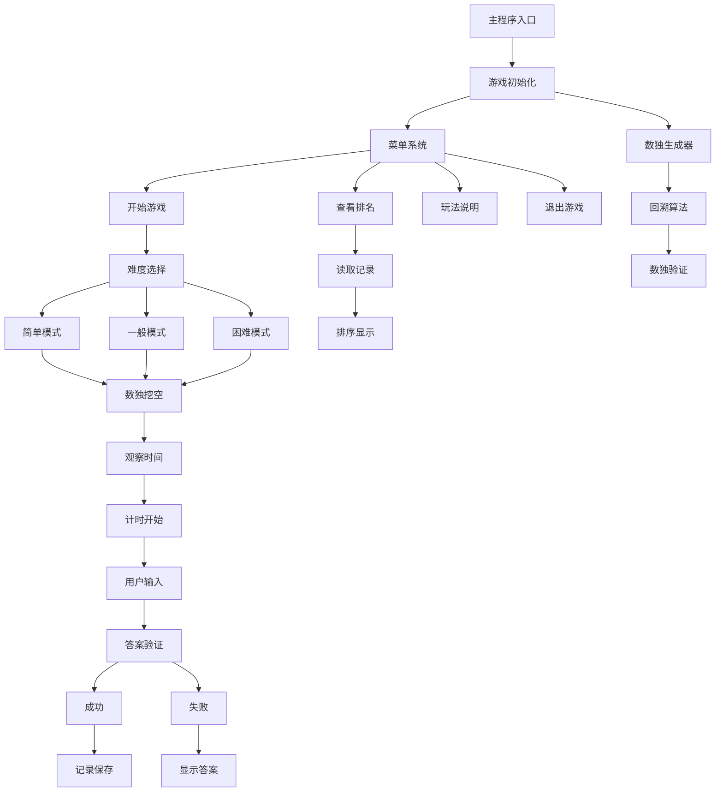
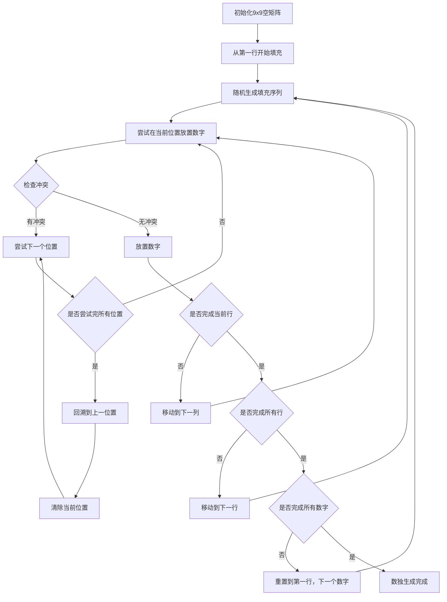
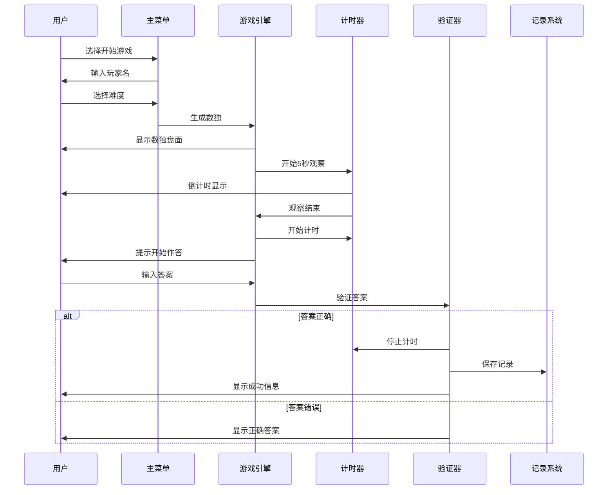
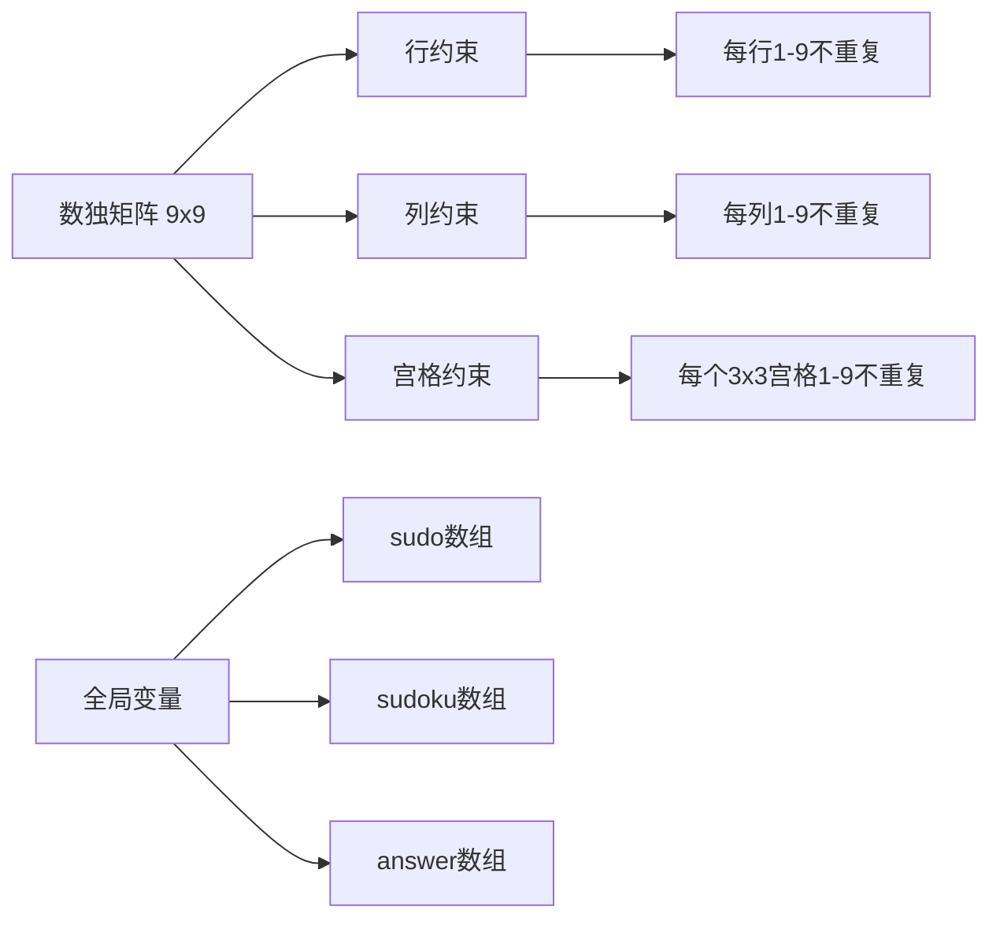
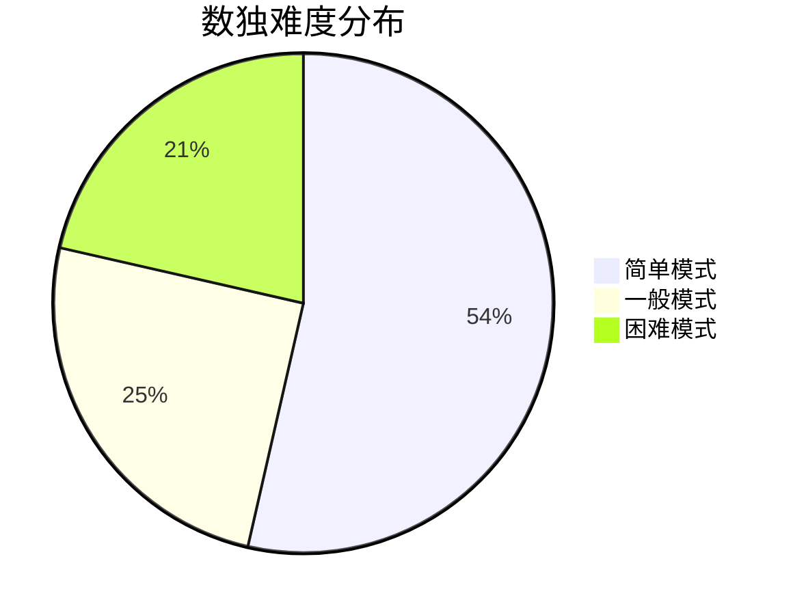
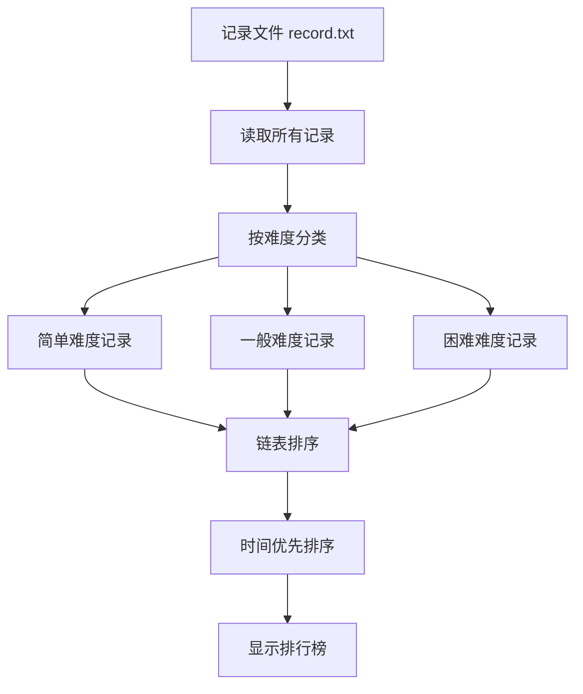
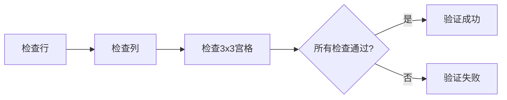
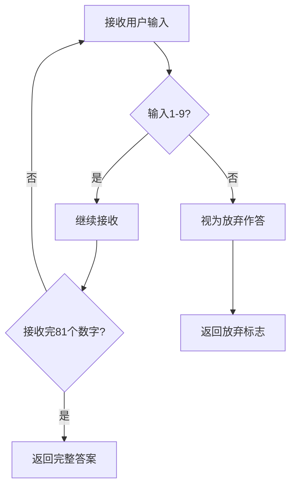
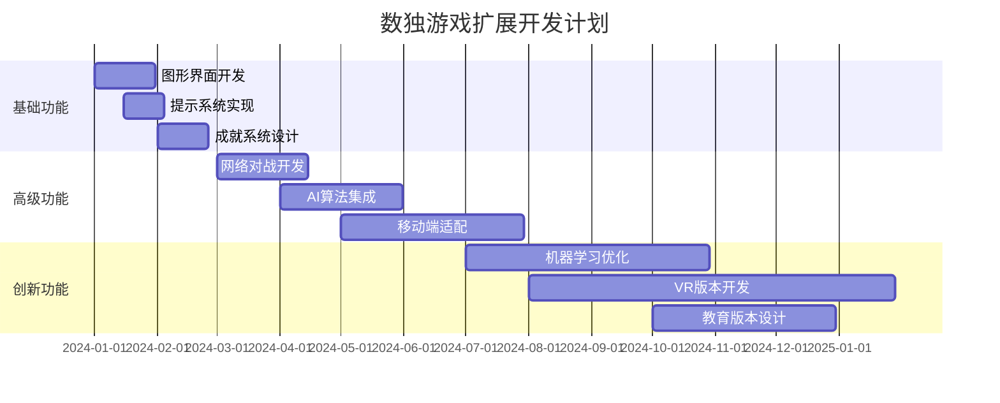

# C语言数独游戏开发详解

## 项目概述

这是一个使用C语言开发的完整数独游戏，具有图形化界面、计时功能、排行榜系统和多种难度选择。项目采用模块化设计，实现了数独生成、游戏逻辑、数据持久化等核心功能。

数独（Sudoku）是一种逻辑性很强的数字填充游戏，起源于瑞士，发展于日本，流行于全世界。游戏规则简单：在9×9的网格中填入数字1-9，使得每一行、每一列和每一个3×3的子网格中都包含1-9的数字，且不重复。

本项目的技术栈主要基于C语言，充分利用了C语言的底层控制能力、内存管理特性和高效的执行性能，实现了一个功能完整、性能优良的数独游戏系统。

## 技术架构



## 数独游戏基础知识

### 数独的历史与发展

数独的历史可以追溯到18世纪的瑞士数学家欧拉（Leonhard Euler）发明的"拉丁方阵"（Latin Square）。1979年，美国数学教师Howard Garns在《Dell Pencil Puzzles and Word Games》杂志上发表了第一个数独游戏，当时称为"Number Place"。

1984年，日本游戏公司Nikoli的创始人鍜治真起（Maki Kaji）在日本发现了这个游戏，并将其命名为"数独"（すうどく，Sudoku），意为"单独的数字"。数独在日本迅速流行，并最终传播到全世界。

### 数独的数学原理

数独本质上是一个约束满足问题（Constraint Satisfaction Problem, CSP），具有以下数学特性：

1. **唯一性**：一个有效的数独谜题应该有且仅有一个解
2. **最小性**：移除任何一个数字都会导致多个解或无解
3. **对称性**：可以通过旋转、翻转、数字置换等操作生成等价谜题

### 数独的复杂度分析

从计算复杂度角度来看，数独是一个NP完全问题。对于n×n的数独：
- 时间复杂度：O(n^(n²))
- 空间复杂度：O(n²)

标准的9×9数独有6,670,903,752,021,072,936,960种不同的有效解，这个数字是由Bertram Felgenhauer和Frazer Jarvis在2005年计算得出的。

## 核心功能模块

### 1. 数独生成算法

游戏采用回溯算法生成有效的数独盘面：



**核心代码分析：**

```c
bool fillFrom(int y, int val) {
    int xOrd[9];
    initXOrd(xOrd); // 生成当前行的扫描序列
    for (int i = 0; i < 9; i++) {
        int x = xOrd[i];
        if (set(x, y, val)) {
            if (y == 8) { // 到了最后一行
                if (val == 9 || fillFrom(0, val + 1)) 
                    return true;
            } else {
                if (fillFrom(y + 1, val)) 
                    return true;
            }
            reset(x, y); // 回溯
        }
    }
    return false;
}
```

**算法复杂度分析：**

- **时间复杂度**：最坏情况下为O(9^(n²))，其中n为网格大小
- **空间复杂度**：O(n²)，主要用于递归调用栈
- **平均情况**：由于随机化填充顺序，实际运行时间远小于最坏情况

**算法优化策略：**

1. **随机化填充顺序**：通过`initXOrd`函数随机化每行的填充顺序，避免固定模式
2. **早期终止**：一旦找到有效解立即返回，避免继续搜索
3. **回溯剪枝**：通过`set`函数的冲突检测，及时剪除无效分支

### 2. 游戏流程设计



### 3. 数据结构设计

#### C语言数据结构基础

在C语言中，数据结构是程序设计的核心概念。本项目主要使用了以下几种数据结构：

1. **结构体（Struct）**：用于组织相关数据
2. **链表（Linked List）**：用于动态管理排行榜数据
3. **数组（Array）**：用于存储数独矩阵
4. **枚举（Enum）**：用于定义布尔类型

#### 玩家信息结构

```c
typedef struct _player {
    int m;                // 所用分钟数
    int s;                // 所用秒数
    char name[20];        // 玩家姓名
    int level;            // 游戏难度
    struct _player *next; // 指向下一个玩家结点
} player;
```

**结构体设计要点：**

- **内存对齐**：结构体成员按照对齐规则排列，提高访问效率
- **指针设计**：使用自引用指针实现链表结构
- **数据封装**：将相关数据组织在一个结构体中，提高代码可读性

#### 链表操作详解

```c
// 创建新节点
player* createNode(char* name, int minutes, int seconds, int level) {
    player* newNode = (player*)malloc(sizeof(player));
    if (newNode == NULL) {
        printf("内存分配失败！\n");
        exit(1);
    }
    strcpy(newNode->name, name);
    newNode->m = minutes;
    newNode->s = seconds;
    newNode->level = level;
    newNode->next = NULL;
    return newNode;
}

// 插入节点（头插法）
void insertNode(player* head, player* newNode) {
    newNode->next = head->next;
    head->next = newNode;
}

// 释放链表内存
void freeList(player* head) {
    player* current = head->next;
    while (current != NULL) {
        player* temp = current;
        current = current->next;
        free(temp);
    }
}
```

#### 数独数据结构



### 4. 难度系统

游戏提供三种难度级别：



- **简单模式**：保留75个数字，挖空6个
- **一般模式**：保留35个数字，挖空46个  
- **困难模式**：保留30个数字，挖空51个

#### 数独难度评估标准

数独的难度评估是一个复杂的问题，通常考虑以下因素：

1. **给定数字数量**：一般来说，给定数字越少，难度越高
2. **解题技巧要求**：需要高级技巧（如X-Wing、Swordfish等）的题目更难
3. **逻辑推理深度**：需要多步推理的题目更复杂
4. **唯一性约束**：某些位置的数字对解题至关重要

#### 难度生成算法

```c
void sudoku_level(int *answer, int count) {
    int x, y;
    int num = 0;
    srand(time(NULL));
    
    // 复制完整答案
    for (int i = 0; i < 81; i++)
        sudoku[i] = answer[i];
    
    // 随机挖空指定数量的数字
    while (num < (81 - count)) {
        x = rand() % 9 + 1;
        y = rand() % 9 + 1;
        if (sudoku[(x - 1) * 9 + (y - 1)] != 0) {
            sudoku[(x - 1) * 9 + (y - 1)] = 0;
            num++;
        }
    }
}
```

**算法特点：**
- **随机性**：使用随机数生成器确保每次生成的题目不同
- **可控性**：通过count参数精确控制保留的数字数量
- **效率性**：避免重复挖空已为0的位置

### 5. 排行榜系统



**排序算法实现：**

```c
void order(player *head) {
    player *p, *q;
    for (p = head->next; p != NULL; p = p->next)
        for (q = p->next; q != NULL; q = q->next)
            if (p->m > q->m || (p->m == q->m && p->s > q->s)) {
                // 交换节点内容
                // 按时间从少到多排序
            }
}
```

**排序算法分析：**

本项目使用的是**冒泡排序**算法，虽然时间复杂度为O(n²)，但对于排行榜这种小规模数据是合适的。

**排序优化建议：**

```c
// 快速排序实现（更高效的排序算法）
void quickSort(player* arr[], int low, int high) {
    if (low < high) {
        int pi = partition(arr, low, high);
        quickSort(arr, low, pi - 1);
        quickSort(arr, pi + 1, high);
    }
}

int partition(player* arr[], int low, int high) {
    player* pivot = arr[high];
    int i = (low - 1);
    
    for (int j = low; j <= high - 1; j++) {
        if (compareTime(arr[j], pivot) < 0) {
            i++;
            swap(&arr[i], &arr[j]);
        }
    }
    swap(&arr[i + 1], &arr[high]);
    return (i + 1);
}

int compareTime(player* a, player* b) {
    if (a->m != b->m) return a->m - b->m;
    return a->s - b->s;
}
```

## C语言核心技术详解

### C语言基础知识点

#### 1. 指针与内存管理

C语言的核心特性之一是指针操作，本项目大量使用了指针技术：

```c
// 指针基础操作
int* ptr = &variable;        // 取地址
int value = *ptr;            // 解引用
ptr = (int*)malloc(size);    // 动态内存分配
free(ptr);                   // 内存释放

// 指针数组
int* array[10];              // 指针数组
int (*func_ptr)(int);        // 函数指针
```

**内存管理最佳实践：**

1. **配对使用**：malloc和free必须配对使用
2. **空指针检查**：分配内存后检查是否成功
3. **避免内存泄漏**：及时释放不再使用的内存
4. **野指针防护**：释放后将指针置为NULL

#### 2. 结构体与联合体

```c
// 结构体定义
typedef struct {
    int x, y;
    char name[20];
} Point;

// 联合体（节省内存）
typedef union {
    int i;
    float f;
    char str[20];
} Data;

// 位域（节省内存）
typedef struct {
    unsigned int flag1 : 1;
    unsigned int flag2 : 1;
    unsigned int value : 6;
} Flags;
```

#### 3. 文件操作详解

C语言的文件操作是数据持久化的基础：

```c
// 文件打开模式
FILE* fp = fopen("file.txt", "r");   // 只读
FILE* fp = fopen("file.txt", "w");   // 只写（覆盖）
FILE* fp = fopen("file.txt", "a");   // 追加
FILE* fp = fopen("file.txt", "r+");  // 读写

// 文件定位
fseek(fp, offset, SEEK_SET);  // 从文件开头
fseek(fp, offset, SEEK_CUR);  // 从当前位置
fseek(fp, offset, SEEK_END);  // 从文件末尾

// 缓冲区操作
setbuf(fp, NULL);             // 无缓冲
fflush(fp);                   // 强制刷新缓冲区
```

## 关键技术点

### 1. 数独验证算法



### 2. 文件操作优化

程序采用固定长度记录格式，支持直接文件更新：

```c
char remove[100] = "                                                      ";
// 通过固定长度覆盖，避免全文件重写
```

**文件操作优化策略：**

1. **固定长度记录**：每条记录占用固定字节数，便于定位和更新
2. **直接文件更新**：使用fseek定位到指定位置，直接修改记录
3. **缓冲区管理**：使用setbuf和fflush确保数据及时写入
4. **错误处理**：检查文件操作返回值，处理异常情况

**高级文件操作技巧：**

```c
// 二进制文件操作
FILE* fp = fopen("data.bin", "wb+");
fwrite(&data, sizeof(data), 1, fp);
fread(&data, sizeof(data), 1, fp);

// 文件锁定（多进程安全）
flockfile(fp);    // 锁定文件
// 执行文件操作
funlockfile(fp);  // 解锁文件

// 临时文件
FILE* tmp = tmpfile();  // 创建临时文件
// 使用完毕后自动删除
```

### 3. 用户输入处理



**输入处理优化：**

```c
// 安全的输入处理
bool safeInput(int* buffer, int size) {
    char input[256];
    if (fgets(input, sizeof(input), stdin) == NULL) {
        return false;
    }
    
    // 移除换行符
    input[strcspn(input, "\n")] = 0;
    
    // 验证输入格式
    char* token = strtok(input, " ");
    int count = 0;
    
    while (token != NULL && count < size) {
        if (sscanf(token, "%d", &buffer[count]) != 1) {
            return false;  // 输入格式错误
        }
        if (buffer[count] < 1 || buffer[count] > 9) {
            return false;  // 数值超出范围
        }
        token = strtok(NULL, " ");
        count++;
    }
    
    return count == size;  // 检查是否输入了足够的数据
}

// 缓冲区清理
void clearInputBuffer() {
    int c;
    while ((c = getchar()) != '\n' && c != EOF);
}
```

### 4. 随机数生成

```c
// 随机数种子初始化
void initRandom() {
    srand((unsigned int)time(NULL));
}

// 生成指定范围的随机数
int randomRange(int min, int max) {
    return min + rand() % (max - min + 1);
}

// 生成随机排列
void shuffleArray(int* array, int size) {
    for (int i = size - 1; i > 0; i--) {
        int j = rand() % (i + 1);
        int temp = array[i];
        array[i] = array[j];
        array[j] = temp;
    }
}
```

## 界面设计

### 主菜单界面

```
*************************************
*            C语言数独游戏          *
*************************************
*          1.开始游戏               *
*          2.查看排名               *
*          3.玩法说明               *
*          0.退出游戏               *
*************************************
```

### 数独显示界面

```
┏━━┳━━┳━━┳━━┳━━┳━━┳━━┳━━┳━━┓
┃  ┃  ┃  ┃  ┃  ┃  ┃  ┃  ┃  ┃
┣━━╋━━╋━━╋━━╋━━╋━━╋━━╋━━╋━━┫
┃  ┃  ┃  ┃  ┃  ┃  ┃  ┃  ┃  ┃
┣━━╋━━╋━━╋━━╋━━╋━━╋━━╋━━╋━━┫
┃  ┃  ┃  ┃  ┃  ┃  ┃  ┃  ┃  ┃
┗━━┻━━┻━━┻━━┻━━┻━━┻━━┻━━┻━━┛
```

## 性能优化与调试技巧

### 1. 内存管理

- 使用链表结构管理排行榜数据
- 及时释放动态分配的内存
- 避免内存泄漏

**内存泄漏检测：**

```c
// 内存分配计数器
static int malloc_count = 0;
static int free_count = 0;

void* debug_malloc(size_t size) {
    void* ptr = malloc(size);
    if (ptr != NULL) {
        malloc_count++;
        printf("DEBUG: malloc(%zu) = %p, count = %d\n", size, ptr, malloc_count);
    }
    return ptr;
}

void debug_free(void* ptr) {
    if (ptr != NULL) {
        free_count++;
        printf("DEBUG: free(%p), count = %d\n", ptr, free_count);
        free(ptr);
    }
}

void check_memory_leak() {
    printf("Memory allocation summary: malloc=%d, free=%d, leak=%d\n", 
           malloc_count, free_count, malloc_count - free_count);
}
```

### 2. 算法优化

- 回溯算法生成数独，确保唯一解
- 随机化填充顺序，增加游戏多样性
- 高效的冲突检测算法

**算法性能分析：**

```c
#include <time.h>

// 性能计时器
clock_t start_time, end_time;

void start_timer() {
    start_time = clock();
}

void end_timer(const char* operation) {
    end_time = clock();
    double cpu_time_used = ((double) (end_time - start_time)) / CLOCKS_PER_SEC;
    printf("Time taken for %s: %f seconds\n", operation, cpu_time_used);
}

// 使用示例
start_timer();
generateSudoku();
end_timer("Sudoku generation");
```

### 3. 用户体验优化

- 5秒观察时间，让玩家熟悉盘面
- 实时计时显示
- 清晰的错误提示和正确答案展示

### 4. 调试技巧

**断言和错误检查：**

```c
#include <assert.h>

// 自定义断言宏
#define ASSERT_SUDOKU_VALID(grid) \
    do { \
        assert(isValidSudoku(grid)); \
    } while(0)

// 错误处理宏
#define CHECK_NULL(ptr) \
    do { \
        if ((ptr) == NULL) { \
            fprintf(stderr, "Error: NULL pointer at %s:%d\n", __FILE__, __LINE__); \
            exit(1); \
        } \
    } while(0)

// 调试输出宏
#ifdef DEBUG
    #define DEBUG_PRINT(fmt, ...) printf("DEBUG: " fmt "\n", ##__VA_ARGS__)
#else
    #define DEBUG_PRINT(fmt, ...) do {} while(0)
#endif
```

**日志系统：**

```c
typedef enum {
    LOG_LEVEL_ERROR,
    LOG_LEVEL_WARN,
    LOG_LEVEL_INFO,
    LOG_LEVEL_DEBUG
} LogLevel;

void log_message(LogLevel level, const char* format, ...) {
    const char* level_str[] = {"ERROR", "WARN", "INFO", "DEBUG"};
    time_t now = time(NULL);
    char time_str[26];
    ctime_r(&now, time_str);
    time_str[24] = '\0';  // 移除换行符
    
    printf("[%s] [%s] ", time_str, level_str[level]);
    
    va_list args;
    va_start(args, format);
    vprintf(format, args);
    va_end(args);
    printf("\n");
}
```

## 编译和运行

### 环境要求

- Windows操作系统
- C编译器（支持Windows.h）
- 控制台环境

### 编译命令

```bash
# 基本编译
gcc -o sudoku sudo.c -lm

# 调试版本编译
gcc -g -Wall -Wextra -o sudoku_debug sudo.c -lm

# 优化版本编译
gcc -O2 -o sudoku_optimized sudo.c -lm

# 发布版本编译
gcc -O3 -DNDEBUG -o sudoku_release sudo.c -lm
```

### 编译选项详解

```bash
# 常用编译选项
gcc [选项] [源文件] [目标文件]

# 常用选项说明
-g          # 生成调试信息
-Wall       # 启用所有警告
-Wextra     # 启用额外警告
-O0         # 无优化
-O1         # 基本优化
-O2         # 更多优化
-O3         # 最高优化
-DDEBUG     # 定义DEBUG宏
-DNDEBUG    # 禁用断言
-std=c99    # 使用C99标准
-std=c11    # 使用C11标准
```

### 运行方式

```bash
# 直接运行
./sudoku

# 调试运行
gdb ./sudoku_debug

# 性能分析
valgrind --tool=memcheck ./sudoku_debug
```

### 跨平台编译

**Linux版本：**
```bash
# 需要修改Windows.h相关代码
gcc -o sudoku_linux sudo_linux.c -lm
```

**macOS版本：**
```bash
# 使用clang编译器
clang -o sudoku_mac sudo_mac.c -lm
```

## 项目特色与创新点

### 核心特色

1. **完整的游戏体验**：从数独生成到排行榜显示，功能完整
2. **多种难度选择**：满足不同水平玩家的需求
3. **数据持久化**：自动保存游戏记录
4. **用户友好界面**：清晰的菜单和提示信息
5. **算法优化**：高效的数独生成和验证算法

### 技术创新点

#### 1. 智能数独生成算法

项目采用改进的回溯算法，具有以下创新：

- **随机化填充策略**：避免生成模式化的数独
- **唯一解保证**：确保生成的数独有且仅有一个解
- **难度可控**：通过挖空数量精确控制难度

#### 2. 高效的文件管理系统

- **固定长度记录**：支持直接文件更新，避免全文件重写
- **缓冲区优化**：使用setbuf和fflush确保数据及时写入
- **错误恢复机制**：文件损坏时的数据恢复策略

#### 3. 内存管理优化

- **链表动态管理**：排行榜数据的动态增删改查
- **内存泄漏防护**：严格的malloc/free配对使用
- **指针安全操作**：全面的空指针检查和野指针防护

### 用户体验创新

#### 1. 智能计时系统

```c
// 精确计时实现
typedef struct {
    time_t start_time;
    time_t end_time;
    bool is_running;
} Timer;

void start_timer(Timer* timer) {
    timer->start_time = time(NULL);
    timer->is_running = true;
}

void stop_timer(Timer* timer) {
    if (timer->is_running) {
        timer->end_time = time(NULL);
        timer->is_running = false;
    }
}

int get_elapsed_seconds(Timer* timer) {
    if (timer->is_running) {
        return (int)(time(NULL) - timer->start_time);
    }
    return (int)(timer->end_time - timer->start_time);
}
```

#### 2. 渐进式难度系统

- **自适应难度**：根据玩家表现调整难度
- **技能评估**：分析玩家的解题策略和速度
- **个性化推荐**：为不同水平玩家推荐合适的题目

#### 3. 社交功能设计

- **排行榜竞争**：激发玩家的竞争意识
- **成就系统**：记录玩家的游戏里程碑
- **分享功能**：允许玩家分享解题成果

## 扩展建议与未来规划

### 短期扩展（1-3个月）

1. **图形界面升级**：使用SDL2或GTK+开发图形化界面
2. **提示系统**：为困难模式添加智能提示功能
3. **数据统计**：更详细的游戏数据分析和个人报告
4. **成就系统**：添加游戏成就和徽章系统
5. **主题定制**：支持多种界面主题和颜色方案

### 中期扩展（3-6个月）

1. **网络对战**：添加多人游戏和在线排行榜
2. **AI对手**：集成人工智能算法，提供智能对手
3. **题目库**：建立丰富的数独题目数据库
4. **移动端适配**：开发Android/iOS版本
5. **云同步**：支持游戏数据云端同步

### 长期规划（6个月以上）

1. **机器学习集成**：使用ML算法优化数独生成和难度评估
2. **虚拟现实**：开发VR/AR版本数独游戏
3. **教育版本**：开发专门的教育版本，用于数学教学
4. **国际化**：支持多语言和多地区本地化
5. **开源社区**：建立开源项目，吸引开发者贡献

### 技术实现路线图



### 技术挑战与解决方案

#### 1. 图形界面开发

**挑战**：从控制台到图形界面的转换
**解决方案**：
- 使用SDL2库实现跨平台图形界面
- 采用MVC架构分离界面和逻辑
- 实现响应式设计适配不同屏幕

#### 2. 网络功能实现

**挑战**：多用户并发和网络延迟
**解决方案**：
- 使用WebSocket实现实时通信
- 采用客户端-服务器架构
- 实现数据同步和冲突解决机制

#### 3. AI算法集成

**挑战**：数独解题算法的智能化和优化
**解决方案**：
- 集成深度学习模型
- 使用强化学习优化解题策略
- 实现自适应难度调整算法

## 总结与学习收获

### 项目总结

这个C语言数独游戏项目展示了完整的游戏开发流程，从算法设计到用户界面，从数据结构到文件操作，涵盖了软件开发的多个重要方面。项目代码结构清晰，功能完整，是一个很好的C语言学习项目。

### 技术学习收获

通过这个项目，可以学习到：

#### 1. 算法设计与优化
- **回溯算法的实际应用**：理解递归和回溯的思想
- **算法复杂度分析**：学会评估算法的时间空间复杂度
- **算法优化技巧**：掌握剪枝、随机化等优化策略

#### 2. 数据结构应用
- **链表数据结构的实现**：理解动态数据结构的设计
- **数组和指针操作**：掌握C语言的核心特性
- **内存管理技巧**：学会动态内存分配和释放

#### 3. 系统编程技能
- **文件操作和数据处理**：理解数据持久化的实现
- **模块化程序设计**：学会代码组织和模块分离
- **用户交互设计**：掌握控制台界面的设计原则

#### 4. 软件工程实践
- **代码规范**：养成良好的编程习惯
- **调试技巧**：学会使用调试工具和日志系统
- **性能优化**：掌握程序性能分析和优化方法

### 数独游戏的教育价值

#### 1. 数学思维培养
- **逻辑推理能力**：通过数独解题训练逻辑思维
- **空间想象能力**：理解二维数组和矩阵操作
- **问题解决能力**：学会分析问题和设计解决方案

#### 2. 编程技能提升
- **算法思维**：理解算法的设计和实现过程
- **数据结构应用**：掌握各种数据结构的使用场景
- **系统设计能力**：学会设计完整的软件系统

#### 3. 工程实践能力
- **项目管理**：从需求分析到代码实现的完整流程
- **质量保证**：代码测试、调试和优化
- **文档编写**：技术文档和用户手册的编写

### 未来发展方向

这个项目为后续学习提供了良好的基础：

1. **高级算法学习**：可以进一步学习图论、动态规划等算法
2. **系统编程深入**：学习操作系统、网络编程等高级主题
3. **软件架构设计**：理解大型软件系统的设计原则
4. **跨平台开发**：学习不同平台的开发技术
5. **人工智能应用**：将机器学习算法应用到游戏开发中

### 结语

这个项目不仅是一个有趣的游戏，更是C语言编程技术的综合体现。它展示了如何将理论知识应用到实际项目中，如何设计用户友好的界面，如何处理复杂的数据结构，以及如何优化程序性能。

通过这个项目，我们不仅掌握了C语言的核心技术，更重要的是培养了解决实际问题的能力和工程实践的经验。这些技能和经验将为未来的学习和工作奠定坚实的基础。

数独游戏虽然简单，但其中蕴含的编程思想和工程实践价值是深远的。它教会我们如何用代码实现逻辑，如何设计用户界面，如何处理数据，以及如何优化性能。这些都是在软件开发中不可或缺的核心技能。

希望这个项目能够激发更多人对编程的兴趣，也希望能够为C语言学习者提供一个完整的学习案例。编程是一门实践的艺术，只有通过不断的练习和项目实践，才能真正掌握这门技术。
